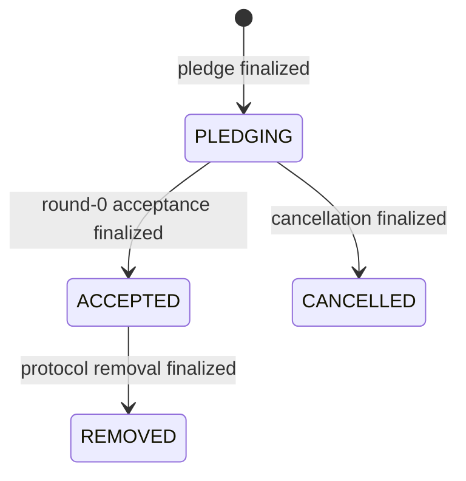

# Mixin Kernel Node Operations

This guide describes the lifecycle and operation of a Mixin Kernel consensus node. A node validates transactions, participates in collective snapshot signing, maintains every node chain and round reference, and persists the resulting BFT-DAG and UTXO state.

Node membership is ledger state. Joining, cancelling a pending join, accepting a node, and removing a node are all represented by special transactions that receive the same snapshot finality as asset transfers. Read the [transaction guide](./mixin-kernel-transactions.md) and [technical paper](./mixin-kernel-technical-paper.md) before operating a signer.

## Roles and identities

A Kernel node uses two public identities:

- The **signer** authenticates P2P traffic and participates in collective signatures. Its private spend key is configured in the daemon and has protocol-level authority.
- The **payee** receives the pledge output when the node is removed. Keeping reward ownership separate from the online signer limits the funds exposed with the consensus key.

Both identities use the public-address form in which the view key is deterministically derived from the public spend key. The node identifier is scoped to the genesis-derived network identifier, so the same signer address has a different node ID on a different Kernel network.

The durable membership states are:



The active node operations are `pledge`, `cancel`, `accept`, and `remove`.

## Protocol parameters

| Parameter | Value |
| --- | ---: |
| XIN pledge | 13,439 XIN |
| Minimum accepted nodes | 7 |
| Maximum Kernel nodes | 50 |
| Minimum delay from pledge to accept or cancel | 12 hours |
| Maximum pending pledge period | 7 days |
| Maturity after non-genesis acceptance before ordinary signing | More than 12 hours |
| Accept, cancel, and remove operation hours | Network-epoch hours 13 through 19 |

Protocol hours are calculated from the epoch in `genesis.json`; they are not necessarily wall-clock UTC hour labels. Pledge snapshots are permitted only outside the mint window (epoch hours 7–9) and the membership-operation window (hours 13–19). The protocol elects the node that may snapshot a pledge or removal at a given time and permits only one pending pledging node.

These rules are consensus validation rules, not scheduling promises. A submitted operation may remain cached or be retried until an eligible proposer, valid window, current graph, and quorum are all available.

## Prepare the node

Build the binary with `make` or use a release containing the matching network files. A data directory needs exactly two files before first start:

```text
~/mixin/
├── config.toml
└── genesis.json
```

Create it from this repository:

```bash
mkdir -p "$HOME/mixin"
cp config/genesis.json "$HOME/mixin/genesis.json"
cp config/config.example.toml "$HOME/mixin/config.toml"
```

The contents of `genesis.json` define the network. Do not edit it for a node that is intended to join an existing network.

Generate separate signer and payee addresses:

```bash
./mixin createaddress --public
./mixin createaddress --public
```

Record which output is the signer and which is the payee. Back up both private spend keys before publishing the addresses. Put only the signer private spend key in `config.toml`:

```toml
[node]
signer-key = "SIGNER_PRIVATE_SPEND_KEY"
kernel-operation-period = 700
memory-cache-size = 1024
cache-ttl = 3600
```

Review the remaining configuration:

- `p2p.port` is a QUIC/UDP port. Permit it through the firewall when the node must accept direct peers.
- `p2p.seeds` contains `node-id@host:port` relay entries for initial connectivity.
- A consensus signer should keep `p2p.relayer = false`. A dedicated public relay can enable it intentionally.
- `rpc.port` enables the HTTP RPC service; the example uses TCP port `6860`.
- `rpc.object-server` exposes the optional transaction object paths documented in [STORAGE.md](../STORAGE.md).
- `dev.port` enables the Go profiling server. Do not expose it to an untrusted network.

The signer must be able to synchronize the graph, maintain a stable clock, reach a quorum of peers, and remain online through the acceptance process.

## Create the pledge

The pledge transaction consumes exactly one XIN output and creates one `0xa3` node-pledge output. The amount is exactly `13,439.00000000` XIN. Its 64-byte `extra` field is the signer public spend key followed by the payee public spend key.

The bundled builder spends output index `0`, so first prepare a finalized ordinary output with all of these properties:

- asset XIN;
- output index `0`;
- amount exactly `13,439.00000000`;
- one key controlled by the funding address;
- a source transaction containing exactly that one output, if the bundled cancellation builder may be needed later.

Then build the pledge against a synchronized RPC node:

```bash
PLEDGE_RAW=$(./mixin --node http://127.0.0.1:6860 \
  buildnodepledgetransaction \
  --view FUNDING_PRIVATE_VIEW_KEY \
  --spend FUNDING_PRIVATE_SPEND_KEY \
  --signer XIN_SIGNER_ADDRESS \
  --payee XIN_PAYEE_ADDRESS \
  --input FUNDING_TRANSACTION_HASH)
```

The builder signs the funding input and references the RPC node's current consensus transaction. Inspect the payload before broadcasting it:

```bash
./mixin decoderawtransaction --raw "$PLEDGE_RAW"
./mixin decodenodepledgetransaction --raw "$PLEDGE_RAW"
```

Broadcast it and retain both the raw transaction and returned hash:

```bash
./mixin --node http://127.0.0.1:6860 \
  sendrawtransaction --raw "$PLEDGE_RAW"
```

The pledge becomes effective only after it appears in a finalized snapshot. Verify that `gettransaction` returns a `snapshot` field and that `listallnodes` reports the signer as `PLEDGING`:

```bash
./mixin --node http://127.0.0.1:6860 \
  gettransaction --hash PLEDGE_TRANSACTION_HASH

./mixin --node http://127.0.0.1:6860 \
  listallnodes --threshold 0
```

Admission rejects duplicate signer identities, a second simultaneous pledging node, and membership beyond the 50-node cap.

## Start and accept the node

After the pledge is finalized, start the daemon with the signer's configured data directory:

```bash
./mixin kernel --dir "$HOME/mixin"
```

The node synchronizes the graph and periodically tests whether acceptance is possible. Acceptance is automated; there is no operator-built accept command. The accept transaction:

- spends the single pledge output;
- creates one `0xa4` node-accept output for the full pledge amount;
- repeats the signer and payee public spend keys in `extra`;
- is signed by the new node signer;
- is the only transaction in the new node's round-zero snapshot.

The round-zero snapshot is proposed by the joining node and certified by the applicable consensus set. It may finalize no earlier than 12 hours and no later than seven days after the pledge, during epoch hours 13–19. Keep the node synchronized, reachable through relayers or direct connections, and running before this window opens.

Finalized acceptance changes the state to `ACCEPTED` and starts round 1 on the new node chain. A non-genesis node becomes eligible to sign ordinary snapshots only after more than another 12 hours. This maturity delay is distinct from acceptance itself.

## Cancel a pending pledge

A pledge can be cancelled while its node remains `PLEDGING`. Cancellation is valid from 12 hours through seven days after the pledge and only during epoch hours 13–19.

The cancel transaction spends the pledge output and creates:

1. a `0xaa` node-cancel output containing one percent of the pledge; and
2. a standard one-signature output refunding the remaining 99 percent to the original funding address.

Its `extra` field contains the pledge's signer and payee keys followed by the funding private view key. Validation uses that view key to prove that the refund ghost key resolves to the same owner as the original pledge input. The cancellation therefore publishes that view key on the ledger: it does not reveal the spend key, but it makes outputs visible to anyone who inspects the transaction.

The bundled builder needs the raw pledge and the raw transaction that created the original funding output. `gettransaction` returns each finalized transaction's `hex` field if either value was not retained:

```bash
CANCEL_RAW=$(./mixin --node http://127.0.0.1:6860 \
  buildnodecanceltransaction \
  --view FUNDING_PRIVATE_VIEW_KEY \
  --spend FUNDING_PRIVATE_SPEND_KEY \
  --receiver XIN_FUNDING_ADDRESS \
  --pledge "$PLEDGE_RAW" \
  --source "$FUNDING_RAW")

./mixin decoderawtransaction --raw "$CANCEL_RAW"
./mixin --node http://127.0.0.1:6860 \
  sendrawtransaction --raw "$CANCEL_RAW"
```

Cancellation is complete only when the transaction is finalized and `listallnodes` reports `CANCELLED`. An accepted node cannot use this path.

## Protocol removal

Removal is automated. When more than the minimum seven accepted nodes are available and no pledge is pending, the protocol can select the oldest eligible accepted node for removal. A deterministic election chooses a different accepted node to propose the operation; a node cannot propose its own removal.

The remove transaction:

- spends the selected node's `0xa4` accept output;
- creates one `0xa6` threshold-one output for the full pledge amount;
- derives that spendable output for the node's payee address;
- preserves the signer and payee keys in `extra`;
- appears alone in its snapshot.

The resulting state is `REMOVED`. The payee controls the returned output with its keys. A node-remove output is also an eligible input type for a later ordinary transfer or node pledge.

Removal proposals run during epoch hours 13–19 and are serialized by membership timing rules. There is no manual removal transaction builder in the CLI.

## Operation formats

| Operation | Input | Output | `extra` | Initiator |
| --- | --- | --- | --- | --- |
| Pledge | One script or node-remove UTXO | `0xa3`, full 13,439 XIN | Signer public spend + payee public spend | Candidate operator submits; elected node snapshots |
| Cancel | Pending `0xa3` pledge | `0xaa` one percent + script refund | Pledge extra + funding private view | Candidate operator |
| Accept | Pending `0xa3` pledge | `0xa4`, full pledge | Same as pledge | Joining node automatically |
| Remove | Accepted `0xa4` pledge | `0xa6`, full pledge to payee | Same as accept | Elected existing node automatically |

Every membership operation is non-batchable: its transaction is the sole transaction in its snapshot. This gives all validators an unambiguous membership boundary for later threshold and signer-set calculations.

## Observe node health and membership

```bash
# Node, consensus, graph, queue, mint, and transport summary
./mixin --node http://127.0.0.1:6860 getinfo

# Latest state of every known signer
./mixin --node http://127.0.0.1:6860 listallnodes --threshold 0

# Complete membership-state history up to now
./mixin --node http://127.0.0.1:6860 listallnodes --threshold 0 --state

# Direct peer list; available only through loopback RPC
./mixin --node http://127.0.0.1:6860 listpeers

# Local view of each chain head
./mixin --node http://127.0.0.1:6860 dumpgraphhead
```

Useful signals in `getinfo` include the current consensus snapshot, active consensus nodes, final and cache round heads, local topology, snapshot and transaction rates, processing queues, and transport metrics.

## Operational security

- Protect the signer private spend key as an online consensus credential. Compromise permits authenticated protocol traffic and consensus responses.
- Keep the payee private spend key offline where practical. It controls the returned pledge after removal.
- Restrict file permissions on `config.toml`, backups, and any shell scripts containing keys.
- Avoid passing production keys on a multi-user command line; process listings and shell history can expose them.
- Keep signer and payee backups separate and test the recovery procedure before pledging.
- Keep the system clock synchronized. Snapshot and membership checks use nanosecond timestamps and protocol windows.
- Expose only the required QUIC/UDP P2P port. Bind or firewall RPC and profiling endpoints to trusted networks.
- Monitor free disk space, database health, peer reachability, graph progress, queue growth, and signer availability.
- Preserve the exact `genesis.json` and verify the network identifier before funding or pledging.

RPC method parameters and result shapes are documented in [Remote Procedure Calls](./remote-procedure-calls.md).
