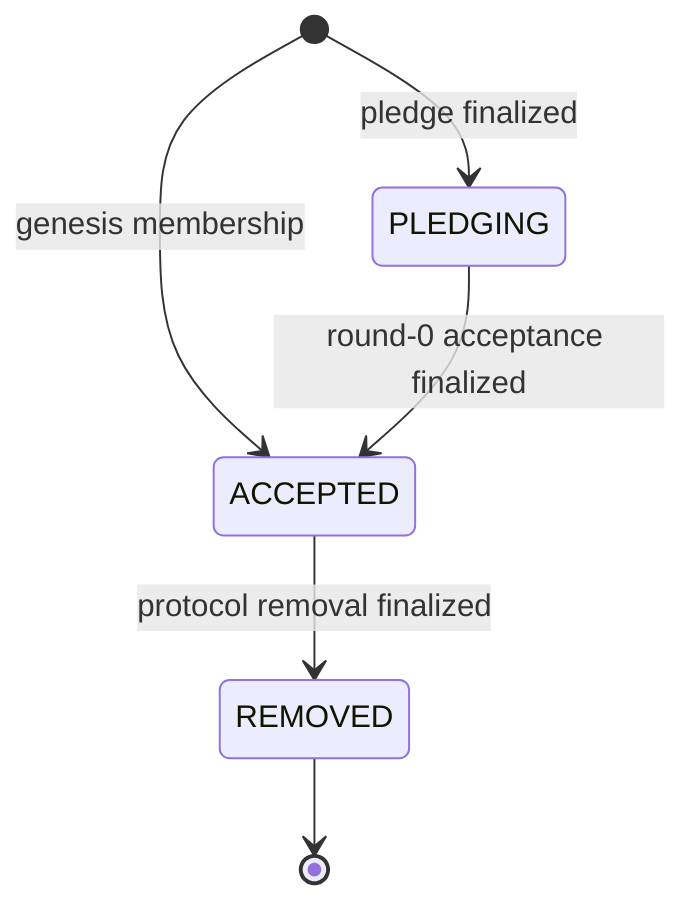

# Mixin Kernel Node Operations

This guide describes the lifecycle and operation of a Mixin Kernel consensus node. Accepted nodes validate transactions, participate in collective snapshot signing when eligible, maintain the node chains and round references, and persist the resulting BFT-DAG and UTXO state.

Node membership is ledger state. Pledging, accepting, and removing a node are represented by special transactions that receive the same snapshot finality as asset transfers. Read the [transaction guide](./mixin-kernel-transactions.md) and [technical paper](./mixin-kernel-technical-paper.md) before operating a signer.

## Roles and identities

A Kernel node uses two public identities:

- The **signer** authenticates P2P traffic and participates in collective signatures. Its private spend key is configured in the daemon and has protocol-level authority.
- The **payee** receives the node's mint rewards and the stake returned on removal. Its private spend key can be held separately from the online signer.

Both identities use the public-address form in which the view key is deterministically derived from the public spend key. The node identifier is scoped to the genesis-derived network identifier, so the same signer address has a different node ID on a different Kernel network.

The durable membership states are:


```mermaid
stateDiagram-v2
    [*] --> ACCEPTED: genesis membership
    [*] --> PLEDGING: pledge finalized
    PLEDGING --> ACCEPTED: round-0 acceptance finalized
    ACCEPTED --> REMOVED: protocol removal finalized
    REMOVED --> [*]
```

The membership transaction types are pledge, accept, and remove. Only pledge has an operator-facing CLI builder. Removed identities remain in the membership history.

## Protocol parameters

| Parameter | Value |
| --- | ---: |
| XIN pledge | 13,439 XIN |
| Minimum accepted nodes | 7 |
| Maximum Kernel nodes | 50 |
| Minimum interval between pledge and acceptance snapshot timestamps | 12 hours |
| Maximum interval between pledge and acceptance snapshot timestamps | 7 days |
| Maturity after non-genesis acceptance before ordinary signing | More than 12 hours |
| Accept and remove operation hours | Network-epoch hours 13 through 19 |

Protocol hours are calculated from the epoch in `genesis.json`; they are not necessarily wall-clock UTC hour labels. Pledge snapshots are permitted only outside the mint window (epoch hours 7–9) and the membership-operation window (hours 13–19). The protocol elects the node that may snapshot a pledge or removal at a given time and permits only one pending pledging node.

These rules are consensus validation rules, not scheduling promises. A submitted operation may remain cached or be retried until an eligible proposer, valid window, current graph, and quorum are all available.

A finalized pledge can be spent only by its acceptance transaction. The protocol has no cancellation or expiry-refund transition. Acceptance requires an eligible snapshot timestamp between 12 hours and seven days after the pledge timestamp. A valid acceptance certificate produced for an eligible timestamp may arrive later and still resolve the pledge if its consensus references and graph context remain admissible; the finalized path skips the proposal-freshness check.

If no admissible acceptance certificate exists and the graph has advanced beyond the opportunity to produce an eligible acceptance, restarting the candidate does not recover its stake. The pending state persists and prevents ordinary removal of accepted nodes, including their stake returns, as well as another pledge. The normal protocol has no recovery transition from that state. Verify the signer and payee keys, network files, connectivity, and node readiness before broadcasting the pledge.

## Prepare the node

Use the Go version declared in [go.mod](../go.mod) and build with `make` from a clean checkout. The Makefile embeds the Git commit identifier and restores `config/reader.go` from Git before and after compiling. A binary built with plain `go build` refuses to start while its build version contains `BUILD_VERSION`.

A data directory requires these two files before first start; the daemon creates its databases there:

```text
~/mixin/
├── config.toml
└── genesis.json
```

Create it from this repository:

```bash
mkdir -p "$HOME/mixin"
cp config/genesis.json "$HOME/mixin/genesis.json"
cp config/config.example.toml "$HOME/mixin/config.toml"
chmod 600 "$HOME/mixin/config.toml"
```

The contents of `genesis.json` define the network. Do not edit it for a node that is intended to join an existing network.

Generate separate signer and payee addresses:

```bash
./mixin createaddress --public
./mixin createaddress --public
```

Record which output is the signer and which is the payee. Back up both private spend keys before publishing the addresses; their view keys can be derived from their public spend keys. Replace the example signer key in `config.toml` with only the signer's private spend key:

```toml
[node]
signer-key = "SIGNER_PRIVATE_SPEND_KEY"
kernel-operation-period = 700
memory-cache-size = 1024
cache-ttl = 3600
```

Review the remaining configuration:

- `p2p.port` is a QUIC/UDP port. Permit it through the firewall when the node must accept direct peers.
- `p2p.seeds` contains `node-id@host:port` relay entries for initial connectivity.
- A consensus signer should keep `p2p.relayer = false`. A dedicated public relay can enable it intentionally.
- A positive `rpc.port` enables HTTP RPC on all interfaces; the example uses TCP port `6860`. Restrict access at the host or network boundary.
- `rpc.object-server` exposes the optional transaction object paths documented in [STORAGE.md](../STORAGE.md).
- A positive `dev.port` enables Go profiling on all interfaces; the example uses TCP port `7870`. Set it to `0` to disable profiling, or restrict access at the host or network boundary.

The signer must be able to synchronize the graph, maintain a stable clock, reach a quorum of peers, and remain online through the acceptance process.

## Create the pledge

The pledge transaction consumes exactly one XIN output and creates one `0xa3` node-pledge output. The amount is exactly `13,439.00000000` XIN. Its 64-byte `extra` field is the signer public spend key followed by the payee public spend key.

The bundled builder spends output index `0`, so first prepare a finalized ordinary output with all of these properties:

- asset XIN;
- output index `0`;
- amount exactly `13,439.00000000`;
- a threshold-one script with one key controlled by the funding address.

Then build the pledge against a synchronized RPC node:

```bash
PLEDGE_RAW=$(./mixin --node http://127.0.0.1:6860 \
  buildnodepledgetransaction \
  --view FUNDING_PRIVATE_VIEW_KEY \
  --spend FUNDING_PRIVATE_SPEND_KEY \
  --signer XIN_SIGNER_ADDRESS \
  --payee XIN_PAYEE_ADDRESS \
  --input FUNDING_TRANSACTION_HASH)
```

The builder signs the funding input and references the RPC node's current consensus transaction. It creates no change output; its default `--amount` is the required pledge amount. Confirm the node's network identifier with `getinfo`, then inspect the funding input, amount, signer, and payee before broadcasting:

```bash
./mixin decoderawtransaction --raw "$PLEDGE_RAW"
./mixin decodenodepledgetransaction --raw "$PLEDGE_RAW"
```

Broadcast it and retain both the raw transaction and returned hash:

```bash
./mixin --node http://127.0.0.1:6860 \
  sendrawtransaction --raw "$PLEDGE_RAW"
```

Submission success alone does not establish finalization. To check the queried node's ledger state, verify that `gettransaction` returns a `snapshot` field and that `listallnodes` reports the signer as `PLEDGING`:

```bash
./mixin --node http://127.0.0.1:6860 \
  gettransaction --hash PLEDGE_TRANSACTION_HASH

./mixin --node http://127.0.0.1:6860 \
  listallnodes --threshold 0
```

These RPC results reflect the selected node's view; use a trusted, synchronized node and verify its network identifier. Admission rejects a signer spend key already used by a recorded signer or payee, a second simultaneous pledging node, and membership beyond the 50-node cap. Removing a node does not make its signer identity reusable.

## Start and accept the node

After the pledge is finalized, start the daemon with the signer's configured data directory:

```bash
./mixin kernel --dir "$HOME/mixin"
```

The node synchronizes the graph and periodically tests whether acceptance is possible. Acceptance is automated; there is no operator-built accept command. The accept transaction:

- spends the single pledge output;
- creates one `0xa4` node-accept output for the full pledge amount;
- repeats the signer and payee public spend keys in `extra`;
- is signed by the joining node signer;
- is the only transaction in that node's round-zero snapshot.

The joining node proposes the round-zero snapshot, and the applicable consensus set certifies it. Its timestamp must fall between 12 hours and seven days after the pledge timestamp, during epoch hours 13–19. Delayed certificate delivery is subject to the admissibility conditions described above. Keep the node synchronized, reachable through relayers or direct connections, and running before this window opens. The example `kernel-operation-period = 700` checks acceptance opportunities every 700 seconds; it does not guarantee acceptance at a particular time.

Finalized acceptance records `ACCEPTED` and starts round 1 on the joining node's chain. A non-genesis node becomes eligible to sign ordinary snapshots only when their timestamps are more than 12 hours after its acceptance timestamp. This maturity delay is distinct from acceptance itself.

## Protocol removal

Removal is automated. When the ledger contains more than seven accepted nodes and no pledge is pending, the protocol can select the oldest eligible accepted node for removal. A deterministic election chooses a different accepted node to propose the operation; a node cannot propose its own removal.

The remove transaction:

- spends the selected node's `0xa4` accept output;
- creates one `0xa6` threshold-one output for the full pledge amount;
- derives that spendable output for the node's payee address;
- preserves the signer and payee keys in `extra`;
- references the last consensus transaction and, when reference-seeded ghost derivation applies, a finalized transaction as its ghost-seed anchor;
- appears alone in its snapshot.

Reference-seeded derivation applies on non-mainnet networks and on mainnet for snapshot timestamps at or after 2026-09-01 00:00:00 UTC. The builder selects an anchor from the proposer's final round and mixes its transaction hash with the payee and signer data. Validation requires the recorded anchor to be nonzero and finalized, then reconstructs the transaction from it; it does not enforce the builder's anchor-recency policy. The reference is public and does not provide a guarantee against output-key reservations. Mainnet snapshots with timestamps before that boundary use a single consensus reference and derive the output without an anchor.

The resulting state is `REMOVED`. The payee controls the returned output with its keys. A node-remove output is also an eligible input type for a later ordinary transfer or node pledge.

Removal proposals run during epoch hours 13–19 and are serialized by membership timing rules. There is no manual removal transaction builder in the CLI.

## Operation formats

| Operation | Input | Output | `extra` | Initiator |
| --- | --- | --- | --- | --- |
| Pledge | One script or node-remove UTXO | `0xa3`, full 13,439 XIN | Signer public spend + payee public spend | Candidate operator submits; elected node snapshots |
| Accept | Pending `0xa3` pledge | `0xa4`, full pledge | Same as pledge | Joining node automatically |
| Remove | Accepted `0xa4` pledge | `0xa6`, full pledge to payee | Same as accept | Elected existing node automatically |

Every membership operation is non-batchable: its transaction is the sole transaction in its snapshot. Membership history supplies the timestamp-dependent state used for threshold and signer-set calculations.

## Observe node health and membership

```bash
# Node, consensus, graph, queue, mint, and transport summary
./mixin --node http://127.0.0.1:6860 getinfo

# Latest state of every known signer
./mixin --node http://127.0.0.1:6860 listallnodes --threshold 0

# Complete membership-state history up to now
./mixin --node http://127.0.0.1:6860 listallnodes --threshold 0 --state

# Direct peer list; RPC requires a caller address of 127.0.0.1
./mixin --node http://127.0.0.1:6860 listpeers

# Queried node's view of each chain head
./mixin --node http://127.0.0.1:6860 dumpgraphhead
```

Useful signals in `getinfo` include the current consensus snapshot, active consensus nodes, final and cache round heads, local topology, snapshot and transaction rates, processing queues, and transport metrics.

## Operational security

- Protect the signer private spend key as an online consensus credential. Compromise permits authenticated protocol traffic and consensus responses.
- Keep the payee private spend key offline where practical. It controls the returned pledge after removal.
- Restrict file permissions on `config.toml`, backups, and any shell scripts containing keys.
- Avoid passing production keys on a multi-user command line; process listings and shell history can expose them.
- Keep signer and payee backups separate and test the recovery procedure before pledging.
- Keep the system clock synchronized. Snapshot and membership checks use nanosecond timestamps and protocol windows.
- Expose only the required QUIC/UDP P2P port. Firewall RPC and profiling endpoints to trusted networks; their port settings do not select a loopback bind address.
- Monitor free disk space, database health, peer reachability, graph progress, queue growth, and signer availability.
- Preserve the exact `genesis.json` and verify the network identifier before funding or pledging.

RPC method parameters and result shapes are documented in [Remote Procedure Calls](./remote-procedure-calls.md).
