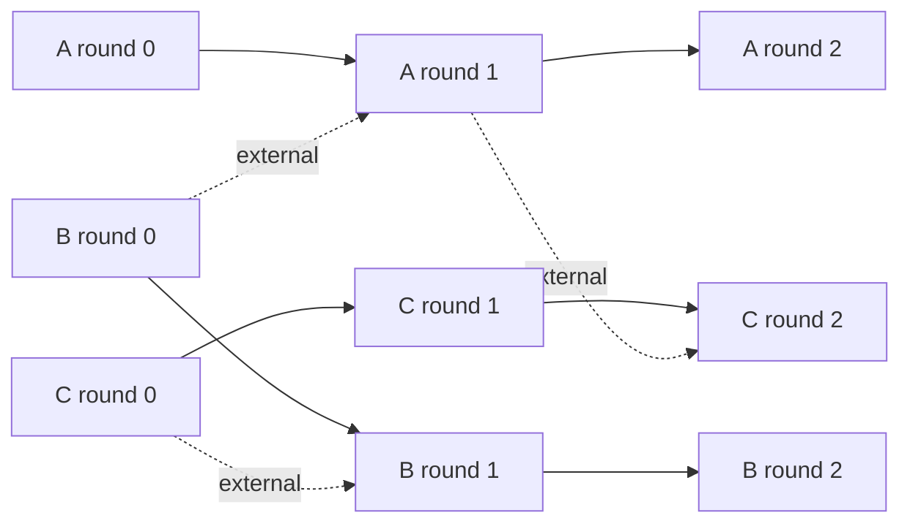

# Mixin Kernel Snapshots

A snapshot is the consensus envelope of Mixin Kernel. Transactions describe individual state transitions; a snapshot commits their hashes, fixes their position on one node's chain, and carries the collective signature that makes them final. Short rounds group snapshots on each node chain, while cross-node round references weave those chains into the ledger DAG.

For the complete protocol model, see [Mixin Kernel: A Fast BFT-DAG Distributed Ledger](./mixin-kernel-technical-paper.md). The transaction objects committed by snapshots are described in [Mixin Kernel Transactions](./mixin-kernel-transactions.md).

## Encoding and identity

Kernel snapshots use version `2` (`0x02`) deterministic binary encoding. A snapshot hash commits the payload but excludes its collective signature and the receiving node's local topological order:

$$
H_{snap} = \mathrm{BLAKE3}\bigl(
  \mathrm{Encode}(version, node, round, references, transactions, timestamp)
\bigr).
$$

Transaction hashes are sorted bytewise before encoding. The resulting order is canonical, so nodes that start with the same set compute the same snapshot hash. A snapshot must contain at least one and at most 255 unique transaction hashes. A round-zero snapshot contains exactly one transaction.

The collective signature authorizes `H_snap`. Adding the signature after consensus therefore does not change the snapshot identifier.

## JSON representation

RPC methods return snapshots in the following shape. The values below are schematic placeholders rather than a complete ledger record.

```json
{
  "version": 2,
  "node": "<proposing node identifier>",
  "references": {
    "self": "<previous round hash on this node chain>",
    "external": "<round hash from another node chain>"
  },
  "round": 367849,
  "timestamp": 1760000000000000000,
  "transactions": [
    "<first transaction hash>",
    "<second transaction hash>"
  ],
  "hash": "<snapshot payload hash>",
  "signature": "<collective signature and signer mask>",
  "topology": 10000000,
  "hex": "<encoded signed snapshot with topology>",
  "witness": {
    "signature": "<signature from the queried node>",
    "timestamp": 1760000001000000000
  }
}
```

| Field | Meaning | In `H_snap` |
| --- | --- | :---: |
| `version` | Snapshot encoding version, currently `2` | Yes |
| `node` | Network-scoped identifier of the proposing node | Yes |
| `references.self` | Hash of the preceding finalized round on the same chain | Yes |
| `references.external` | Hash of a finalized round on another chain | Yes |
| `round` | Proposer's round number | Yes |
| `timestamp` | Nanosecond Unix timestamp accepted by consensus | Yes |
| `transactions` | Canonically sorted transaction-hash list | Yes |
| `hash` | Computed BLAKE3 payload identifier | Computed |
| `signature` | Compact collective signature and signer mask | No |
| `topology` | Local durable enumeration cursor | No |
| `hex` | Encoded stored snapshot, including signature and topology | No |
| `witness` | Fresh serving-node attestation over the encoded stored snapshot | No |

Round-zero and genesis records may have `references: null`. In `getsnapshot`, `transactions` contains expanded transaction objects rather than hashes. `listsnapshots` expands them only when requested.

## Transaction batching

A version 2 snapshot is a bounded batch commitment. Instead of running one collective-signature exchange for every transfer, Kernel can certify as many as 255 eligible transaction hashes with one snapshot signature.

Batching does not merge transaction semantics:

- Every transaction keeps its own payload hash, input signatures, inputs, outputs, references, and validation result.
- Every consensus participant obtains and validates every transaction before responding to the signing challenge.
- A validator can report missing transaction hashes so the proposer sends only the bodies it lacks.
- Transactions in a batch validate against already materialized state; one transaction cannot spend an output created by another transaction in the same batch.
- All transactions and the containing snapshot are finalized in one durable database transaction.
- A single-transaction snapshot follows the same validation and finality rules as a larger batch.

The following transaction classes may share a snapshot:

| Transaction class | May be batched |
| --- | :---: |
| Ordinary script transfer or storage transaction | Yes |
| Deposit | Yes |
| Withdrawal submit | Yes |
| Withdrawal claim | Yes |
| Mint | No |
| Node pledge, cancel, accept, or remove | No |
| Custodian update or slash | No |

Consensus-sensitive transactions remain alone because they can change membership or protocol state used to validate later work.

If `C_c` is the coordination and collective-signature cost for one snapshot, `C_v` is the independent validation cost per transaction, and the snapshot contains `b` transactions, the amortized work is approximately

$$
C_{tx}(b) \approx C_v + \frac{C_c}{b} + C_{data}.
$$

Batching reduces the coordination term. It does not remove transaction dissemination, signature verification, or state access.

## Proposal and finalization

There is no network-wide producer for every snapshot. Each accepted node leads proposals on its own chain. A proposer fixes the batch, current round, self and external references, and timestamp, then asks the timestamp-appropriate consensus set to certify the payload.

The normal collective-signing path is:

```text
proposer announcement
    → validator commitments and missing-transaction requests
    → aggregate challenge with requested transaction bodies
    → validator responses
    → aggregate collective signature
    → finalization broadcast and durable application
```

For a stable set of `n` consensus nodes, the signature threshold is:

$$
q(n) = \left\lfloor \frac{2n}{3} \right\rfloor + 1.
$$

Kernel requires at least seven effective consensus nodes. The signer mask supports 64 indexes, while node admission caps membership at 50.

Before signing or applying a finalization, a node verifies:

1. The snapshot version, payload hash, proposing node, timestamp, and round number.
2. The self and external references against its round graph.
3. The historical membership and public-key set applicable at the snapshot timestamp.
4. The signer mask, collective signature, and required threshold.
5. The presence and validity of every transaction body.
6. Multi-transaction batching eligibility and transaction uniqueness.
7. UTXO locks, protocol state, and duplicate-finalization rules.

If a finalization arrives before all transaction bodies, it remains pending while the node requests the missing bodies. The state transition is applied only after the complete snapshot passes validation.

## Rounds

Every accepted node has an independent sequence of numbered rounds. The current cache round collects finalized snapshots; when it closes, it becomes a final round and the node starts the next cache round.

All snapshots in one round occupy a time span shorter than the configured three-second round gap:

$$
end_r < start_r + 3\,\mathrm{s}.
$$

A round may contain several snapshots, and every snapshot may contain several transactions. A round is therefore a graph and synchronization unit, not a synonym for a transaction batch.

To compute a final round hash, snapshots are sorted by `(timestamp, snapshot hash)`. For node `N`, round number `r`, and sorted snapshot hashes `s_1 ... s_k`, the implementation computes:

$$
h_0 = \mathrm{BLAKE3}(N \parallel \mathrm{BE64}(r)),
$$

$$
h_i = \mathrm{BLAKE3}(h_{i-1} \parallel s_i), \qquad H_{round}=h_k.
$$

This commits the node, round number, and complete canonical snapshot sequence.

## The cross-referenced DAG

Snapshots in a nonzero round carry two round hashes:

- `self` points to the previous finalized round on the proposer's own chain;
- `external` points to a finalized round produced by another accepted node.

The self reference makes each node chain append-only. External references merge knowledge among chains and turn the collection into a DAG. A new snapshot can reference only established graph history, and external link positions cannot move backward.



Rounds do not receive a second independent vote. Their integrity follows from deterministic hashing of already certified snapshots and from subsequent certified snapshots committing their round references.

## Topological order

After verifying a snapshot, each node assigns it the next local `topology` value and stores it. This sequence provides an efficient pagination and synchronization cursor and drives local snapshots-per-second and transactions-per-second statistics.

Topological order is deliberately not part of the snapshot payload hash or collective signature. Correct nodes can receive independent finalized snapshots in different orders and assign different topology values while agreeing on the snapshot hashes, round histories, and ledger state. Do not treat a topology value as a globally agreed block height.

The `witness` object returned by RPC lets the serving node attest to the exact stored encoding, including its local topology value, at the witness timestamp. It is distinct from the consensus `signature` that establishes snapshot finality.

## Querying snapshots and rounds

Retrieve one snapshot by its payload hash:

```bash
./mixin --node http://127.0.0.1:6860 \
  getsnapshot --hash SNAPSHOT_HASH
```

Page through the local topology sequence:

```bash
./mixin --node http://127.0.0.1:6860 \
  listsnapshots --since 1 --count 10 --sig --tx
```

- `--since` is the inclusive local topological cursor.
- `--count` limits the number of returned snapshots.
- `--sig` includes the collective signature.
- `--tx` replaces transaction hashes with expanded transaction objects. Requests with expanded transactions are limited to 500 snapshots.

Inspect the round containing graph context:

```bash
./mixin --node http://127.0.0.1:6860 \
  getroundbynumber --id NODE_ID --number ROUND_NUMBER

./mixin --node http://127.0.0.1:6860 \
  getroundbyhash --hash ROUND_HASH
```

The exact HTTP parameter order and result envelopes are documented in [Remote Procedure Calls](./remote-procedure-calls.md).
