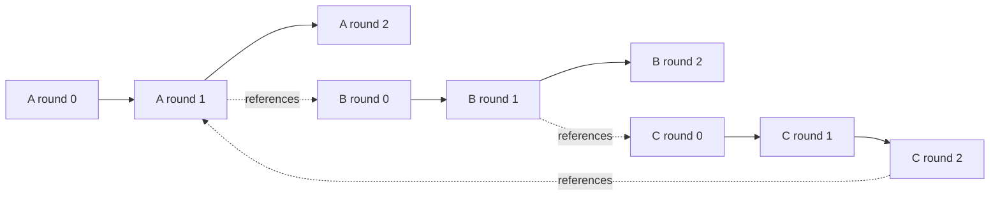

# Mixin Kernel Snapshots

A snapshot is the consensus envelope of Mixin Kernel. Transactions describe individual state transitions; a snapshot commits their hashes and position on one node's chain. Post-genesis snapshots carry a collective signature and undergo ledger validation before application. Short rounds group snapshots on each node chain, while cross-node round references connect those chains into the ledger DAG.

For the protocol model and its assumptions, see the [technical paper](./mixin-kernel-technical-paper.md). The transaction objects committed by snapshots are described in [Mixin Kernel Transactions](./mixin-kernel-transactions.md).

## Encoding and identity

Kernel snapshots use version `2` (`0x02`) deterministic binary encoding. A snapshot hash commits the payload but excludes its collective signature and the receiving node's local topological order. Conceptually:

$$
H_{snap} = \mathrm{BLAKE3}\bigl(
  \mathrm{Encode}(version, node, round, references, transactions, timestamp)
\bigr).
$$

The payload encoding includes the format header, counts, and a zero-valued CoSi mask in place of the omitted signature. The signed encoding and the RPC `hex` field therefore are not the bytes to hash directly when computing `H_snap`.

Transaction hashes are sorted bytewise before encoding; the decoder rejects duplicate or out-of-order hashes. A snapshot must contain at least one and at most 255 unique transaction hashes. A round-zero snapshot contains exactly one transaction and no round references. Every nonzero round has both round references. The decoder enforces these reference shapes.

The collective signature authorizes `H_snap`. Adding the signature after consensus therefore does not change the snapshot identifier.

## JSON representation

RPC methods return snapshots in the following shape. The values below are schematic placeholders rather than a complete ledger record.

```json
{
  "version": 2,
  "node": "<proposing node identifier>",
  "references": {
    "self": "<previous round hash on this node chain>",
    "external": "<round hash from another node chain>"
  },
  "round": 367849,
  "timestamp": 1788998400000000000,
  "transactions": [
    "<first transaction hash>",
    "<second transaction hash>"
  ],
  "hash": "<snapshot payload hash>",
  "signature": "<128 hex characters for signature followed by 16 for mask>",
  "topology": 10000000,
  "hex": "<encoded signed snapshot with topology>",
  "witness": {
    "signature": "<128 hex characters from the queried node>",
    "timestamp": 1788998401000000000
  }
}
```

| Field | Meaning | In `H_snap` |
| --- | --- | :---: |
| `version` | Snapshot encoding version, currently `2` | Yes |
| `node` | Network-scoped identifier of the proposing node | Yes |
| `references.self` | Hash of the preceding finalized round on the same chain | Yes |
| `references.external` | Hash of a finalized round on another chain | Yes |
| `round` | Proposer's round number | Yes |
| `timestamp` | Nanosecond Unix timestamp accepted by consensus | Yes |
| `transactions` | Canonically sorted transaction-hash list | Yes |
| `hash` | Computed BLAKE3 payload identifier | Computed |
| `signature` | 64-byte collective signature followed by a 64-bit mask, represented as 144 hex characters | No |
| `topology` | Local durable enumeration cursor | No |
| `hex` | Encoded stored snapshot, including signature and topology | No |
| `witness` | Serving-node signature over the encoded stored snapshot, plus a separately reported timestamp | No |

Round-zero records have `references: null`. Genesis records can have `signature: null`. `getsnapshot` includes the signature field and expands `transactions` into transaction objects. `listsnapshots` expands transactions and includes the signature field only when the respective options are requested. Its `hex` field still contains the stored signature bytes when the separate signature field is omitted.

## Transaction batching

A version 2 snapshot is a bounded batch commitment. Instead of running one collective-signature exchange for every transfer, Kernel can certify as many as 255 eligible transaction hashes with one snapshot signature.

Batching does not merge transaction semantics:

- Every transaction keeps its own payload hash, authorization envelope, inputs, outputs, and references.
- Before responding to a signing challenge, a participant obtains every transaction body and applies snapshot validation. Bodies obtained from the cache undergo common transaction validation; durable bodies reuse prior admission and receive the applicable kernel checks.
- A validator can report missing transaction hashes so the proposer sends only the bodies it lacks.
- Transactions in a batch validate against already materialized state; a transaction cannot depend on outputs first created during that same snapshot application.
- Snapshot application records the snapshot and applies each transaction's first local financial effects in one database transaction. An already finalized transaction's outputs and accounting are not applied again.
- A single-transaction snapshot of a batchable class follows the same per-transaction rules. Protocol operations that cannot be batched have additional singleton validation rules.

The following transaction classes may share a snapshot:

| Transaction class | May be batched |
| --- | :---: |
| Ordinary script transfer or storage transaction | Yes |
| Deposit | Yes |
| Withdrawal submit | Yes |
| Withdrawal claim | Yes |
| Mint | No |
| Node pledge, accept, or remove | No |
| Custodian update | No |
| Custodian slash; validation is unimplemented | No |

Consensus-sensitive transactions remain alone because they affect membership or protocol state used to validate later work. Their consensus-history index is committed separately after financial finalization.

If `C_c` is the coordination and collective-signature cost for one snapshot, `C_v` is the independent validation cost per transaction, and the snapshot contains `b` transactions, the amortized work is approximately

$$
C_{tx}(b) \approx C_v + \frac{C_c}{b} + C_{data}.
$$

Batching reduces the coordination term. It does not remove transaction dissemination, signature verification, or state access.

## Proposal and finalization

Each accepted node leads proposals on its own chain. A proposer sets the batch, current round, self and external references, and timestamp, then asks the timestamp-appropriate consensus set to certify the payload. A pledging candidate also proposes its own round-zero acceptance snapshot; that signing set includes the candidate as well as the eligible existing nodes.

The normal collective-signing path is:

```text
proposer announcement with commitment pair
    → validator commitment pairs and missing-transaction requests
    → aggregate challenge, leader response, and requested bodies
    → validator responses
    → aggregate collective signature
    → finalization broadcast and durable application
```

For a stable set of `n` consensus nodes, the signature threshold is:

$$
q(n) = \left\lfloor \frac{2n}{3} \right\rfloor + 1.
$$

The threshold function uses timestamp-dependent membership and returns an unusable threshold of 1,000 when its effective base has fewer than seven nodes. Non-genesis accepted signers ordinarily require more than 12 hours of maturity; their entry into the threshold base follows a separate 30-second rule. The signer mask supports 64 indexes, while node admission caps membership at 50. The technical paper describes the pending-node and historical membership rules that accompany this steady-state formula.

Before producing a response, a participant checks the snapshot's shape, proposer, timestamp, round position, references, transaction availability, and applicable transaction rules. It also verifies the challenge and leader response against the signing session. The leader checks individual responses and the aggregate signature. Prepublished nonce pairs permit a full-challenge path that supplies the same signing context without a fresh announcement/commitment round trip; the full challenge carries a separate leader signature over its payload.

Before applying a received finalization, a node verifies:

1. The snapshot version, payload hash, proposing node, timestamp, and round number.
2. The self and external references against its round graph.
3. The historical membership and public-key set applicable at the snapshot timestamp.
4. The signer mask, collective signature, and required threshold.
5. The presence of every transaction body, using common validation for cached bodies and prior-admission reuse for durable bodies.
6. Multi-transaction batching eligibility and transaction uniqueness.
7. UTXO locks, protocol state, and duplicate-finalization rules.

Certificate verification reconstructs membership from the snapshot timestamp. During the acceptance window, it can also try an earlier, larger membership and its threshold. Finalized-history validation contains timestamp- and mint-batch-dependent exceptions described in the technical paper; it does not apply every current proposal check to every historical certificate.

If a finalization arrives before all transaction bodies, it remains pending while the node requests them. Proposers and synchronization send cache-only transaction bundles before finalizations; those bundles do not schedule proposals. An individually requested body uses the ordinary transaction message and can also enter the proposal queue. The snapshot is applied only after the required validation succeeds.

Durable candidate locks and envelopes precede finalization. They normally share one candidate commit, with per-transaction fallback when the batch exceeds the database limit. Requeueing a failed proposal restores scheduling records for available unfinalized transactions; it does not release durable input or ghost-key reservations. Finalization and candidate persistence are separate commits.

## Rounds

Every accepted node has an independent sequence of numbered rounds. The current cache round collects finalized snapshots; when it closes, it becomes a final round and the node starts the next cache round. The round-zero acceptance of a pledging node establishes its initial chain state.

All snapshots in one round occupy a time span shorter than the configured three-second round gap:

$$
end_r < start_r + 3\,\mathrm{s}.
$$

A round may contain several snapshots, and a nonzero-round snapshot may contain several transactions. Snapshots within a round cannot duplicate timestamps or transaction hashes and must remain within the same Unix day. The local scheduler uses a 2.4-second proposal cutoff, while received snapshots are checked against the three-second round gap. Neither number is an end-to-end transaction-finality promise.

To compute a final round hash, snapshots are sorted by `(timestamp, snapshot hash)`. For node `N`, round number `r`, and sorted snapshot hashes `s_1 ... s_k`, the implementation computes:

$$
h_0 = \mathrm{BLAKE3}(N \parallel \mathrm{BE64}(r)),
$$

$$
h_i = \mathrm{BLAKE3}(h_{i-1} \parallel s_i), \qquad H_{round}=h_k.
$$

This commits the node, round number, and complete canonical snapshot sequence.

## The cross-referenced DAG

Snapshots in a nonzero round carry two round hashes:

- `self` points to the previous finalized round on the proposer's own chain;
- `external` points to a finalized round produced by another accepted node.

The self reference commits the preceding self round. External references connect knowledge among chains, and external link positions cannot move backward. Proposal validation checks known external rounds and their timestamp/freshness constraints. Certified replay uses non-strict reference checks: missing external data can defer finalization, while the quorum certificate supplies the historical authorization for proposal-time conditions that are not repeated.


```mermaid
flowchart LR
    A0[A round 0] --> A1[A round 1] --> A2[A round 2]
    B0[B round 0] --> B1[B round 1] --> B2[B round 2]
    C0[C round 0] --> C1[C round 1] --> C2[C round 2]

    A1 -. references .-> B0
    B1 -. references .-> C0
    C2 -. references .-> A1
```

Solid arrows show each chain's progression; dotted arrows point from a referencing round to the round it references. Rounds do not receive a second independent vote. Their integrity follows from deterministic hashing of certified snapshots and from subsequent certified snapshots committing their round references.

## Topological order

After verifying a snapshot, each node assigns it the next local `topology` value and stores it. This sequence provides an efficient pagination and synchronization cursor and drives local snapshots-per-second and transactions-per-second statistics.

Topological order is deliberately not part of the snapshot payload hash or collective signature. Correct nodes can receive independent finalized snapshots in different orders and assign different topology values while agreeing on the snapshot hashes, round histories, and ledger state. Do not treat a topology value as a globally agreed block height.

The RPC `witness.signature` signs `BLAKE3(stored snapshot encoding)`, including the local topology value. The separately returned `witness.timestamp` is not covered by that signature and does not establish cryptographic freshness. A witness is one serving node's attestation; the collective certificate and ledger validation supply the consensus evidence.

## Querying snapshots and rounds

Retrieve one snapshot by its payload hash:

```bash
./mixin --node http://127.0.0.1:6860 \
  getsnapshot --hash SNAPSHOT_HASH
```

Page through the local topology sequence:

```bash
./mixin --node http://127.0.0.1:6860 \
  listsnapshots --since 1 --count 10 --sig --tx
```

- `--since` is the inclusive local topological cursor.
- `--count` accepts at most 500 snapshots, with or without expanded transactions; its default is 10. A count of zero returns an empty list.
- `--sig` includes the separate collective-signature field. The encoded `hex` and `witness` fields are returned independently of this option.
- `--tx` replaces transaction hashes with expanded transaction objects.

To continue a page without repeating its last record, use that record's `topology + 1` as the next `--since` value. Nanosecond timestamps and topology values are integers that clients must preserve without floating-point rounding.

Inspect the round containing graph context:

```bash
./mixin --node http://127.0.0.1:6860 \
  getroundbynumber --id NODE_ID --number ROUND_NUMBER

./mixin --node http://127.0.0.1:6860 \
  getroundbyhash --hash ROUND_HASH
```

Round queries return `node`, `hash`, `number`, `start`, `end`, `references`, and `snapshots`. A node ID can also identify its current head record: that record uses the node ID as `hash`, and `start` and `end` contain its stored timestamp rather than a closed round's computed interval. It may contain no snapshots yet. Closed round queries use the computed round hash and interval.

The exact HTTP parameter order and result envelopes are documented in [Remote Procedure Calls](./remote-procedure-calls.md).
