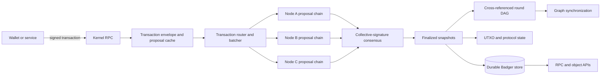
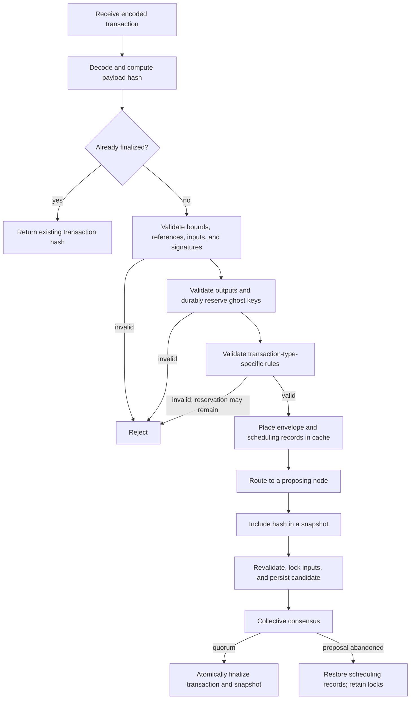
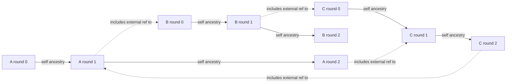
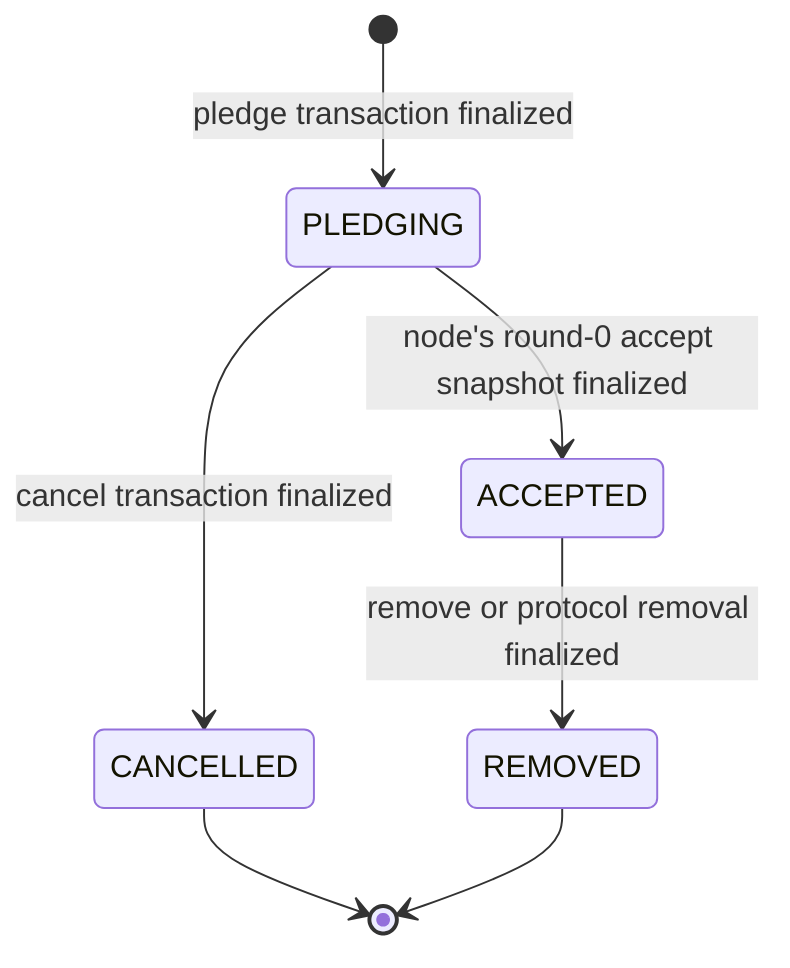
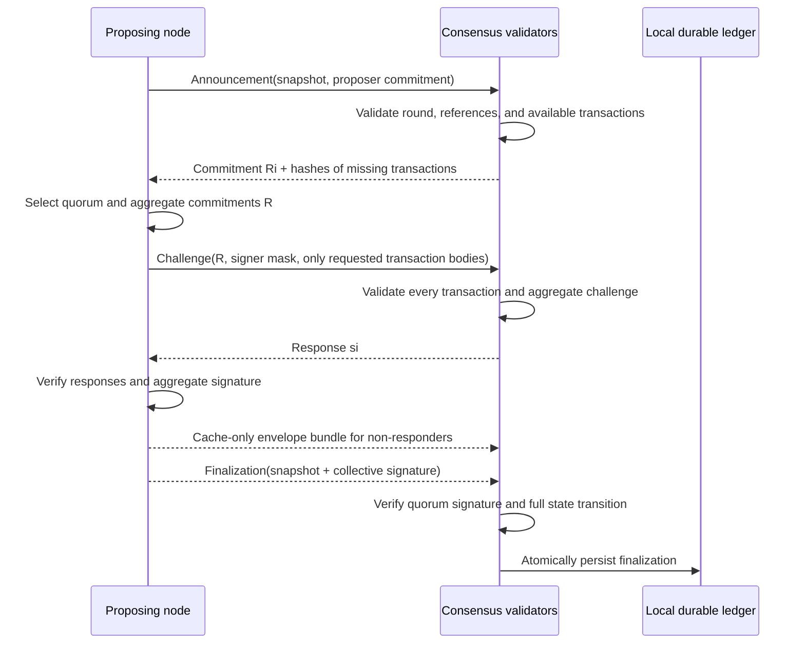
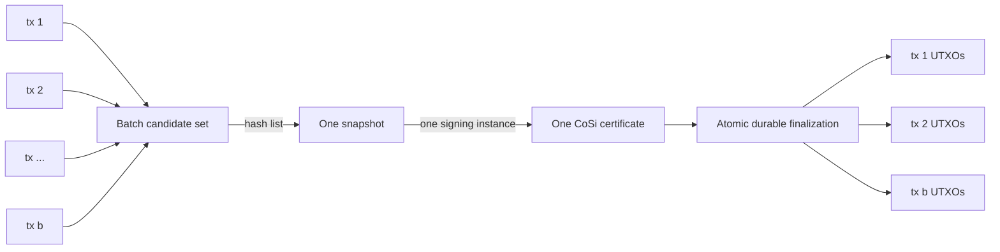

# Mixin Kernel: A Fast BFT-DAG Distributed Ledger

> A technical introduction to the architecture, data model, and consensus protocol
>
> July 2026, aligned with the v0.19 implementation

## Abstract

Mixin Kernel is a distributed ledger for digital assets that combines a UTXO state model, per-validator chains, a cross-referenced directed acyclic graph (DAG), and Byzantine-fault-tolerant collective signing. It does not wait for one global block producer. Accepted nodes propose snapshots concurrently on their own chains, while every post-genesis snapshot is finalized by a supermajority signature from the active consensus set. Short, hash-linked rounds summarize each node's history and reference rounds produced by other nodes, joining the independent chains into a common graph.

A snapshot commits a bounded batch of transaction hashes. Up to 255 eligible transactions can share one snapshot hash and one collective-signing instance. Each transaction still has its own authorization, UTXO validation, conflict protection, and finalization record; only the coordination and collective-signature work is shared. This separation gives Kernel both individual transaction auditability and efficient group finalization.

This paper develops the system from first principles: transactions describe state transitions, snapshots carry consensus, rounds organize each node's history, external references form the DAG, and collective signatures provide finality. It then follows the same objects through networking, persistence, synchronization, and recovery. The paper describes the implementation in this repository rather than defining a separate wire-protocol standard. Numeric limits are implementation parameters, and the quorum discussion is a security rationale rather than a formal proof or audit.

## 1. System at a glance

The simplest mental model is a set of parallel ledger lanes, one for each accepted node. A node groups validated transactions into a snapshot and asks the consensus set to certify that snapshot. Certified snapshots accumulate in short rounds on the node's lane. Each non-initial round points both to the preceding round on the same lane and to a round on another lane, weaving all lanes into one verifiable graph.

Mixin Kernel separates asset state, consensus envelopes, and graph structure:

- A **transaction** is a deterministic UTXO state-transition request.
- A **snapshot** commits one or more transaction hashes and receives a collective signature.
- A **round** groups a short interval of snapshots produced by one node.
- A **node chain** is the ordered sequence of that node's rounds.
- External round references connect all node chains into a **BFT-DAG**.
- A local **topological order** gives stored snapshots an efficient enumeration and synchronization cursor; it is not part of the consensus-signed snapshot payload.



The durable ledger state can be viewed as a tuple

$$
\mathcal{L} = (U, G, D, M, N, C, S, R),
$$

where $U$ is the UTXO set, $G$ the used ghost-key set, $D$ deposit locks, $M$ mint state, $N$ node membership, $C$ custodian state, $S$ finalized snapshots, and $R$ the round graph. Some conflict and ghost-key reservations are written durably during admission, before consensus. A finalized snapshot supplies the Byzantine agreement and atomic application step for the resulting ledger transition.

## 2. System and fault model

### 2.1 Participants

Clients create and sign transactions. Kernel nodes validate transactions, propose snapshots, participate in collective signing, persist the graph, and serve synchronization and RPC requests. A node may also operate as a relayer for nodes that do not accept inbound connections.

Consensus membership is ledger-managed rather than open per message. Genesis establishes the first accepted nodes. Later membership changes use special pledge, accept, cancel, and remove transactions that themselves pass through consensus. An address used as a node signer determines the network-scoped node identifier; a separate payee address separates consensus authority from reward ownership.

### 2.2 Assumptions

The implementation is designed around the usual Byzantine quorum assumption: fewer than one third of the effective consensus members may be faulty. For a stable consensus set of $n$ nodes, the threshold is

$$
q(n) = \left\lfloor \frac{2n}{3} \right\rfloor + 1.
$$

The concrete threshold function reconstructs a **threshold base** from membership records strictly earlier than the snapshot timestamp. Genesis nodes count immediately. A later accepted node enters that base after the 30-second reference window (`10` reference rounds times the three-second round gap), but its public key does not enter the ordinary `ConsensusKeys` signer list until `ConsensusReady` becomes true more than 12 hours after acceptance. During the last 90 seconds before a pending node reaches its minimum 12-hour acceptance time, that pledging node can also increase the non-final proposal threshold; it is not counted in the threshold used to verify a final certificate. These transition rules can temporarily demand a larger quorum from the still-mature signer set, rather than granting a new key early.

If the reconstructed threshold base has fewer than seven nodes, `ConsensusThreshold` returns the deliberately unusable sentinel `1000`; otherwise it returns $\lfloor 2n/3\rfloor+1$. Membership, signer-key, and threshold calculations are timestamp-aware so that certificates are checked against historical ledger state rather than only the node's current membership view.

Safety requires honest nodes not to sign conflicting valid snapshots under the same protocol conditions. Progress additionally requires eventual message delivery among enough honest nodes, usable clocks within the protocol's timestamp checks, and enough available nodes to form a quorum. In other words, the implementation targets safety under asynchronous delay and liveness after the network becomes sufficiently synchronous; a fixed wall-clock finality guarantee is not implied.

### 2.3 Cryptographic and encoding foundations

Transactions use encoding version `0x05`; snapshots use version `0x02`. Both use a deterministic binary encoder. BLAKE3 produces transaction, snapshot, round, network, and message identifiers where the corresponding code path calls for it. Signatures and public keys use Edwards25519 group operations. The Schnorr and CoSi Fiat-Shamir challenge scalars are derived with SHA-512, following the Edwards25519 convention; the ghost-key derivation scalar $H_s$ uses BLAKE3. Address hashes and checksums use SHA3-256.

The distinction between payload and envelope is important:

$$
H_{tx} = \mathrm{BLAKE3}\bigl(\mathrm{EncodeUnsigned}(tx)\bigr),
$$

$$
H_{snap} = \mathrm{BLAKE3}\bigl(\mathrm{EncodePayload}(snapshot)\bigr).
$$

Here, $\mathrm{EncodeUnsigned}$ omits transaction authorization signatures, while $\mathrm{EncodePayload}$ omits the snapshot's collective signature body and local topological order. The payload encoder writes a fixed zero-valued mask field in place of the omitted signature. That zero field is part of the hashed payload and makes the unsigned layout deterministic; the real signer mask and 64-byte signature body do not affect the hash.

Signatures authorize stable content identifiers. They do not recursively change the identifiers they sign.

These identifiers connect the protocol layers in one continuous commitment path:

```text
transaction payload → transaction hash → snapshot payload → snapshot hash
                    → quorum certificate → round hash → cross-referenced DAG
```

## 3. Transactions

### 3.1 UTXO model

A Mixin transaction consumes existing outputs and creates new outputs of one declared asset. Its principal fields are:

| Field | Meaning |
| --- | --- |
| `version` | Binary transaction format; version 5 |
| `asset` | 32-byte identifier shared by every input and output |
| `inputs` | Ordinary UTXO references or special genesis, deposit, or mint inputs |
| `outputs` | Amounts, output types, threshold scripts, ghost keys, and masks |
| `references` | Finalized transactions referenced without spending their outputs |
| `extra` | Application or protocol data |
| signatures | Per-input signature maps or one aggregate signature plus signer indexes |

Authorization is envelope data rather than transaction identity. Because $H_{tx}$ omits the signature maps or aggregate signature, two differently authorized envelopes for the same unsigned payload have the same transaction hash. Cache and durable transaction records are keyed by that payload hash and retain one encoded authorization envelope for validation.

Amounts use integer arithmetic with eight decimal places. For every post-genesis transaction that passes the normal validator, conservation is exact:

$$
\sum_{i \in Inputs} amount(i) = \sum_{o \in Outputs} amount(o).
$$

There is no floating-point balance calculation in consensus validation. Ordinary inputs obtain their amount and asset from finalized UTXOs; deposit and mint inputs carry the amount that must be reproduced by their outputs. Genesis allocations are constructed and loaded through the separate genesis path rather than `VersionedTransaction.Validate`.

An ordinary input identifies an earlier output by `(transaction hash, output index)`. Special inputs represent genesis allocation, an externally observed deposit, or a mint distribution. Output types also encode protocol operations such as withdrawal, node membership, and custodian updates.

### 3.2 Threshold scripts and ghost keys

The standard script has the three-byte form `ff fe T`, where the format accepts a threshold byte from 0 through 64. An output may contain several public keys, and script evaluation requires signatures from at least $T$ of them. The format check does not require $T$ to be no greater than the key count; such scripts can deliberately be unspendable. Also, the ordinary-input verification path still requires verifiable signature entries before its batch equation, so `T = 0` is not a general signature-free spending mode.

Outputs use one-time, recipient-derived **ghost keys**. Let $A=aG$ be the recipient's public view key, $B=bG$ the public spend key, $r$ sender-generated randomness, $R=rG$ the published output mask, and $j$ the output index. The sender derives

$$
x = H_s(rA, j), \qquad P = B + xG.
$$

The recipient obtains the same scalar from $aR=rA$ and derives the one-time private spend key

$$
p = b + H_s(aR, j).
$$

The view key can identify and inspect outputs, while spending also requires the spend key. Ghost keys reduce address reuse on the ledger, but amounts and asset identifiers are not confidential in this implementation; ghost addressing should not be confused with a full confidential-transaction system.

### 3.3 Validation pipeline

Before a transaction can participate in a snapshot, a node checks all of the following:

1. The version and inferred transaction type are supported.
2. Input, output, reference, extra-data, decoded-envelope-size, and unsigned-payload-size limits are respected.
3. Every ordinary input exists, belongs to the declared asset, is unique within the transaction, and is not locked by a conflicting unfinalized transaction.
4. The signature indexes satisfy each input script and the signatures verify over $H_{tx}$.
5. Outputs have positive amounts, valid scripts and masks, valid unique ghost keys, and exactly conserve value.
6. Referenced transactions exist and are finalized.
7. Type-specific rules for deposits, minting, withdrawals, membership, and custodian operations hold.

Transaction authorization can use per-input signature maps or a compact aggregate signature across selected input keys. Ordinary signatures in a transaction are checked together through an Edwards25519 batch-verification equation. These mechanisms reduce authorization overhead inside one transaction, while snapshot batching amortizes consensus overhead across many transactions.

Ghost-key reservation and spend-conflict locking occur at different stages. Output validation calls `LockGhostKeys`, including during initial RPC admission and later queue revalidation, so a successfully checked ghost key is already reserved in the synchronized snapshot database before the envelope is placed in the transient cache. During snapshot announcement the node validates again, writes the ordinary-input, deposit, or mint lock, and then stores the full transaction envelope in another durable transaction. New spendable UTXOs and the transaction-to-snapshot finalization record are created only when the snapshot is committed.

These candidate writes survive a crash and there is no general unlock operation. Requeueing restores only cache queue/order records; it does **not** release input or ghost-key locks. Retrying the same payload reuses its idempotent locks. On the finalized conflict path, `fork = true` may replace an ordinary-input, deposit, or mint lock and prune the superseded unfinalized durable envelope. A ghost key remains bound to the transaction that first reserved it, apart from narrowly hard-coded historical compatibility exceptions. Because reservation, later type-specific validation, cache insertion, input locking, and envelope persistence are separate commits, transaction admission itself is not one atomic write; Section 12 records the resulting failure boundary.



### 3.4 Transaction classes and batching eligibility

The transaction type is inferred from special inputs or output types rather than trusted as a separate caller-provided field.

| Transaction class | Purpose | Multi-transaction snapshot |
| --- | --- | :---: |
| Script | Ordinary UTXO transfer or storage transaction | Yes |
| Deposit | Introduce an externally observed asset deposit | Yes |
| Withdrawal submit | Request an external withdrawal | Yes |
| Withdrawal claim | Finalize withdrawal accounting | Yes |
| Mint | Create a protocol mint distribution | No |
| Node pledge, cancel, accept, remove | Change consensus membership | No |
| Custodian update or slash | Change custodian protocol state | No |

Consensus-sensitive transactions remain alone in a snapshot. They form a serialized reference chain and can change the rules or participants used to validate later snapshots. Mixing them with unrelated transfers would make membership boundaries and protocol-state transitions harder to evaluate deterministically.

Once a transaction has passed these rules, the snapshot layer can treat its hash as a compact commitment to the complete state-transition request.

## 4. Snapshots

### 4.1 Consensus envelope

A snapshot is the object on which Kernel consensus operates. Version 2 contains:

| Field | Meaning | In payload hash |
| --- | --- | :---: |
| `version` | Snapshot format | Yes |
| `node` | Proposing node's network identifier | Yes |
| `round` | Proposer's round number | Yes |
| `references.self` | Hash of the proposer's preceding finalized round; absent on an initial round | Yes |
| `references.external` | Hash of another node's finalized round; absent on an initial round | Yes |
| `transactions` | Canonically sorted, unique transaction hashes | Yes |
| `timestamp` | Proposer timestamp accepted by signers | Yes |
| `signature` | Collective signature and signer bit mask | No |
| `hash` | Computed snapshot identifier | Computed |
| `topology` | Local durable enumeration cursor | No |

The canonical transaction list contains between 1 and 255 hashes and is strictly sorted, so duplicate hashes are rejected. The encoder additionally requires a round-zero snapshot to contain exactly one transaction because round zero is used for a node's initial acceptance path. The current decoder does not mirror that round-zero count check; this audit gap is described in Section 12 and must not be interpreted as a second valid wire form.

If the sorted transaction hashes are $t_1,\ldots,t_b$, then conceptually

$$
H_{snap}=\mathrm{BLAKE3}\Bigl(
  \mathrm{Encode}(v, node, round, refs, t_1,\ldots,t_b, timestamp)
\Bigr).
$$

The collective signature is over $H_{snap}$, so one quorum decision covers the entire list without placing all transaction bodies inside the signed snapshot.

### 4.2 Transaction batching

A snapshot is a bounded commitment to a set of transactions. The cache stores transaction envelope bytes separately from the queue and ordering records that make a transaction eligible for proposal. RPC submissions and ordinary P2P transaction bundles enter both layers. Envelopes carried inside a challenge or a proactive finalization-class bundle enter only the envelope cache, preventing those delivery paths from creating a redundant local proposal. There is one fallback exception: an envelope returned in response to an individual transaction request uses the ordinary single-transaction message and therefore enters the proposal queue as well as the envelope cache.

The cache worker is both timer- and event-driven. It waits at most one third of the round gap, wakes immediately for incoming queued bundles or explicit retries, then applies a 50 ms debounce so nearby arrivals can batch together. One retrieval returns at most 255 distinct available candidates and consumes the queue and order records that it inspected; while a retrieval returns the full 255, the worker immediately drains another. Each candidate is checked for prior finalization and revalidated against ledger state, consensus-sensitive operations are separated, and eligible transaction hashes are accumulated. Section 7.1 describes how the resulting candidate set is assigned to a proposal chain.

The queue intends to keep a batch below two thirds of the 32 MiB transport-message ceiling, leaving framing and relay headroom. However, its `ValidatedSize` counter is the unsigned `PayloadMarshal` length, while P2P bundles carry the larger signed `Marshal` envelope. The current check therefore does not prove that a challenge or finalization bundle fits the target—or even the transport maximum—and Section 12 records this as an implementation gap.

Transaction batching is constrained by several invariants:

- Every transaction retains its own payload hash, authorization envelope, inputs, and outputs and is validated independently.
- Only explicitly batchable transaction classes may appear when a snapshot contains more than one hash.
- A new transaction in a batch cannot spend an output created by another transaction in that batch; each candidate validates against already materialized ledger state.
- Every signer whose response is counted must have and validate every transaction before responding to the challenge.
- A participant reports precisely which transaction hashes it lacks; the proposer sends only those bodies in the normal challenge path.
- Receiving a challenge or finalization-class transaction bundle stores the bodies without scheduling them as a new proposal.
- A receiving node that sees a valid finalization before receiving all bodies requests the missing transactions and delays application.
- Dequeuing removes scheduling metadata but retains the cached envelope; a retry restores queue metadata, retains durable locks, and wakes the worker.
- Durable snapshot application finalizes all included transactions in one Badger write transaction.
- A one-transaction snapshot of a batchable class follows the same per-transaction ledger and finality semantics as a larger batch; non-batchable protocol classes are intentionally restricted to the one-transaction form.

The main gain is amortization. If $C_c$ is the coordination and collective-signature cost for a snapshot, $C_v$ the average independent transaction-validation cost, and $b$ the batch size, the average work per transaction is approximately

$$
C_{tx}(b) \approx C_v + \frac{C_c}{b} + C_{data},
$$

where $C_{data}$ represents unavoidable transaction dissemination and storage. Batching makes $C_c/b$ small; it does not eliminate signature validation, state access, or transaction bytes.

## 5. Rounds and the ledger DAG

### 5.1 Per-node rounds

Every accepted node owns a logical chain of numbered rounds; a pledging candidate also has a chain for its prospective round-zero acceptance. The live round is a **cache round** that collects finalized snapshots. Once it closes, it becomes a **final round**, and a new cache round starts.

Snapshots in one round must occupy a time span shorter than the configured three-second round gap:

$$
end_r < start_r + \Delta, \qquad \Delta = 3\,\mathrm{s}.
$$

A round can therefore contain several separately finalized snapshots, and each snapshot may contain several transactions. The round boundary is a graph and synchronization unit, not the transaction batch itself.

The local proposal scheduler uses a stricter cutoff than the consensus gap: after four fifths of the gap from the first snapshot in a live round, it defers new local work to a later attempt. This 2.4-second scheduling cutoff leaves time to complete CoSi before the round boundary; it is a liveness policy, not a different validity rule for received snapshots.

### 5.2 Round commitment

To compute a final round hash, snapshots are sorted by `(timestamp, snapshot hash)`. Let $s_1,\ldots,s_k$ be the resulting snapshot hashes. The implementation computes

$$
r_0 = \mathrm{BLAKE3}\bigl(nodeId \parallel \mathrm{BE64}(roundNumber)\bigr),
$$

$$
r_i = \mathrm{BLAKE3}\bigl(r_{i-1} \parallel s_i\bigr), \qquad
H_{round}=r_k.
$$

This construction commits to the node, round number, and complete canonical snapshot sequence. A finalized round record stores its hash, node, number, start timestamp, and references.

### 5.3 Self and external references

When a node starts round $r+1$, its snapshots carry two round references:

- `self` points to that node's finalized round $r$;
- `external` points to a recent valid round produced by another accepted node.

The self edge makes each node history append-only. The external edge merges knowledge across histories and turns the collection of chains into a DAG. External link numbers may advance but not move backward. Proposal validation requires a known round from another node and applies timestamp and staleness sanity checks. Replay of an already certified snapshot uses a non-strict reference path: it still requires a known, non-self, non-regressing external link, but skips those proposal-time sanity checks and relies on the historical quorum certificate for the stricter decision.



In the diagram, solid arrows point from a parent round to its child within the same chain. Dotted arrows point from a round that **includes** an external reference toward the **referenced** (earlier) round on another chain. Consensus finalizes snapshots independently, while these edges record causal graph progress and give synchronization a compact way to compare histories.

The graph is directed because every reference has a source and target, and it remains acyclic because a new round can reference only rounds that are already finalized while external link positions never move backward. Rounds do not receive a separate consensus vote: their integrity comes from deterministic hashing of quorum-certified snapshots and from later certified snapshots committing the round references.

### 5.4 Topological order is a storage cursor

After a snapshot is verified and accepted, each node increments a local topological sequence and writes the snapshot at that position. This order supports pagination, statistics, and graph synchronization. It is intentionally excluded from $H_{snap}$ and from the collective signature.

Consequently, finality is defined by the signed snapshot and its valid round position—not by agreement on one universal topological number. Two correct nodes may receive independent finalized snapshots in different orders and assign different local cursor values while agreeing on every snapshot, transaction, and round commitment.

## 6. Nodes and networking

### 6.1 Node identity

Each node has an address containing public spend and view keys. The signer spend key authenticates P2P messages and participates in collective signatures. The identifier is scoped to the genesis-derived network:

$$
NodeId = \mathrm{BLAKE3}\bigl(NetworkId \parallel AddressHash\bigr),
$$

$$
AddressHash = \mathrm{SHA3\text{-}256}\bigl(publicSpendKey \parallel publicViewKey\bigr),
$$

$$
NetworkId = \mathrm{BLAKE3}\bigl(\mathrm{JSON}(genesis)\bigr).
$$

Scoping prevents a signer identity from being confused across two Kernel networks with different genesis definitions.

### 6.2 Membership lifecycle

The durable membership states are `PLEDGING`, `ACCEPTED`, `CANCELLED`, and `REMOVED`.



A new node pledges XIN and publishes signer and payee public spend keys; their public view keys are derived deterministically. Its acceptance is unusual: the new node proposes an initial round-zero snapshot, the existing consensus nodes collectively approve it, and the new node also participates in that round-zero signing set. The accept transaction must carry a Schnorr signature verifiable by the pledged signer public key, providing proof of possession before that non-genesis key is accepted. Non-genesis accepted nodes then mature for more than 12 hours before `ConsensusReady` allows them to sign ordinary snapshots. Membership operations are subject to additional timing and serialization rules so that all nodes reconstruct the same historical signer set for a snapshot timestamp.

Membership is bounded by the following controls:

| Control | Value |
| --- | ---: |
| Pledge amount | 13,439 XIN |
| Minimum usable threshold base | 7 |
| Maximum Kernel nodes | 50 |
| Delay before an accept or cancel operation | At least 12 hours |
| Maximum pending acceptance period | 7 days |
| Delay before a non-genesis accepted node can sign ordinary snapshots | More than 12 hours |

The 50-node membership cap leaves headroom below the 64 indexes available in the collective-signature mask.

### 6.3 One chain per node

Every Kernel process tracks a `Chain` object for each active or historically relevant node. Each chain maintains:

- the active cache round and preceding final round;
- recent round history and external-link positions;
- pending and finalized snapshot queues;
- collective-signature aggregators, verifiers, commitments, and responses;
- work and storage-accounting aggregation state.

The local node actively proposes on its own chain and verifies remote proposals on the corresponding remote chains. Separate processing loops let chains advance concurrently, while durable writes serialize the state changes that must be atomic.

### 6.4 P2P transport and relaying

P2P streams use QUIC with TLS transport encryption. The TLS configuration uses an ephemeral self-signed certificate, so certificate PKI does not define node identity. Connecting consumers instead present a timestamped authentication message signed by their node signer, and protocol-critical messages are checked against ledger-known signer keys. The protocol supports directly connected relayers and consumers, plus forwarding through known relayers when the destination is not a direct neighbor.

Messages have high- and normal-priority queues, bounded sizes, and short-lived deduplication records. Consensus messages include announcements, nonce commitments, challenges, responses, finalizations, transaction requests, transaction bundles, and signed graph summaries. The current wire protocol always uses the batch-capable announcement, commitment, challenge, response, and finalization forms, even when a snapshot contains one transaction; the legacy single-transaction CoSi message forms have been removed. The maximum transport message is 32 MiB.

Transaction bundles have two scheduling semantics. An ordinary bundle stores each unfinalized envelope, adds it to the receiver's proposal queue, and wakes that queue. A finalization-class bundle stores envelopes in the cache without scheduling them. Proposers and graph synchronization use the latter immediately before sending a finalization so the receiver can validate the snapshot without accidentally proposing the same transactions itself. As noted in Section 4.2, an individually requested fallback body currently returns through the ordinary single-transaction path.

### 6.5 Graph synchronization

Nodes periodically exchange graph messages containing sync points for each chain's node ID, final round number, and final round hash. These messages carry a sender signature, which is checked when the sender is a ledger-known accepted or pledging node. A node compares the remote graph with its local graph, finds an earlier local topological cursor, and streams finalized snapshots forward. For every synchronized snapshot it sends the transaction envelopes first in a cache-only finalization-class bundle and then sends the signed snapshot. It also sends the head rounds for individual chains in the same transaction-first order so a lagging peer can close gaps without replaying the entire ledger.

Synchronization reuses the same finalization verification path as live consensus. A peer does not trust a snapshot merely because another node sent it: it verifies the collective signature, historical signer set, round and reference rules, transaction bodies, and state transition before persistence.

## 7. Collective-signature consensus

### 7.1 Proposal model

There is no single network-wide leader slot. A node leads snapshots on its own chain, and concurrent node chains allow multiple proposals to be in flight without placing every transfer behind one producer. Mint, node-pledge, node-remove, and custodian update/slash transactions use the deterministic type-specific owner election in `electSnapshotNode`. A node-accept transaction instead originates on the candidate's own round-zero chain, while cancel follows its own membership workflow; it is therefore too broad to describe every membership operation as using the same election function.

Ordinary transaction routing is readiness-aware and normally selects one temporary proposal owner. From the locally known working set, the router keeps chains whose cache round is initialized and whose timestamp can still fit the current round or advance through a valid external reference. The local chain has two additional requirements: a quorum of graph reports must show that its head has been broadcast, and a quorum must show that it is not behind. Among ready chains, the first eight bytes of the transaction hash plus the current round-gap time bucket select one owner. If the local node is selected, it keeps the batch instead of forwarding it elsewhere; otherwise it sends one ordinary transaction bundle to the selected node. If no chain appears ready, a minute-rotating fallback chooses an accepted node and may also include a recently advancing head.

This owner selection is a queueing heuristic, not a consensus election. Nodes may have different readiness views, retries may choose a later owner, and fallback routing can duplicate delivery. Safety still comes from transaction conflict checks, per-chain duplicate guards, and quorum validation of every snapshot.

The snapshot leader first fixes the transaction hashes, round references, and timestamp. Validators sign only after reconstructing and validating the complete snapshot payload.

### 7.2 CoSi exchange

The normal collective-signing path is:



Validators can pre-publish nonce commitments. When the proposer has a usable precommitment, it can begin with a full challenge rather than waiting for a fresh announcement/commitment round trip. Each nonce handle is single-use: the first aggregate challenge permanently binds it, an identical retry may reuse the cached response, and a different challenge is rejected to prevent private-key disclosure. Consumed commitment keys and snapshot-to-nonce retry bindings are retained in bounded insertion-order histories; the consumed nonce itself is removed from the active precommitment pool.

Proposal state is deliberately disposable, but transaction work is not. A local aggregator associates each transaction hash with its verifier, suppressing another proposal for that transaction on the same chain and round during the round-gap window. Recoverable self-announcement deferrals—such as graph-readiness, stale timestamp, round-cutoff, or external-reference refresh—return available, still-unfinalized transactions to the queue. Kernel does the same when a self-announcement cannot enter a full local action queue, aggregation reaches a terminal error, or an aggregator remains incomplete for one round gap. A round transition similarly deduplicates and requeues transactions owned only by discarded old-round aggregators while leaving the snapshot that triggered the new round under its new owner.

Late commitments for an expired aggregator are ignored. If a candidate batch overlaps an existing verifier, only the unowned companion transactions are requeued; the already-owned hashes remain with their active proposal. These rules avoid both transaction loss and a hot loop of duplicate proposals without changing any snapshot validity or quorum requirement.

### 7.3 Signature construction

Let $G$ be the group base point. For signer $i$, let $a_i$ be its private key, $A_i=a_iG$ its public key, and $r_i$ a fresh nonce with commitment $R_i=r_iG$. For the selected quorum $Q$:

$$
R = \sum_{i\in Q} R_i, \qquad A_Q = \sum_{i\in Q} A_i,
$$

$$
c = \mathrm{Scalar}\!\left(\mathrm{SHA512}\bigl(R \parallel A_Q \parallel H_{snap}\bigr)\right),
$$

$$
s_i = r_i + c a_i \pmod \ell, \qquad s = \sum_{i\in Q} s_i.
$$

Verification checks

$$
sG = R + cA_Q.
$$

The final snapshot carries one 64-byte signature and one 64-bit signer mask, rather than an array of validator signatures. The mask represents at most 64 consensus indexes, while membership admission imposes a lower 50-node cap. Supporting a larger set would require a wider signer-set encoding.

### 7.4 Quorum and Byzantine intersection

For a stable $n=3f+1$ membership with threshold $q=2f+1$, any two quorums intersect in at least

$$
|Q_1\cap Q_2| \ge 2q-n = f+1
$$

members. Since at most $f$ are Byzantine, the intersection contains at least one honest signer. If honest nodes refuse conflicting snapshots, two conflicting quorum certificates cannot both be formed. This is the core quorum-intersection rationale; complete safety also depends on deterministic transaction validation, correct historical membership reconstruction, nonce safety, and enforcement of the round rules.

The CoSi aggregate public key is a plain sum $A_Q = \sum A_i$ without per-signer key-prefixing coefficients. For a non-genesis member, the pledge commits the proposed key and the later accept transaction must be signed by that key before acceptance, so admission supplies the proof of possession needed to rule out a freely chosen rogue key. Genesis signer keys are instead part of the trusted genesis definition and must be vetted under that trust assumption. The transaction-level aggregate signature, where signer keys come from arbitrary UTXO outputs, does apply MuSig-style coefficient weighting.

### 7.5 Finalization checks

A received finalization is not applied until the node verifies:

1. Snapshot encoding, payload hash, proposer identity, timestamp, and round range.
2. Self and external round references against the local graph.
3. The historical consensus public-key set at the snapshot timestamp.
4. A collective signature whose mask meets the computed threshold.
5. Presence and validity of every transaction body named by the snapshot.
6. Batch eligibility when more than one transaction is present.
7. UTXO, protocol-state, canonical-finalization-mapping, and per-node duplicate invariants.

The proposer proactively sends cache-only finalization-class transaction bundles to consensus nodes that did not respond before it sends them the finalization; graph synchronization does the same for every snapshot. If bodies are still missing, the receiver asks the sender for the individual transactions and leaves the snapshot in the finalization queue. That individual reply currently restores proposal eligibility as well as the cached body, so it can cause redundant work before the queued finalization wins the race. If a local proposal cannot safely proceed because its graph view, round, references, timestamp, or CoSi state is no longer usable, its still-unfinalized transactions are returned to the queue for another owner or attempt.

## 8. End-to-end ledger operation

The complete fast path for an ordinary transfer is:

1. A client constructs a version-5 UTXO transaction, derives ghost outputs, signs $H_{tx}$, and submits the encoded envelope through RPC.
2. The receiving node decodes it, validates it, durably reserves its ghost output keys, and then stores its full authorization envelope plus proposal-order records in the TTL-backed cache.
3. A timer or queue wake triggers a short batching debounce. The worker removes already-finalized entries, revalidates live locks, and groups eligible candidates.
4. Readiness-aware routing retains the batch locally or sends it to a selected proposal owner. The owner creates a version-2 snapshot containing the sorted transaction hashes, active round number, self and external references, and timestamp.
5. Consensus validators obtain any missing bodies and independently validate every transaction and the graph position.
6. A supermajority CoSi exchange produces one compact signature over $H_{snap}$. Once an incomplete proposal has remained open for one round-gap window, or immediately after a terminal aggregation failure, its available unfinalized transactions are requeued.
7. The proposer verifies the certificate and atomically writes its snapshot. Before notifying non-responders, it sends the transaction envelopes in a finalization-class bundle that does not enter their proposal queues.
8. Receiving validators verify the certificate and complete the same state transition. One durable transaction creates the new unspent outputs, records each transaction's canonical finalizing snapshot, applies output-derived membership/custodian and asset-accounting state, stores the snapshot and work records, and advances the durable local topology index. A singleton consensus transaction's serialized consensus-history marker is written immediately afterward in a separate transaction.
9. Signed graph summaries carry the result to lagging peers; synchronization again sends cache-only finalization-class bundles before the corresponding finalizations.



## 9. Why Mixin Kernel is fast

No single technique is responsible for performance. The design removes or amortizes work at several layers.

| Mechanism | Performance effect | What it does not remove |
| --- | --- | --- |
| Per-node proposal chains | Allows independent proposals to progress concurrently | Quorum validation of each snapshot |
| Batched snapshots | Shares one collective-signing instance among up to 255 transactions | Per-transaction signatures, bytes, and state checks |
| Compact CoSi certificate | Makes final signatures constant-size for the 64-bit signer mask | Commitment and response messages |
| Precommitments | Can remove the fresh commitment round trip | Need for fresh, single-use nonce security |
| Selective transaction delivery | Sends a validator only bodies it reports missing | Initial transaction dissemination |
| Readiness-aware proposal ownership | Usually routes one batch to one chain and avoids redundant local forwarding | Retry and fallback duplicates |
| Event-driven cache queue | Reacts quickly to incoming work while a short debounce preserves batching | Validation and routing work |
| Transaction bundles | Reduces framing overhead; finalization-class bundles stage bodies without requeueing them | Transaction-envelope bandwidth |
| Batch input-signature verification | Combines curve work for signatures in a transaction | Invalid-signature rejection and script checks |
| UTXO-specific execution | Avoids a general smart-contract VM and global contract scheduler | Type-specific protocol validation |
| Hash-only snapshot payload | Keeps the consensus object compact | Need to possess bodies before signing |
| QUIC streams and relayers | Provides encrypted streaming transport and reachability | Byzantine validation or network partitions |
| Separate cache and durable stores | Keeps transient queue traffic away from the synchronized ledger store | Atomic durable finalization writes |

If a snapshot contains $b$ transactions, the number of collective-signature rounds per transaction falls by a factor approaching $b$. The maximum is a safety bound, not an expected batch size; actual batches depend on arrival rate, transaction size, conflicts, node readiness, and network conditions.

The three-second round gap is also not a promise that a transaction always finalizes in three seconds. It bounds the timestamp span used to summarize one node's round. End-to-end latency includes queueing, routing, validation, quorum communication, missing-data recovery, and durable storage.

The implementation updates three topology metrics every 60 seconds: snapshots per second (`SPS`), de-duplicated transaction hashes per second (`TPS`), and snapshot inclusions per distinct transaction (`SPT`). `SPS` is the topology-sequence delta for that minute. `SPT` is computed from a per-minute map, so a value near one means each observed transaction hash appeared in one written snapshot during that minute, while a larger value records duplicate inclusions. `TPS` has a wider de-duplication horizon: its seen-hash set is reset every 100,000 topology writes (at sequence numbers congruent to 7), not every minute, and the minute reports only newly seen hashes in that epoch. Because one snapshot can carry many transactions, a low `SPS` can accompany a much higher `TPS`. This paper makes no benchmark claim because the repository does not define a hardware, topology, workload, or fault profile from which a reproducible headline number could be derived.

## 10. Persistence and crash recovery

Mixin Kernel uses two Badger databases:

- The **snapshot database** uses synchronized writes and stores transactions, UTXOs, locks, snapshots, rounds, links, topology indexes, membership, mint, custodian, work, and space records.
- The **cache database** stores full transaction envelopes separately from queue and order records, without synchronized writes because these entries can be retransmitted or rebuilt. Queue and order records use the configured cache TTL; a newly written envelope receives that TTL plus an additional 60 seconds.

`CacheQueueTransaction` writes or restores the envelope and scheduling records when no order record exists; that write replaces any older cached envelope for the same payload hash and refreshes its TTL. If an order record already exists, it returns without replacing or refreshing anything. `CacheStoreTransaction`, used for challenge bodies and finalization-class bundles, writes only when the payload-hash entry is absent. Retrieval atomically consumes queue and order records but leaves the envelope available for consensus. Requeueing a failed proposal restores scheduling records for any envelope that is still available and not finalized, then wakes the cache worker; it does not change durable ledger locks.

Final snapshot persistence is protected by a store mutex and a single Badger write transaction. For every transaction in the snapshot, it writes the first transaction-to-snapshot finalization mapping, materializes unspent outputs, and updates output-derived protocol and asset-accounting records; it then writes per-node uniqueness, snapshot, work, and topology indexes. A failed database transaction does not expose a partially finalized batch. Ghost-key reservations may have been written as early as admission. Input/deposit/mint locks and full transaction envelopes are written in earlier, independent transactions during announcement and are durable on their own.

The serialized `CONSENSUSSNAPSHOT` history used by mint, membership, and custodian operations is not part of that atomic snapshot write. After a singleton consensus transaction is finalized, `reloadConsensusState` writes this marker in a second synchronized Badger transaction and refreshes in-memory membership/chain state. On setup, Kernel reloads the last durable singleton snapshot, which repairs this follow-up step if a crash occurred between the two writes. This distinction matters when describing snapshot atomicity: the batch and its output-derived ledger state are atomic, but every piece of consensus bookkeeping is not in the same database transaction.

At startup, the node loads genesis, reconstructs membership, loads each chain's head and recent round history, obtains the last durable topology position, and validates recent graph entries. Transient cache envelopes and scheduling records are expendable and can be retransmitted, but durable candidate envelopes and locks in the snapshot database are not automatically discarded or unlocked during setup. Finalized snapshots are recovered from the durable graph and can be synchronized again from peers.

## 11. Protocol invariants

The implementation repeatedly enforces the following invariants across admission, consensus, and persistence:

### Transaction invariants

- Transaction payload encoding is canonical and content-addressed.
- Every normally validated post-genesis transaction declares one asset and conserves the input amount exactly; the separate genesis loader is the exception to that validation path.
- Candidate persistence assigns an ordinary UTXO, deposit, or mint slot to one unfinalized payload hash unless the finalized fork path replaces the earlier candidate.
- A ghost output key cannot be reused by a different transaction, apart from explicit historical compatibility exceptions.
- Every ordinary scripted input supplies enough valid authorizing keys, and special inputs satisfy their type-specific authorization rules.
- Transaction references point to finalized transactions.
- Envelope presence in the transient cache is separate from proposal eligibility; finalization-class delivery never queues a new proposal.
- Retiring an incomplete local proposal requeues each transaction only if it is still unfinalized and its envelope remains available.

### Snapshot invariants

- A decoded snapshot has one to 255 unique, canonically ordered transaction hashes; the encoder additionally requires exactly one at round zero, subject to the decoder gap in Section 12.
- Multi-transaction snapshots contain only batchable classes.
- Storage keeps one canonical transaction-to-snapshot finalization mapping; proposal deduplication and per-node uniqueness indexes suppress repeats.
- The CoSi signature covers the proposer, round, references, timestamp, and complete transaction-hash list.
- Finalization waits for all transaction bodies and deterministic validation.
- During the round-gap ownership window, one chain verifier guards a transaction from entering another active proposal on that chain and round.

### Round and graph invariants

- Snapshot timestamps within a round occupy less than the round gap.
- A new round commits to the complete preceding self round.
- Its external reference names a known round from another node.
- External links do not move backward.
- Round hashes are deterministic over a canonical snapshot ordering.

### Membership invariants

- Consensus keys are reconstructed from ledger state at the snapshot timestamp.
- Certificate keys, consensus indexes, and proposal-time membership/maturity checks are reconstructed for the snapshot timestamp. Some network ingress methods first require the sender to be accepted or pledging in the node's current view, so message admission is not exclusively historical.
- A stable quorum is greater than two thirds of the effective membership.
- Genesis nodes are immediately ready; later accepted nodes pass a maturity delay.
- Consensus-changing operations are single-transaction snapshots linked through a serialized reference history.

## 12. Security boundaries and limitations

Mixin Kernel's speed does not remove its operating assumptions. The remaining security and operating boundaries are:

- **Byzantine bound:** Safety relies on fewer than one third of the effective consensus set violating the signing rules or losing key control.
- **Availability:** A partition that prevents a quorum from communicating stops finality rather than safely choosing a minority history.
- **Transient overload:** Per-chain CoSi action queues are bounded. Local proposal work is requeued when its self-announcement cannot enter a full queue, but delayed or dropped remote actions still rely on protocol retries and eventual message delivery for progress.
- **Routing scope:** Readiness-aware owner selection reduces duplicate proposals but is not a safety-critical leader election; inconsistent graph views or fallback routing may deliver the same transaction to more than one chain.
- **Key security:** Node signer keys authorize P2P identity and consensus responses. Compromise has protocol-level consequences until membership changes take effect.
- **Clock behavior:** Snapshot and membership validation uses nanosecond timestamps and bounded past/future checks. Severe clock faults can impair liveness.
- **External assets:** Deposit and withdrawal correctness also depends on the configured custodian and external-chain observation processes; BFT agreement cannot prove an off-ledger fact that was supplied incorrectly.
- **Privacy scope:** Ghost keys reduce public address linkage, but transaction amounts, asset identifiers, references, and graph activity remain observable.
- **Consensus-set size:** The CoSi signer mask is 64 bits, and node admission caps Kernel membership at 50.
- **Fixed execution model:** Kernel supports audited transaction classes rather than a general smart-contract VM. This reduces execution complexity but deliberately limits programmability.
- **Topology semantics:** The local topology counter is an index, not a globally signed total order.
- **Custodian slashing:** The snapshot validation path identifies custodian-slash handling as not implemented; it should not be treated as a completed feature.

## 13. Protocol parameters and implementation bounds

These parameters bound resource consumption and define the implementation described in this paper. They are not throughput or latency guarantees.

| Parameter | Value |
| --- | ---: |
| Transaction encoding | 5 |
| Snapshot encoding | 2 |
| Transactions per snapshot | 1–255 |
| Transactions in a round-zero snapshot | Exactly 1 in the encoder; decoder gap noted in Section 12 |
| Round gap | 3 seconds |
| Local in-round proposal cutoff | $4/5$ of round gap (2.4 seconds) |
| Cache worker maximum timer wait | $1/3$ of round gap (1 second) |
| Cache worker batching debounce | 50 ms |
| Decoded transaction envelope maximum | 4 MiB, including authorization signatures |
| Unsigned payload validation/accounting cap | 4 MiB |
| General `extra` limit | 256 bytes |
| Priced storage `extra` allowance cap | 4 MiB; the complete encoded transaction must also fit 4 MiB |
| Inputs or outputs per transaction | Up to 256 each |
| Keys in one output | Up to 256 |
| Ordinary input output-index value | 0–1,024 |
| Transaction references | Up to 16 |
| Threshold-script byte | 0–64 |
| P2P transport message | Up to 32 MiB |
| Batch size accounting target | Unsigned payload sum below about 21.3 MiB; signed wire size is not guaranteed |
| Minimum usable threshold base | 7; smaller bases return sentinel `1000` |
| Maximum Kernel nodes | 50 |
| Node pledge amount | 13,439 XIN |
| Stable quorum threshold | $\lfloor 2n/3\rfloor+1$ |
| Signers represented by CoSi mask | Up to 64 |
| CoSi actions buffered per chain | 256 |
| Precommitments generated per refresh | 512 |
| Precommitments accepted in one message | Up to 1,024 |
| Retained used precommitment keys | 1,048,576 |
| Retained snapshot-to-nonce retry bindings | 131,072 |
| Later accepted node enters threshold base | More than 30 seconds after acceptance |
| Non-genesis signer maturity | More than 12 hours |

## 14. Conclusion

Mixin Kernel is fast because it does not force all work through one global block sequence. Accepted nodes advance their own short-round chains concurrently, external references weave those chains into a DAG, and a supermajority collective signature gives each snapshot Byzantine finality. The UTXO model keeps execution deterministic and bounded, while ghost keys provide recipient-specific one-time outputs.

The snapshot is the bridge between individual transactions and distributed agreement. It commits a bounded batch by hash, lets validators request only the bodies they lack, and amortizes proposal, commitment, challenge, response, finalization, and storage overhead across the batch. Every signer reconstructs and validates the complete state transition before responding, so batching reduces coordination cost without changing the meaning of a valid transaction.

Together, these mechanisms form a ledger in which transactions are individually auditable, snapshots are compact and quorum-certified, rounds are deterministic graph commitments, and nodes make progress in parallel under a clear Byzantine fault threshold.

## Appendix A. Implementation map

The following files are the primary sources for this paper:

| Topic | Implementation |
| --- | --- |
| Transaction structures and types | [`common/transaction.go`](../common/transaction.go) |
| Transaction validation | [`common/validation.go`](../common/validation.go) |
| Deterministic binary encoding | [`common/encoding.go`](../common/encoding.go), [`common/decoding.go`](../common/decoding.go) |
| Addresses, network ID, and genesis | [`common/address.go`](../common/address.go), [`common/genesis.go`](../common/genesis.go), [`crypto/hash.go`](../crypto/hash.go) |
| Snapshot structure and hashing | [`common/snapshot.go`](../common/snapshot.go) |
| Round hashing | [`common/round.go`](../common/round.go) |
| Ghost-key derivation | [`crypto/key.go`](../crypto/key.go) |
| Input signature batching and aggregation | [`crypto/batch.go`](../crypto/batch.go), [`crypto/aggregation.go`](../crypto/aggregation.go) |
| Collective signatures and nonce safety | [`crypto/cosi.go`](../crypto/cosi.go), [`crypto/nonce.go`](../crypto/nonce.go) |
| Transaction queue, proposal routing, and snapshot batching | [`kernel/queue.go`](../kernel/queue.go), [`kernel/node.go`](../kernel/node.go) |
| Snapshot transaction validation | [`kernel/self.go`](../kernel/self.go) |
| CoSi state machine | [`kernel/cosi.go`](../kernel/cosi.go) |
| Chain and round state | [`kernel/chain.go`](../kernel/chain.go), [`kernel/round.go`](../kernel/round.go) |
| Cross-chain graph references | [`kernel/graph.go`](../kernel/graph.go) |
| Membership transaction validation, persistence, and threshold logic | [`common/node.go`](../common/node.go), [`kernel/node.go`](../kernel/node.go), [`kernel/election.go`](../kernel/election.go), [`storage/badger_node.go`](../storage/badger_node.go) |
| Local topology sequence and throughput metrics | [`kernel/topology.go`](../kernel/topology.go) |
| P2P messages and batch wire forms | [`p2p/handle.go`](../p2p/handle.go) |
| QUIC transport and graph sync | [`p2p/quic.go`](../p2p/quic.go), [`p2p/sync.go`](../p2p/sync.go) |
| Transient transaction-envelope and queue storage | [`storage/badger_cache.go`](../storage/badger_cache.go) |
| Durable UTXO, ghost, deposit, and mint locks | [`storage/badger_utxo.go`](../storage/badger_utxo.go), [`storage/badger_deposit.go`](../storage/badger_deposit.go), [`storage/badger_mint.go`](../storage/badger_mint.go) |
| Durable snapshot application | [`storage/badger_graph.go`](../storage/badger_graph.go), [`storage/badger_transaction.go`](../storage/badger_transaction.go) |
| Configuration constants | [`config/reader.go`](../config/reader.go) |

## Appendix B. Glossary

**Batch**

A bounded list of independently valid transactions committed by one snapshot.

**Cache round**

The active round of a node chain, still accepting finalized snapshots.

**CoSi**

The collective Schnorr-style signing procedure used to create a compact quorum certificate.

**Final round**

A closed round whose canonical snapshots have been reduced to one round hash.

**Finalization-class transaction bundle**

A full-transaction-envelope bundle cached for validation without adding its contents to the receiver's proposal queue.

**Ghost key**

A recipient-derived one-time output key that avoids publishing the recipient's spend key directly in each output.

**Proposal owner**

The chain temporarily selected by the transaction router to propose a candidate set; it is a queueing choice, not a network-wide consensus leader.

**Round link**

The pair of self and external final-round hashes carried by snapshots in a round.

**Snapshot**

The consensus-signed envelope that commits transaction hashes to one node chain and round.

**Topological order**

A node-local monotonic storage and synchronization cursor assigned after finalization.

**Transaction finality**

The state in which a transaction is mapped to a valid quorum-signed snapshot and its resulting ledger state is durably applied.
