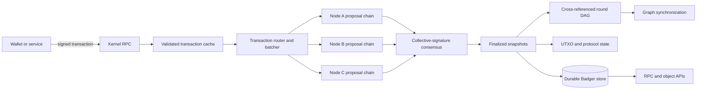
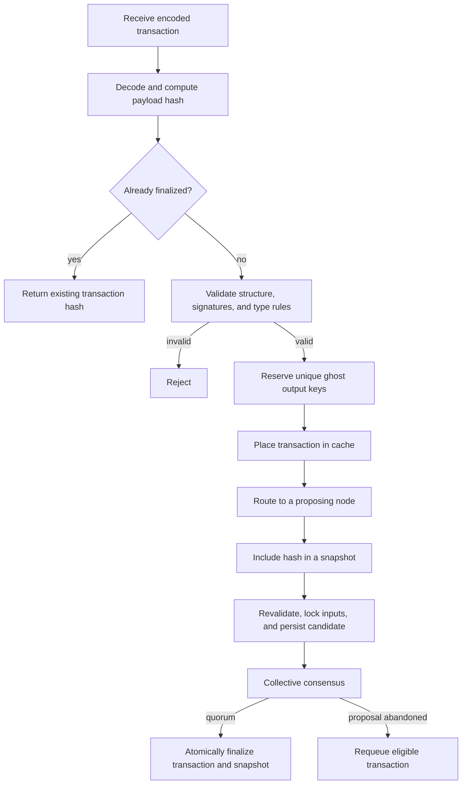
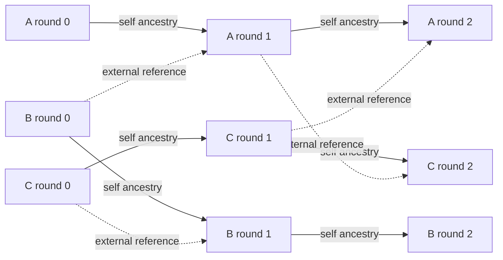
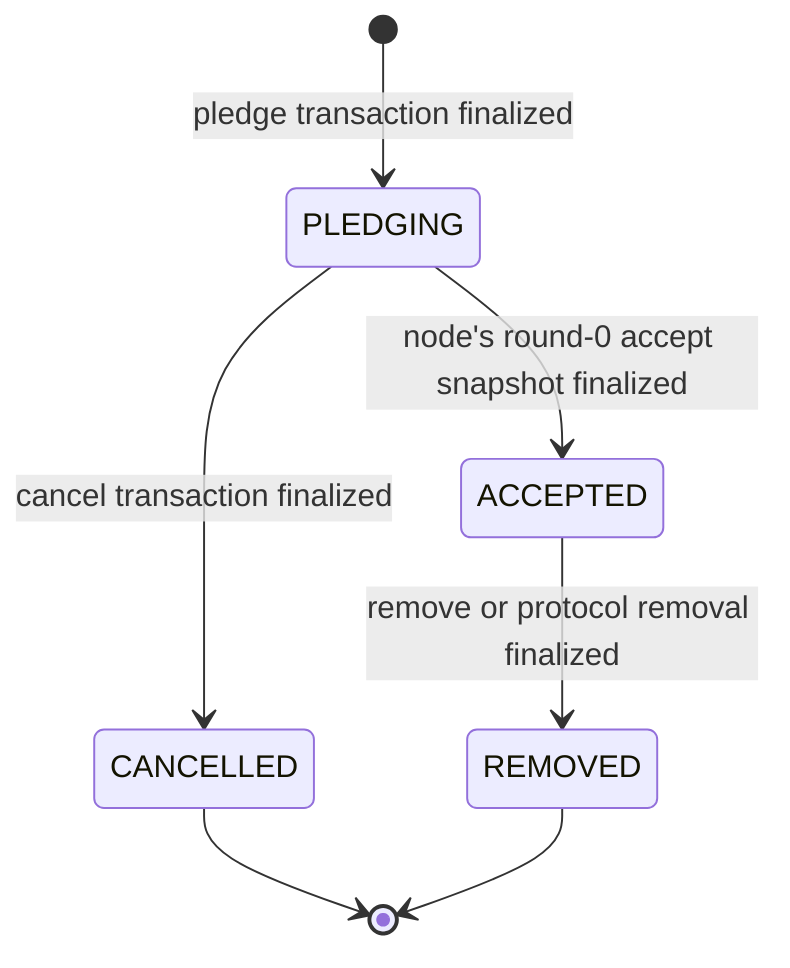
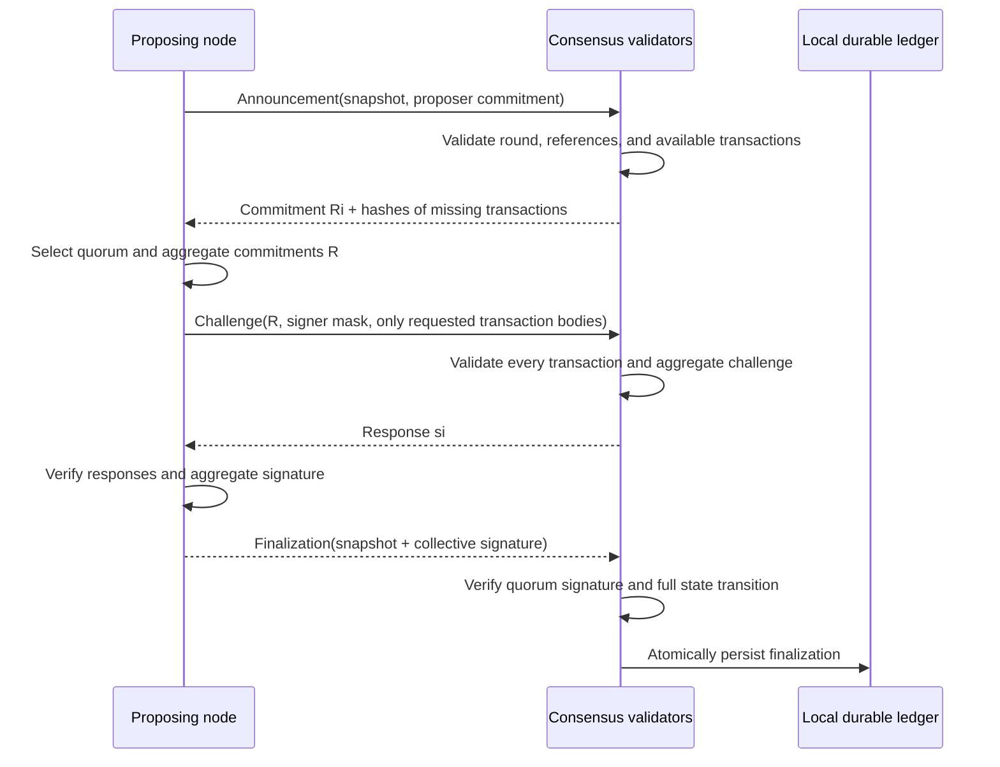
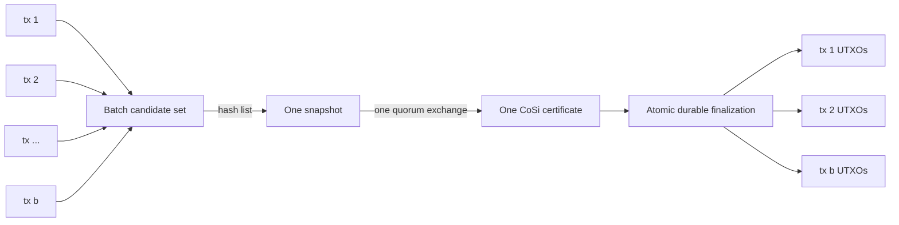

# Mixin Kernel: A Fast BFT-DAG Distributed Ledger

> An implementation-oriented technical paper for Mixin Kernel v0.19, **Fleet Fireflies**
>
> Draft — July 2026

## Abstract

Mixin Kernel is a distributed ledger for digital assets that combines a UTXO state model, per-validator chains, a cross-referenced directed acyclic graph (DAG), and Byzantine-fault-tolerant collective signing. It does not wait for one global block producer. Accepted nodes can propose snapshots concurrently on their own chains, while every post-genesis snapshot is finalized by a supermajority signature from the active consensus set. Short, hash-linked rounds summarize each node's history and add references to other nodes' rounds, joining the independent chains into a common graph.

Version 0.19 improves throughput by allowing one snapshot to commit a batch of transactions. Up to 255 eligible transactions share one snapshot hash and one consensus exchange. Transaction validation, UTXO conflict protection, and finalization records remain per transaction, while the expensive coordination and collective-signature work is amortized over the batch.

This paper explains the implementation from the data model upward: transactions, snapshots, rounds, nodes, networking, consensus, storage, synchronization, and the performance properties produced by their composition. It describes the code in this repository rather than defining a separate wire-protocol standard. Constants are current implementation values and may change in later releases. The quorum discussion explains the implementation's security rationale; it is not a formal proof or a security audit.

## 1. System at a glance

Mixin Kernel separates asset state, consensus envelopes, and graph structure:

- A **transaction** is a deterministic UTXO state-transition request.
- A **snapshot** commits one or more transaction hashes and receives a collective signature.
- A **round** groups a short interval of snapshots produced by one node.
- A **node chain** is the ordered sequence of that node's rounds.
- External round references connect all node chains into a **BFT-DAG**.
- A local **topological order** gives stored snapshots an efficient enumeration and synchronization cursor; it is not part of the consensus-signed snapshot payload.

The durable ledger state can be viewed as a tuple

$$
\mathcal{L} = (U, G, D, M, N, C, S, R),
$$

where $U$ is the UTXO set, $G$ the used ghost-key set, $D$ deposit locks, $M$ mint state, $N$ node membership, $C$ custodian state, $S$ finalized snapshots, and $R$ the round graph. A valid transaction changes part of this state; a finalized snapshot supplies the Byzantine agreement needed to make that change durable.

## 2. System and fault model

### 2.1 Participants

Clients create and sign transactions. Kernel nodes validate transactions, propose snapshots, participate in collective signing, persist the graph, and serve synchronization and RPC requests. A node may also operate as a relayer for nodes that do not accept inbound connections.

Consensus membership is ledger-managed rather than open per message. Genesis establishes the first accepted nodes. Later membership changes use special pledge, accept, cancel, and remove transactions that themselves pass through consensus. An address used as a node signer determines the network-scoped node identifier; a separate payee address separates consensus authority from reward ownership.

### 2.2 Assumptions

The implementation is designed around the usual Byzantine quorum assumption: fewer than one third of the effective consensus members may be faulty. For a stable consensus set of $n$ nodes, the threshold is

$$
q(n) = \left\lfloor \frac{2n}{3} \right\rfloor + 1.
$$

Mixin Kernel requires at least seven nodes before returning a usable threshold. Membership and threshold calculations are timestamp-aware so that nodes entering or leaving the set do not become signers at ambiguous historical points.

Safety requires honest nodes not to sign conflicting valid snapshots under the same protocol conditions. Progress additionally requires eventual message delivery among enough honest nodes, usable clocks within the protocol's timestamp checks, and enough available nodes to form a quorum. In other words, the implementation targets safety under asynchronous delay and liveness after the network becomes sufficiently synchronous; a fixed wall-clock finality guarantee is not implied.

### 2.3 Cryptographic and encoding foundations

Current transactions use encoding version `0x05`; snapshots use version `0x02`. Both use a deterministic binary encoder. BLAKE3 produces transaction, snapshot, round, network, and message identifiers where the corresponding code path calls for it. Signatures and public keys use Edwards25519 group operations.

The distinction between payload and envelope is important:

$$
H_{tx} = \operatorname{BLAKE3}(\operatorname{Encode}(tx\text{ without authorizing signatures})),
$$

$$
H_{snap} = \operatorname{BLAKE3}(\operatorname{Encode}(snapshot\text{ without CoSi signature or topology})).
$$

Signatures authorize stable content identifiers. They do not recursively change the identifiers they sign.

## 3. Transactions

### 3.1 UTXO model

A Mixin transaction consumes existing outputs and creates new outputs of one asset. Its principal fields are:

| Field | Meaning |
| --- | --- |
| `version` | Binary transaction format; currently version 5 |
| `asset` | 32-byte identifier shared by every input and output |
| `inputs` | Ordinary UTXO references or special genesis, deposit, or mint inputs |
| `outputs` | Amounts, output types, threshold scripts, ghost keys, and masks |
| `references` | Finalized transactions referenced without spending their outputs |
| `extra` | Application or protocol data |
| signatures | Per-input signature maps or one aggregate signature plus signer indexes |

Amounts use integer arithmetic with eight decimal places. For an ordinary transfer, conservation is exact:

$$
\sum_{i \in Inputs} amount(i) = \sum_{o \in Outputs} amount(o).
$$

There is no floating-point balance calculation in consensus validation.

An ordinary input identifies an earlier output by `(transaction hash, output index)`. Special inputs represent genesis allocation, an externally observed deposit, or a mint distribution. Output types also encode protocol operations such as withdrawal, node membership, and custodian updates.

### 3.2 Threshold scripts and ghost keys

The standard script has the three-byte form `ff fe T`, where $T$ is a threshold from 0 through 64. An output may contain several public keys, and spending it requires signatures from at least $T$ of them.

Outputs use one-time, recipient-derived **ghost keys**. Let $A=aG$ be the recipient's public view key, $B=bG$ the public spend key, $r$ sender-generated randomness, $R=rG$ the published output mask, and $j$ the output index. The sender derives

$$
x = H_s(rA, j), \qquad P = B + xG.
$$

The recipient obtains the same scalar from $aR=rA$ and derives the one-time private spend key

$$
p = b + H_s(aR, j).
$$

The view key can identify and inspect outputs, while spending also requires the spend key. Ghost keys reduce address reuse on the ledger, but amounts and asset identifiers are not confidential in this implementation; ghost addressing should not be confused with a full confidential-transaction system.

### 3.3 Validation pipeline

Before a transaction can participate in a snapshot, a node checks all of the following:

1. The version and inferred transaction type are supported.
2. Input, output, reference, extra-data, and total-size limits are respected.
3. Every ordinary input exists, belongs to the declared asset, is unique within the transaction, and is not locked by a conflicting unfinalized transaction.
4. The signature indexes satisfy each input script and the signatures verify over $H_{tx}$.
5. Outputs have positive amounts, valid scripts and masks, valid unique ghost keys, and exactly conserve value.
6. Referenced transactions exist and are finalized.
7. Type-specific rules for deposits, minting, withdrawals, membership, and custodian operations hold.

Ordinary input signatures are verified together through an Edwards25519 batch-verification equation. Version 5 also supports a compact aggregate signature across selected input keys. These optimizations concern authorization inside one transaction; they are separate from v0.19's batching of many transactions inside one snapshot.

Input, deposit, mint, and ghost-key locks prevent conflicting candidates from advancing concurrently. Raw validated transactions may be durably stored before finality, but new spendable UTXOs and the transaction-to-snapshot finalization record are created only when the snapshot is committed.

### 3.4 Transaction classes and batching eligibility

The transaction type is inferred from special inputs or output types rather than trusted as a separate caller-provided field.

| Transaction class | Purpose | Multi-transaction snapshot |
| --- | --- | :---: |
| Script | Ordinary UTXO transfer or storage transaction | Yes |
| Deposit | Introduce an externally observed asset deposit | Yes |
| Withdrawal submit | Request an external withdrawal | Yes |
| Withdrawal claim | Finalize withdrawal accounting | Yes |
| Mint | Create a protocol mint distribution | No |
| Node pledge, cancel, accept, remove | Change consensus membership | No |
| Custodian update or slash | Change custodian protocol state | No |

Consensus-sensitive transactions remain alone in a snapshot. They form a serialized reference chain and can change the rules or participants used to validate later snapshots. Mixing them with unrelated transfers would make membership boundaries and protocol-state transitions harder to evaluate deterministically.

## 4. Snapshots

### 4.1 Consensus envelope

A snapshot is the object on which Kernel consensus operates. Version 2 contains:

| Field | Meaning | In payload hash |
| --- | --- | :---: |
| `version` | Snapshot format | Yes |
| `node` | Proposing node's network identifier | Yes |
| `round` | Proposer's round number | Yes |
| `references.self` | Hash of the proposer's preceding finalized round | Yes |
| `references.external` | Hash of another node's finalized round | Yes |
| `transactions` | Canonically sorted, unique transaction hashes | Yes |
| `timestamp` | Proposer timestamp accepted by signers | Yes |
| `signature` | Collective signature and signer bit mask | No |
| `hash` | Computed snapshot identifier | Computed |
| `topology` | Local durable enumeration cursor | No |

The canonical transaction list contains between 1 and 255 hashes. Duplicate hashes are rejected. Round-zero snapshots are restricted to exactly one transaction because they are used for a node's initial acceptance path.

If the sorted transaction hashes are $t_1,\ldots,t_b$, then conceptually

$$
H_{snap}=\operatorname{BLAKE3}\left(
  \operatorname{Encode}(v, node, round, refs, t_1,\ldots,t_b, timestamp)
\right).
$$

The collective signature is over $H_{snap}$, so one quorum decision covers the entire list without placing all transaction bodies inside the signed snapshot.

### 4.2 Batched snapshots in v0.19

Before v0.19, the snapshot-to-transaction relationship was one-to-one. The new design changes the snapshot payload from a sole transaction hash to a bounded list while retaining the same outer consensus object.

The queue retrieves at most 255 candidates at a time. It revalidates each candidate against current state, separates consensus-sensitive transactions, and accumulates eligible transaction hashes. The selected transaction bodies are kept below roughly two thirds of the 32 MiB transport-message ceiling, leaving room for the snapshot, signature material, framing, and relay overhead. The resulting batch is sent to a node that can propose it on its chain.

The optimization preserves several invariants:

- Every transaction retains its own payload hash, signatures, inputs, outputs, and validation result.
- Only explicitly batchable transaction classes may appear when a snapshot contains more than one hash.
- A new transaction in a batch cannot spend an output created by another transaction in that batch; each candidate validates against already materialized ledger state.
- Every participant must have and validate every transaction before responding to the challenge.
- A participant reports precisely which transaction hashes it lacks; the proposer sends only those bodies in the normal challenge path.
- A receiving node that sees a valid finalization before receiving all bodies requests the missing transactions and delays application.
- Durable snapshot application finalizes all included transactions in one Badger write transaction.
- Single-transaction snapshots continue to use the legacy message forms during the upgrade transition.

The main gain is amortization. If $C_c$ is the coordination and collective-signature cost for a snapshot, $C_v$ the average independent transaction-validation cost, and $b$ the batch size, the average work per transaction is approximately

$$
C_{tx}(b) \approx C_v + \frac{C_c}{b} + C_{data},
$$

where $C_{data}$ represents unavoidable transaction dissemination and storage. Batching makes $C_c/b$ small; it does not eliminate signature validation, state access, or transaction bytes.

## 5. Rounds and the ledger DAG

### 5.1 Per-node rounds

Every accepted node owns a logical chain of numbered rounds. The live round is a **cache round** that collects finalized snapshots. Once it closes, it becomes a **final round**, and a new cache round starts.

Snapshots in one round must occupy a time span shorter than the configured three-second round gap:

$$
end_r < start_r + \Delta, \qquad \Delta = 3\text{ seconds}.
$$

A round can therefore contain several separately finalized snapshots, and each of those snapshots may now contain several transactions. The round boundary is a graph and synchronization unit, not the transaction batch itself.

### 5.2 Round commitment

To compute a final round hash, snapshots are sorted by `(timestamp, snapshot hash)`. Let $s_1,\ldots,s_k$ be the resulting snapshot hashes. The implementation computes

$$
r_0 = \operatorname{BLAKE3}(nodeId \parallel \operatorname{BE64}(roundNumber)),
$$

$$
r_i = \operatorname{BLAKE3}(r_{i-1} \parallel s_i), \qquad
H_{round}=r_k.
$$

This construction commits to the node, round number, and complete canonical snapshot sequence. A finalized round record stores its hash, node, number, start timestamp, and references.

### 5.3 Self and external references

When a node starts round $r+1$, its snapshots carry two round references:

- `self` points to that node's finalized round $r$;
- `external` points to a recent valid round produced by another accepted node.

The self edge makes each node history append-only. The external edge merges knowledge across histories and turns the collection of chains into a DAG. External link numbers may advance but not move backward. Nodes prefer recent sane external rounds and reject self-loops, unknown references, implausible future timestamps, and excessively stale links.

Arrows in the diagram run from a referenced round toward the later round that includes the reference. Consensus finalizes snapshots independently, while these edges record causal graph progress and give synchronization a compact way to compare histories.

### 5.4 Topological order is a storage cursor

After a snapshot is verified and accepted, each node increments a local topological sequence and writes the snapshot at that position. This order supports pagination, statistics, and graph synchronization. It is intentionally excluded from $H_{snap}$ and from the collective signature.

Consequently, finality is defined by the signed snapshot and its valid round position—not by agreement on one universal topological number. Two correct nodes may receive independent finalized snapshots in different orders and assign different local cursor values while agreeing on every snapshot, transaction, and round commitment.

## 6. Nodes and networking

### 6.1 Node identity

Each node has an address containing public spend and view keys. The signer spend key authenticates P2P messages and participates in collective signatures. The identifier is scoped to the genesis-derived network:

$$
NodeId = \operatorname{BLAKE3}(NetworkId \parallel AddressHash),
$$

$$
NetworkId = \operatorname{BLAKE3}(\operatorname{JSON}(genesis)).
$$

Scoping prevents a signer identity from being confused across two Kernel networks with different genesis definitions.

### 6.2 Membership lifecycle

The durable membership states are `PLEDGING`, `ACCEPTED`, `CANCELLED`, and `REMOVED`.

A new node pledges XIN and publishes signer and payee keys. Its acceptance is unusual: the new node proposes an initial round-zero snapshot, the existing consensus nodes collectively approve it, and the new node also participates in that round-zero signing set. Non-genesis accepted nodes mature for more than 12 hours before `ConsensusReady` allows them to sign ordinary snapshots. Membership operations are subject to additional timing and serialization rules so that all nodes reconstruct the same historical signer set at a snapshot timestamp.

Current membership controls include:

| Control | Current implementation |
| --- | ---: |
| Pledge amount | 13,439 XIN |
| Minimum accepted nodes | 7 |
| Maximum Kernel nodes | 50 |
| Delay before an accept or cancel operation | At least 12 hours |
| Maximum pending acceptance period | 7 days |
| Delay before a non-genesis accepted node can sign ordinary snapshots | More than 12 hours |

The 50-node membership cap leaves headroom below the 64 indexes available in the current collective-signature mask.

### 6.3 One chain per node

Every Kernel process tracks a `Chain` object for each current or historically relevant node. Each chain maintains:

- the current cache round and preceding final round;
- recent round history and external-link positions;
- pending and finalized snapshot queues;
- collective-signature aggregators, verifiers, commitments, and responses;
- work and storage-accounting aggregation state.

The local node actively proposes on its own chain and verifies remote proposals on the corresponding remote chains. Separate processing loops let chains advance concurrently, while durable writes serialize the state changes that must be atomic.

### 6.4 P2P transport and relaying

P2P streams use QUIC with TLS transport encryption. The TLS configuration uses an ephemeral self-signed certificate, so certificate PKI does not define node identity. Connecting consumers instead present a timestamped authentication message signed by their node signer, and protocol-critical messages are checked against ledger-known signer keys. The protocol supports directly connected relayers and consumers, plus forwarding through known relayers when the destination is not a direct neighbor.

Messages have high- and normal-priority queues, bounded sizes, and short-lived deduplication records. Consensus messages include announcements, nonce commitments, challenges, responses, finalizations, transaction requests, transaction bundles, and signed graph summaries. The maximum transport message is 32 MiB.

### 6.5 Graph synchronization

Nodes periodically exchange graph messages containing sync points for each chain's node ID, final round number, and final round hash. These messages carry a sender signature, which is checked when the sender is a ledger-known accepted or pledging node. A node compares the remote graph with its local graph, finds an earlier local topological cursor, and streams finalized snapshots forward. It also sends the head rounds for individual chains so a lagging peer can close gaps without replaying the entire ledger.

Synchronization reuses the same finalization verification path as live consensus. A peer does not trust a snapshot merely because another node sent it: it verifies the collective signature, historical signer set, round and reference rules, transaction bodies, and state transition before persistence.

## 7. Collective-signature consensus

### 7.1 Proposal model

There is no single network-wide leader slot. A node leads snapshots on its own chain. Ordinary transactions are routed among working nodes, favoring nodes whose chain heads are current; protocol-sensitive operations use deterministic election rules. Concurrent node chains allow multiple proposals to be in flight without placing every transfer behind one producer.

The snapshot leader first fixes the transaction hashes, round references, and timestamp. Validators sign only after reconstructing and validating the complete snapshot payload.

### 7.2 CoSi exchange

The normal collective-signing path is:

Validators can pre-publish nonce commitments. When the proposer has a usable precommitment, it can begin with a full challenge rather than waiting for a fresh announcement/commitment round trip. Each nonce handle is single-use: the first aggregate challenge permanently binds it, an identical retry may reuse the cached response, and a different challenge is rejected to prevent private-key disclosure.

### 7.3 Signature construction

Let $G$ be the group base point. For signer $i$, let $a_i$ be its private key, $A_i=a_iG$ its public key, and $r_i$ a fresh nonce with commitment $R_i=r_iG$. For the selected quorum $Q$:

$$
R = \sum_{i\in Q} R_i, \qquad A_Q = \sum_{i\in Q} A_i,
$$

$$
c = H(R \parallel A_Q \parallel H_{snap}),
$$

$$
s_i = r_i + c a_i \pmod \ell, \qquad s = \sum_{i\in Q} s_i.
$$

Verification checks

$$
sG = R + cA_Q.
$$

The final snapshot carries one 64-byte signature and one 64-bit signer mask, rather than an array of validator signatures. The current mask represents at most 64 consensus indexes, and membership admission currently imposes a lower 50-node cap. Expanding beyond the mask requires an encoding and implementation change.

### 7.4 Quorum and Byzantine intersection

For a stable $n=3f+1$ membership with threshold $q=2f+1$, any two quorums intersect in at least

$$
|Q_1\cap Q_2| \ge 2q-n = f+1
$$

members. Since at most $f$ are Byzantine, the intersection contains at least one honest signer. If honest nodes refuse conflicting snapshots, two conflicting quorum certificates cannot both be formed. This is the core quorum-intersection rationale; complete safety also depends on deterministic transaction validation, correct historical membership reconstruction, nonce safety, and enforcement of the round rules.

### 7.5 Finalization checks

A received finalization is not applied until the node verifies:

1. Snapshot encoding, payload hash, proposer identity, timestamp, and round range.
2. Self and external round references against the local graph.
3. The historical consensus public-key set at the snapshot timestamp.
4. A collective signature whose mask meets the computed threshold.
5. Presence and validity of every referenced transaction body.
6. Batch eligibility when more than one transaction is present.
7. UTXO, protocol-state, and duplicate-finalization invariants.

If transaction bodies are missing, the node asks the sender for them and leaves the snapshot in the finalization queue. If a local proposal cannot safely proceed because the graph is stale or not sufficiently broadcast, its transactions are returned to the cache for another attempt.

## 8. End-to-end ledger operation

The complete fast path for an ordinary transfer is:

1. A client constructs a version-5 UTXO transaction, derives ghost outputs, signs $H_{tx}$, and submits the encoded envelope through RPC.
2. The receiving node decodes and validates it, then places it in a TTL-backed transaction cache.
3. The queue periodically retrieves candidates, removes already-finalized entries, revalidates current locks, and routes batchable candidates to a current proposing node.
4. The proposer creates a version-2 snapshot containing the sorted transaction hashes, current round number, self and external references, and timestamp.
5. Consensus validators obtain any missing bodies and independently validate every transaction and the graph position.
6. A supermajority CoSi exchange produces one compact signature over $H_{snap}$.
7. The proposer and receiving validators verify the certificate and write the snapshot.
8. One durable transaction creates each new UTXO, records each transaction's finalizing snapshot, updates protocol state, stores the snapshot, and advances the local topology cursor.
9. Signed graph summaries and finalization messages carry the result to lagging peers.

## 9. Why Mixin Kernel is fast

No single technique is responsible for performance. The design removes or amortizes work at several layers.

| Mechanism | Performance effect | What it does not remove |
| --- | --- | --- |
| Per-node proposal chains | Allows independent proposals to progress concurrently | Quorum validation of each snapshot |
| Batched snapshots | Shares one consensus exchange among up to 255 transactions | Per-transaction signatures, bytes, and state checks |
| Compact CoSi certificate | Makes final signatures constant-size for the current 64-bit mask | Commitment and response messages |
| Precommitments | Can remove the fresh commitment round trip | Need for fresh, single-use nonce security |
| Selective transaction delivery | Sends a validator only bodies it reports missing | Initial transaction dissemination |
| Transaction bundles | Reduces framing and queue overhead | Payload bandwidth |
| Batch input-signature verification | Combines curve work for signatures in a transaction | Invalid-signature rejection and script checks |
| UTXO-specific execution | Avoids a general smart-contract VM and global contract scheduler | Type-specific protocol validation |
| Hash-only snapshot payload | Keeps the consensus object compact | Need to possess bodies before signing |
| QUIC streams and relayers | Provides encrypted streaming transport and reachability | Byzantine validation or network partitions |
| Separate cache and durable stores | Keeps transient queue traffic away from the synchronized ledger store | Atomic durable finalization writes |

If a snapshot contains $b$ transactions, the number of collective-signature rounds per transaction falls by a factor approaching $b$. The maximum is a safety bound, not an expected batch size; actual batches depend on arrival rate, transaction size, conflicts, node readiness, and network conditions.

The three-second round gap is also not a promise that a transaction always finalizes in three seconds. It bounds the timestamp span used to summarize one node's round. End-to-end latency includes queueing, routing, validation, quorum communication, missing-data recovery, and durable storage.

The implementation exposes both snapshots per second (`SPS`) and unique transactions per second (`TPS`). After batching, these metrics intentionally diverge: a low snapshot rate can carry a much higher transaction rate. This paper makes no benchmark claim because the repository does not define a hardware, topology, workload, or fault profile from which a reproducible headline number could be derived.

## 10. Persistence and crash recovery

Mixin Kernel uses two Badger databases:

- The **snapshot database** uses synchronized writes and stores transactions, UTXOs, locks, snapshots, rounds, links, topology indexes, membership, mint, custodian, work, and space records.
- The **cache database** stores transaction payloads, queue order, and TTL records without synchronized writes because these entries can be retransmitted or rebuilt.

Final snapshot persistence is protected by a store mutex and a single Badger write transaction. For every transaction in the snapshot, it writes the finalization mapping and materializes unspent outputs; it then writes the snapshot, work records, and topology indexes. A failed database transaction does not expose a partially finalized batch.

At startup, the node loads genesis, reconstructs membership, loads each chain's head and recent round history, obtains the last durable topology position, and validates recent graph entries. Unfinalized cached work is expendable. Finalized snapshots are recovered from the durable graph and can be synchronized again from peers.

## 11. Protocol invariants

The implementation repeatedly enforces the following invariants across admission, consensus, and persistence:

### Transaction invariants

- Transaction payload encoding is canonical and content-addressed.
- Inputs and outputs use one asset and conserve amount exactly.
- An ordinary UTXO or deposit cannot be assigned to two unfinalized candidates without conflict handling.
- A ghost output key cannot be reused by a different transaction.
- Every input script has enough valid authorizing keys.
- Transaction references point to finalized transactions.

### Snapshot invariants

- A snapshot has one to 255 unique, canonically ordered transaction hashes.
- Multi-transaction snapshots contain only batchable classes.
- Storage keeps one canonical transaction-to-snapshot finalization mapping; proposal deduplication and per-node uniqueness indexes suppress repeats.
- The CoSi signature covers the proposer, round, references, timestamp, and complete transaction-hash list.
- Finalization waits for all transaction bodies and deterministic validation.

### Round and graph invariants

- Snapshot timestamps within a round occupy less than the round gap.
- A new round commits to the complete preceding self round.
- Its external reference names a known round from another node.
- External links do not move backward.
- Round hashes are deterministic over a canonical snapshot ordering.

### Membership invariants

- Consensus keys are reconstructed from ledger state at the snapshot timestamp.
- A stable quorum is greater than two thirds of the effective membership.
- Genesis nodes are immediately ready; later accepted nodes pass a maturity delay.
- Consensus-changing operations are single-transaction snapshots linked through a serialized reference history.

## 12. Security boundaries and limitations

Mixin Kernel's speed does not remove its operating assumptions.

- **Byzantine bound:** Safety relies on fewer than one third of the effective consensus set violating the signing rules or losing key control.
- **Availability:** A partition that prevents a quorum from communicating stops finality rather than safely choosing a minority history.
- **Key security:** Node signer keys authorize P2P identity and consensus responses. Compromise has protocol-level consequences until membership changes take effect.
- **Clock behavior:** Snapshot and membership validation uses nanosecond timestamps and bounded past/future checks. Severe clock faults can impair liveness.
- **External assets:** Deposit and withdrawal correctness also depends on the configured custodian and external-chain observation processes; BFT agreement cannot prove an off-ledger fact that was supplied incorrectly.
- **Privacy scope:** Ghost keys reduce public address linkage, but transaction amounts, asset identifiers, references, and graph activity remain observable.
- **Consensus-set size:** The current CoSi signer mask is 64 bits, and node admission currently caps Kernel membership at 50.
- **Fixed execution model:** Kernel supports audited transaction classes rather than a general smart-contract VM. This reduces execution complexity but deliberately limits programmability.
- **Topology semantics:** The local topology counter is an index, not a globally signed total order.
- **TEE scope:** The repository README states that Trusted Execution Environment integration is not present in this reference implementation.
- **Custodian slashing:** The current snapshot validation path identifies custodian-slash handling as not implemented; it should not be described as a completed feature.

## 13. Current implementation limits

These values document the v0.19 code path and are not promises for future versions.

| Parameter | Current value |
| --- | ---: |
| Transaction encoding | 5 |
| Snapshot encoding | 2 |
| Transactions per snapshot | 1–255 |
| Transactions in a round-zero snapshot | Exactly 1 |
| Round gap | 3 seconds |
| Transaction maximum encoded size | 4 MiB |
| General `extra` limit | 256 bytes |
| Priced storage `extra` capacity | Up to 4 MiB |
| Inputs or outputs per transaction | Up to 256 each |
| Transaction references | Up to 16 |
| P2P transport message | Up to 32 MiB |
| Batch transaction-body target | Less than about 21.3 MiB |
| Minimum consensus nodes | 7 |
| Maximum Kernel nodes | 50 |
| Current node pledge | 13,439 XIN |
| Stable quorum threshold | $\lfloor 2n/3\rfloor+1$ |
| Signers represented by current CoSi mask | Up to 64 |
| Non-genesis signer maturity | More than 12 hours |

## 14. Conclusion

Mixin Kernel is fast because it does not force all work through one global block sequence. Accepted nodes advance their own short-round chains concurrently; external references merge those chains into a DAG; and a supermajority collective signature gives each snapshot Byzantine finality. The UTXO model keeps execution deterministic and bounded, while ghost keys provide recipient-specific one-time outputs.

Version 0.19 extends the natural unit of consensus from one transaction to a bounded batch. The change leaves transaction semantics intact and amortizes proposal, commitment, challenge, response, finalization, and snapshot-storage overhead across many transfers. Selective body delivery and bundled P2P messages complement that change without weakening the requirement that every signer validate the full state transition.

The result is a ledger in which transactions remain individually auditable, snapshots remain compact and quorum-certified, rounds remain deterministic graph commitments, and nodes can make progress in parallel under a clear Byzantine fault threshold.

## Appendix A. Implementation map

The following files are the primary sources for this paper:

| Topic | Implementation |
| --- | --- |
| Transaction structures and types | [`common/transaction.go`](../common/transaction.go) |
| Transaction validation | [`common/validation.go`](../common/validation.go) |
| Deterministic binary encoding | [`common/encoding.go`](../common/encoding.go), [`common/decoding.go`](../common/decoding.go) |
| Snapshot structure and hashing | [`common/snapshot.go`](../common/snapshot.go) |
| Round hashing | [`common/round.go`](../common/round.go) |
| Ghost-key derivation | [`crypto/key.go`](../crypto/key.go) |
| Input signature batching and aggregation | [`crypto/batch.go`](../crypto/batch.go), [`crypto/aggregation.go`](../crypto/aggregation.go) |
| Collective signatures and nonce safety | [`crypto/cosi.go`](../crypto/cosi.go), [`crypto/nonce.go`](../crypto/nonce.go) |
| Transaction queue and snapshot batching | [`kernel/queue.go`](../kernel/queue.go) |
| Snapshot transaction validation | [`kernel/self.go`](../kernel/self.go) |
| CoSi state machine | [`kernel/cosi.go`](../kernel/cosi.go) |
| Chain and round state | [`kernel/chain.go`](../kernel/chain.go), [`kernel/round.go`](../kernel/round.go) |
| Cross-chain graph references | [`kernel/graph.go`](../kernel/graph.go) |
| Membership and threshold logic | [`kernel/node.go`](../kernel/node.go), [`kernel/election.go`](../kernel/election.go) |
| Local topology sequence | [`kernel/topology.go`](../kernel/topology.go) |
| P2P messages and batch wire forms | [`p2p/handle.go`](../p2p/handle.go) |
| QUIC transport and graph sync | [`p2p/quic.go`](../p2p/quic.go), [`p2p/sync.go`](../p2p/sync.go) |
| Durable snapshot application | [`storage/badger_graph.go`](../storage/badger_graph.go), [`storage/badger_transaction.go`](../storage/badger_transaction.go) |
| Current configuration constants | [`config/reader.go`](../config/reader.go) |

## Appendix B. Glossary

**Batch**

A bounded list of independently valid transactions committed by one snapshot.

**Cache round**

The current round of a node chain, still accepting finalized snapshots.

**CoSi**

The collective Schnorr-style signing procedure used to create a compact quorum certificate.

**Final round**

A closed round whose canonical snapshots have been reduced to one round hash.

**Ghost key**

A recipient-derived one-time output key that avoids publishing the recipient's spend key directly in each output.

**Round link**

The pair of self and external final-round hashes carried by snapshots in a round.

**Snapshot**

The consensus-signed envelope that commits transaction hashes to one node chain and round.

**Topological order**

A node-local monotonic storage and synchronization cursor assigned after finalization.

**Transaction finality**

The state in which a transaction is mapped to a valid quorum-signed snapshot and its resulting ledger state is durably applied.
