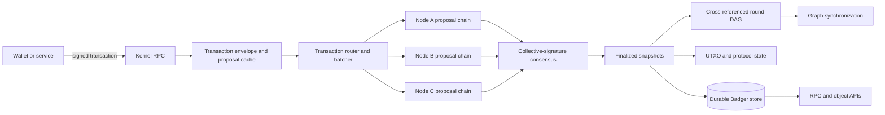
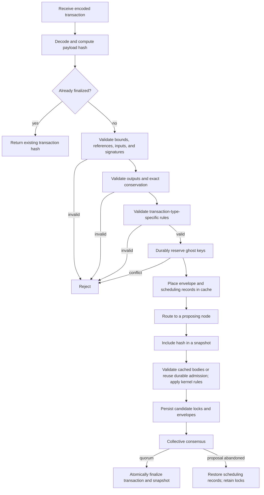
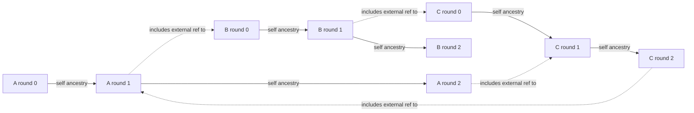
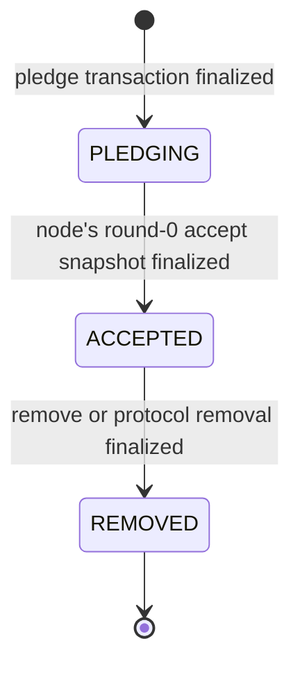
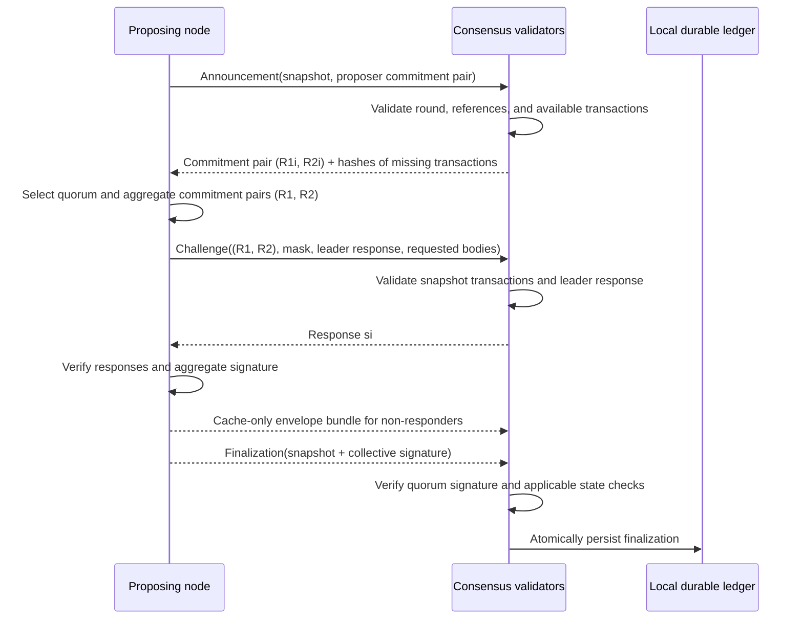
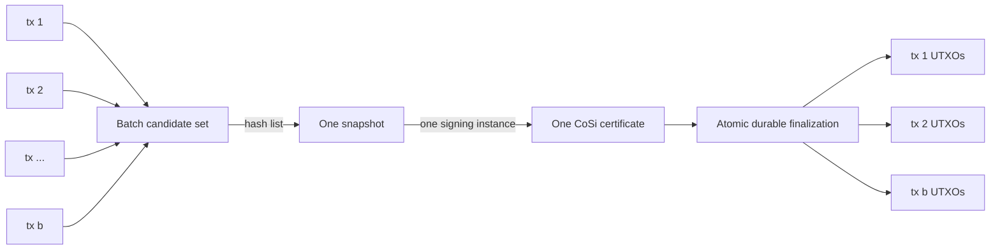

# Mixin Kernel: A BFT-DAG Distributed Ledger

> A technical introduction to the architecture, data model, and consensus protocol

## Abstract

Mixin Kernel is a distributed ledger for digital assets that combines a UTXO state model, per-validator chains, a cross-referenced directed acyclic graph (DAG), and Byzantine-fault-tolerant collective signing. It does not wait for one global block producer. Accepted nodes propose snapshots concurrently on their own chains, while every post-genesis snapshot is finalized by a supermajority signature from the active consensus set. Short, hash-linked rounds summarize each node's history and reference rounds produced by other nodes, joining the independent chains into a common graph.

A snapshot commits a bounded batch of transaction hashes. Up to 255 eligible transactions can share one snapshot hash and one collective-signing instance. Each transaction still has its own authorization, UTXO validation, conflict protection, and finalization record; only the coordination and collective-signature work is shared. This separation gives Kernel both individual transaction auditability and efficient group finalization.

This paper develops the system from first principles: transactions describe state transitions, snapshots carry consensus, rounds organize each node's history, external references form the DAG, and collective signatures provide finality. It follows these objects through networking, persistence, synchronization, and recovery. The paper describes the implementation in this repository. Numeric limits are implementation parameters; the quorum discussion states the security assumptions and their rationale without claiming a formal proof of the complete protocol.

## 1. System at a glance

Accepted nodes maintain parallel ledger lanes. A node groups validated transactions into a snapshot and asks the consensus set to certify that snapshot. Certified snapshots accumulate in short rounds on the node's lane. Each non-initial round points both to the preceding round on the same lane and to a round on another lane, weaving all lanes into one verifiable graph.

Mixin Kernel separates asset state, consensus envelopes, and graph structure:

- A **transaction** is a deterministic UTXO state-transition request.
- A **snapshot** commits one or more transaction hashes and receives a collective signature.
- A **round** groups a short interval of snapshots produced by one node.
- A **node chain** is the ordered sequence of that node's rounds.
- External round references connect all node chains into a **BFT-DAG**.
- A local **topological order** gives stored snapshots an efficient enumeration and synchronization cursor; it is not part of the consensus-signed snapshot payload.


```mermaid
flowchart LR
    W[Wallet or service] -->|signed transaction| RPC[Kernel RPC]
    RPC --> CQ[Transaction envelope and proposal cache]
    CQ --> RT[Transaction router and batcher]

    RT --> A[Node A proposal chain]
    RT --> B[Node B proposal chain]
    RT --> C[Node C proposal chain]

    A --> CS[Collective-signature consensus]
    B --> CS
    C --> CS

    CS --> S[Finalized snapshots]
    S --> DAG[Cross-referenced round DAG]
    S --> U[UTXO and protocol state]
    S --> DB[(Durable Badger store)]

    DAG --> SYNC[Graph synchronization]
    DB --> API[RPC and object APIs]
```

The durable ledger state can be viewed as a tuple

$$
\mathcal{L} = (U, G, D, M, N, C, S, R),
$$

where $U$ is the UTXO set, $G$ the used ghost-key set, $D$ deposit locks, $M$ mint state, $N$ node membership, $C$ custodian state, $S$ finalized snapshots, and $R$ the round graph. Some conflict and ghost-key reservations are written durably during admission, before consensus. A finalized snapshot supplies the Byzantine agreement and atomic application step for the resulting ledger transition.

## 2. System and fault model

### 2.1 Participants

Clients create and sign transactions. Kernel nodes validate transactions, propose snapshots, participate in collective signing, persist the graph, and serve synchronization and RPC requests. A node may also operate as a relayer for nodes that do not accept inbound connections.

Consensus membership is ledger-managed rather than open per message. Genesis establishes the first accepted nodes. Subsequent membership transitions use special pledge, accept, and remove transactions that themselves pass through consensus. An address used as a node signer determines the network-scoped node identifier; a separate payee address separates consensus authority from reward ownership.

### 2.2 Assumptions

The implementation is designed around the usual Byzantine quorum assumption: fewer than one third of the effective consensus members may be faulty. For a stable consensus set of $n$ nodes, the threshold is

$$
q(n) = \left\lfloor \frac{2n}{3} \right\rfloor + 1.
$$

The concrete threshold function reconstructs a **threshold base** from membership records strictly earlier than the snapshot timestamp. Genesis nodes count immediately. A later accepted node enters that base after the 30-second reference window (`10` reference rounds times the three-second round gap), but its public key does not enter the ordinary `ConsensusKeys` signer list until `ConsensusReady` becomes true more than 12 hours after acceptance. During the last 90 seconds before a pending node reaches its minimum 12-hour acceptance time, that pledging node can also increase the non-final proposal threshold; it is not counted in the threshold used to verify a final certificate. These transition rules can temporarily demand a larger quorum from the still-mature signer set, rather than granting a new key early.

If the reconstructed threshold base has fewer than seven nodes, `ConsensusThreshold` returns the deliberately unusable sentinel `1000`; otherwise it returns $\lfloor 2n/3\rfloor+1$. Membership, signer-key, and threshold calculations are timestamp-aware so that certificates are checked against historical ledger state rather than only the node's current membership view.

Safety requires honest nodes not to sign conflicting valid snapshots under the same protocol conditions. Progress additionally requires eventual message delivery among enough honest nodes, usable clocks within the protocol's timestamp checks, and enough available nodes to form a quorum. In other words, the implementation targets safety under asynchronous delay and liveness after the network becomes sufficiently synchronous; a fixed wall-clock finality guarantee is not implied.

### 2.3 Cryptographic and encoding foundations

Transactions use encoding version `0x05`; snapshots use version `0x02`. Both use a deterministic binary encoder. BLAKE3 produces transaction, snapshot, round, network, and message identifiers where the corresponding code path calls for it. Signatures and public keys use Edwards25519 group operations. The Schnorr and CoSi Fiat-Shamir challenge scalars are derived with SHA-512, following the Edwards25519 convention; the ghost-key derivation scalar $H_s$ uses BLAKE3. Address hashes and checksums use SHA3-256.

The distinction between payload and envelope is important:

$$
H_{tx} = \mathrm{BLAKE3}\bigl(\mathrm{EncodeUnsigned}(tx)\bigr),
$$

$$
H_{snap} = \mathrm{BLAKE3}\bigl(\mathrm{EncodePayload}(snapshot)\bigr).
$$

Here, $\mathrm{EncodeUnsigned}$ omits transaction authorization signatures, while $\mathrm{EncodePayload}$ omits the snapshot's collective signature body and local topological order. The payload encoder writes a fixed zero-valued mask field in place of the omitted signature. That zero field is part of the hashed payload and makes the unsigned layout deterministic; the real signer mask and 64-byte signature body do not affect the hash.

Signatures authorize stable content identifiers. They do not recursively change the identifiers they sign.

These identifiers connect the protocol layers in one continuous commitment path:

```text
transaction payload → transaction hash → snapshot payload → snapshot hash
                    → quorum certificate → round hash → cross-referenced DAG
```

## 3. Transactions

### 3.1 UTXO model

A Mixin transaction consumes existing outputs and creates new outputs of one declared asset. Its principal fields are:

| Field | Meaning |
| --- | --- |
| `version` | Binary transaction format; version 5 |
| `asset` | 32-byte identifier shared by every input and output |
| `inputs` | Ordinary UTXO references or special genesis, deposit, or mint inputs |
| `outputs` | Amounts, output types, threshold scripts, ghost keys, and masks |
| `references` | Finalized transactions referenced without spending their outputs |
| `extra` | Application or protocol data |
| signatures | Per-input signature maps or one aggregate signature plus signer indexes |

Authorization is envelope data rather than transaction identity. Because $H_{tx}$ omits the signature maps or aggregate signature, two differently authorized envelopes for the same unsigned payload have the same transaction hash. Cache and durable transaction records are keyed by that payload hash and retain one encoded authorization envelope for validation.

Amounts use integer arithmetic with eight decimal places. For every post-genesis transaction that passes the normal validator, conservation is exact:

$$
\sum_{i \in Inputs} amount(i) = \sum_{o \in Outputs} amount(o).
$$

There is no floating-point balance calculation in consensus validation. Ordinary inputs obtain their amount and asset from finalized UTXOs; deposit and mint inputs carry the amount that must be reproduced by their outputs. Genesis allocations are constructed and loaded through the separate genesis path rather than `VersionedTransaction.Validate`.

An ordinary input identifies an earlier output by `(transaction hash, output index)`. Special inputs represent genesis allocation, an externally observed deposit, or a mint distribution. Output types also encode protocol operations such as withdrawal, node membership, and custodian updates.

### 3.2 Threshold scripts and ghost keys

The standard script has the three-byte form `ff fe T`, where the format accepts a threshold byte from 0 through 64. An output may contain several public keys, and script evaluation requires signatures from at least $T$ of them. The format check does not require $T$ to be no greater than the key count; such scripts can deliberately be unspendable. Also, the ordinary-input verification path still requires verifiable signature entries before its batch equation, so `T = 0` is not a general signature-free spending mode.

Outputs use one-time, recipient-derived **ghost keys**. Let $A=aG$ be the recipient's public view key, $B=bG$ the public spend key, $r$ sender-generated randomness, $R=rG$ the published output mask, and $j$ the output index. The sender derives

$$
x = H_s(rA, j), \qquad P = B + xG.
$$

The recipient obtains the same scalar from $aR=rA$ and derives the one-time private spend key

$$
p = b + H_s(aR, j).
$$

The view key can identify and inspect outputs, while spending also requires the spend key. Ghost keys reduce address reuse on the ledger, but amounts and asset identifiers are not confidential in this implementation; ghost addressing should not be confused with a full confidential-transaction system.

Mint and node-remove transactions are rebuilt deterministically by validators under the applicable snapshot rules. Their builders select an anchor transaction from the elected proposer's latest finalized round and record it immediately after the serialized consensus-state reference. Validators reconstruct the outputs from the recorded anchor, require exactly two references and a nonzero anchor, and apply ordinary finalized-reference validation when admitting the transaction. They do not enforce an anchor age or require it to belong to the proposer's latest round. Recency is a builder policy, not a validator-enforced unpredictability guarantee.

Reference-seeded protocol outputs apply on non-mainnet networks and on mainnet for snapshots at or after 2026-09-01 00:00:00 UTC. Mainnet snapshots before that timestamp use the unanchored derivation and one consensus-state reference.

### 3.3 Validation pipeline

Full transaction validation checks the following before a body enters durable candidate storage through the normal admission path:

1. The version and inferred transaction type are supported.
2. Input, output, reference, extra-data, decoded-envelope-size, and unsigned-payload-size limits are respected.
3. Every ordinary input exists, belongs to the declared asset, is unique within the transaction, and satisfies the applicable conflict-lock rules. Normal admission rejects a different lock owner; finalized replay can replace an unfinalized owner but cannot replace a finalized owner.
4. The signature indexes satisfy each input script and the signatures verify over $H_{tx}$.
5. Outputs have positive amounts, valid scripts and masks, valid unique ghost keys, and exactly conserve value.
6. Referenced transactions exist and are finalized.
7. Type-specific rules for deposits, minting, withdrawals, membership, and custodian operations hold.

Transaction authorization can use per-input signature maps or a compact aggregate signature across selected input keys. Ordinary signatures in a transaction are checked together through an Edwards25519 batch-verification equation. These mechanisms reduce authorization overhead inside one transaction, while snapshot batching amortizes consensus overhead across many transactions.

Ghost-key reservation and spend-conflict locking occur at different stages. On an uncached RPC submission and during queue revalidation, common validation checks references, inputs, signatures, outputs, conservation, and type-specific rules before calling `LockGhostKeys` against the synchronized snapshot database. A payload-hash cache hit instead requeues the first retained envelope without validating the submitted authorization again; the queue worker validates the retained envelope before routing it.

Snapshot transaction validation defers individual ghost-key writes for bodies obtained from the cache. After common validation and applicable kernel rules succeed, `LockAndPersistTransactions` commits their ghost keys, ordinary-input/deposit/mint locks, and full envelopes together. Bodies already present in durable candidate storage reuse their prior common validation and undergo applicable kernel checks; their common time-dependent checks are not rerun at each snapshot timestamp. If a candidate batch exceeds Badger's transaction limit, the kernel falls back to per-transaction validation and bounded commits. Spendable UTXOs and transaction-to-snapshot finalization records are created only when the snapshot is committed.

These candidate writes survive a crash and there is no general unlock operation. Requeueing restores cache queue/order records without releasing input or ghost-key locks. Retrying the same payload reuses its idempotent locks. On the finalized conflict path, `fork = true` may replace an ordinary-input, deposit, or mint lock held by an unfinalized transaction and prune that transaction's durable envelope. It cannot prune a finalized owner. Pruning does not release every other input reservation associated with the removed envelope. A ghost key remains bound to the transaction that first reserved it, including on the fork path. Admission, cache insertion, candidate persistence, and finalization are separate operations; a later failure does not undo a completed earlier reservation.

The uncached RPC admission path is:


```mermaid
flowchart TD
    A[Receive encoded transaction] --> B[Decode and compute payload hash]
    B --> C{Already finalized?}
    C -->|yes| Z[Return existing transaction hash]
    C -->|no| D[Validate bounds, references, inputs, and signatures]
    D -->|invalid| X[Reject]
    D --> E[Validate outputs and exact conservation]
    E -->|invalid| X
    E --> T[Validate transaction-type-specific rules]
    T -->|invalid| X
    T -->|valid| R[Durably reserve ghost keys]
    R -->|conflict| X
    R --> F[Place envelope and scheduling records in cache]
    F --> G[Route to a proposing node]
    G --> H[Include hash in a snapshot]
    H --> L[Validate cached bodies or reuse durable admission; apply kernel rules]
    L --> P[Persist candidate locks and envelopes]
    P --> I[Collective consensus]
    I -->|quorum| J[Atomically finalize transaction and snapshot]
    I -->|proposal abandoned| K[Restore scheduling records; retain locks]
```

### 3.4 Transaction classes and batching eligibility

The transaction type is inferred from special inputs or output types rather than trusted as a separate caller-provided field.

| Transaction class | Purpose | Multi-transaction snapshot |
| --- | --- | :---: |
| Script | Ordinary UTXO transfer or storage transaction | Yes |
| Deposit | Introduce an externally observed asset deposit | Yes |
| Withdrawal submit | Request an external withdrawal | Yes |
| Withdrawal claim | Finalize withdrawal accounting | Yes |
| Mint | Create a protocol mint distribution | No |
| Node pledge, accept, remove | Change consensus membership | No |
| Custodian update | Change custodian protocol state | No |
| Custodian slash | Recognized type; kernel validation is not implemented | No |

Consensus-sensitive transactions remain alone in a snapshot. They form a serialized reference chain and can change the rules or participants used to validate later snapshots. Mixing them with unrelated transfers would make membership boundaries and protocol-state transitions harder to evaluate deterministically.

A withdrawal claim references exactly one finalized withdrawal-submit transaction. Candidate admission requires a custodian signature over `BLAKE3(submit transaction hash || claim data)`, where the claim data follows the 64-byte signature in `extra`. A durable index keyed by the submit hash permits at most one finalized claim for that submit. On the finalized-history path, a claim with a snapshot timestamp before 2026-09-01 00:00:00 UTC is exempt from successful custodian-signature verification. This timestamp exception has no network-ID restriction; ordinary candidate admission does not use it. The finalized path still requires the snapshot's quorum certificate.

Once a transaction has passed these rules, the snapshot layer can treat its hash as a compact commitment to the complete state-transition request.

## 4. Snapshots

### 4.1 Consensus envelope

A snapshot is the object on which Kernel consensus operates. Version 2 contains:

| Field | Meaning | In payload hash |
| --- | --- | :---: |
| `version` | Snapshot format | Yes |
| `node` | Proposing node's network identifier | Yes |
| `round` | Proposer's round number | Yes |
| `references.self` | Hash of the proposer's preceding finalized round; absent on an initial round | Yes |
| `references.external` | Hash of another node's finalized round; absent on an initial round | Yes |
| `transactions` | Canonically sorted, unique transaction hashes | Yes |
| `timestamp` | Proposer timestamp accepted by signers | Yes |
| `signature` | Collective signature and signer bit mask | No |
| `hash` | Computed snapshot identifier | Computed |
| `topology` | Local durable enumeration cursor | No |

The canonical transaction list contains between 1 and 255 hashes and is strictly sorted, so duplicate hashes are rejected. Both encoder and decoder require a round-zero snapshot to contain exactly one transaction. The decoder requires no references at round zero and references on every nonzero round. These wire checks establish the shapes used by subsequent snapshot validation.

If the sorted transaction hashes are $t_1,\ldots,t_b$, then conceptually

$$
H_{snap}=\mathrm{BLAKE3}\Bigl(
  \mathrm{Encode}(v, node, round, refs, t_1,\ldots,t_b, timestamp)
\Bigr).
$$

The collective signature is over $H_{snap}$, so one quorum decision covers the entire list without placing all transaction bodies inside the signed snapshot.

### 4.2 Transaction batching

A snapshot is a bounded commitment to a set of transactions. The cache stores transaction envelope bytes separately from the queue and ordering records that make a transaction eligible for proposal. RPC submissions and ordinary P2P transaction bundles enter both layers. Envelopes carried inside a challenge or a proactive finalization-class bundle enter only the envelope cache, preventing those delivery paths from creating a redundant local proposal. There is one fallback exception: an envelope returned in response to an individual transaction request uses the ordinary single-transaction message and therefore enters the proposal queue as well as the envelope cache.

The cache worker is both timer- and event-driven. It waits up to 300 ms for a timer or queue wake, then applies a 200 ms debounce so nearby arrivals can batch together. Queue wakes can end the initial wait immediately; they do not bypass the debounce. One retrieval returns at most 255 distinct available candidates and consumes the queue and order records that it inspected; while a retrieval returns the full 255, the worker immediately drains another. Each candidate is checked for prior finalization and revalidated against ledger state, consensus-sensitive operations are separated, and eligible transaction hashes are accumulated. Section 7.1 describes how the resulting candidate set is assigned to a proposal chain.

The queue intends to keep a batch below two thirds of the 32 MiB transport-message ceiling, leaving framing and relay headroom. However, its `ValidatedSize` counter is the unsigned `PayloadMarshal` length, while P2P bundles carry the larger signed `Marshal` envelope. The current check therefore does not prove that a challenge or finalization bundle fits the target—or even the transport maximum—and Section 12 records this as an implementation gap.

Transaction batching is constrained by several invariants:

- Every transaction retains its own payload hash, authorization envelope, inputs, and outputs and is validated independently.
- Only explicitly batchable transaction classes may appear when a snapshot contains more than one hash.
- A new transaction in a batch cannot spend an output created by another transaction in that batch; each candidate validates against already materialized ledger state.
- Every signer whose response is counted must have every transaction body and pass snapshot validation before responding. Bodies obtained from the cache undergo common validation; durable bodies reuse their prior admission as described in Section 3.3.
- A participant reports precisely which transaction hashes it lacks; the proposer sends only those bodies in the normal challenge path.
- Receiving a challenge or finalization-class transaction bundle stores the bodies without scheduling them as a new proposal.
- A receiving node that sees a valid finalization before receiving all bodies requests the missing transactions and delays application.
- Dequeuing removes scheduling metadata but retains the cached envelope; a retry restores queue metadata, retains durable locks, and wakes the worker.
- Durable snapshot application finalizes all included transactions in one Badger write transaction.
- A one-transaction snapshot of a batchable class follows the same per-transaction ledger and finality semantics as a larger batch; non-batchable protocol classes are intentionally restricted to the one-transaction form.

The main gain is amortization. If $C_c$ is the coordination and collective-signature cost for a snapshot, $C_v$ the average independent transaction-validation cost, and $b$ the batch size, the average work per transaction is approximately

$$
C_{tx}(b) \approx C_v + \frac{C_c}{b} + C_{data},
$$

where $C_{data}$ represents unavoidable transaction dissemination and storage. Batching makes $C_c/b$ small; it does not eliminate signature validation, state access, or transaction bytes.

## 5. Rounds and the ledger DAG

### 5.1 Per-node rounds

Every accepted node owns a logical chain of numbered rounds; a pledging candidate also has a chain for its prospective round-zero acceptance. The live round is a **cache round** that collects finalized snapshots. Once it closes, it becomes a **final round**, and a new cache round starts.

Snapshots in one round must occupy a time span shorter than the configured three-second round gap:

$$
end_r < start_r + \Delta, \qquad \Delta = 3\,\mathrm{s}.
$$

A round can therefore contain several separately finalized snapshots, and each snapshot may contain several transactions. The round boundary is a graph and synchronization unit, not the transaction batch itself.

The local proposal scheduler uses a stricter cutoff than the consensus gap: after four fifths of the gap from the first snapshot in a live round, it defers new local work to a later attempt. This 2.4-second scheduling cutoff leaves time to complete CoSi before the round boundary; it is a liveness policy, not a different validity rule for received snapshots.

### 5.2 Round commitment

To compute a final round hash, snapshots are sorted by `(timestamp, snapshot hash)`. Let $s_1,\ldots,s_k$ be the resulting snapshot hashes. The implementation computes

$$
r_0 = \mathrm{BLAKE3}\bigl(nodeId \parallel \mathrm{BE64}(roundNumber)\bigr),
$$

$$
r_i = \mathrm{BLAKE3}\bigl(r_{i-1} \parallel s_i\bigr), \qquad
H_{round}=r_k.
$$

This construction commits to the node, round number, and complete canonical snapshot sequence. A finalized round record stores its hash, node, number, start timestamp, and references.

### 5.3 Self and external references

When a node starts round $r+1$, its snapshots carry two round references:

- `self` points to that node's finalized round $r$;
- `external` points to a recent valid round produced by another accepted node.

The self edge makes each node history append-only. The external edge merges knowledge across histories and turns the collection of chains into a DAG. External link numbers may advance but not move backward. Proposal validation requires a known round from another node and applies timestamp and staleness sanity checks. Replay of an already certified snapshot uses a non-strict reference path: it still requires a known, non-self, non-regressing external link, but skips those proposal-time sanity checks and relies on the historical quorum certificate for the stricter decision.


```mermaid
flowchart LR
    A0[A round 0] -->|self ancestry| A1[A round 1] -->|self ancestry| A2[A round 2]
    B0[B round 0] -->|self ancestry| B1[B round 1] -->|self ancestry| B2[B round 2]
    C0[C round 0] -->|self ancestry| C1[C round 1] -->|self ancestry| C2[C round 2]

    A1 -. includes external ref to .-> B0
    B1 -. includes external ref to .-> C0
    C2 -. includes external ref to .-> A1
    A2 -. includes external ref to .-> C1
```

In the diagram, solid arrows point from a parent round to its child within the same chain. Dotted arrows point from a round that **includes** an external reference toward the **referenced** (earlier) round on another chain. Consensus finalizes snapshots independently, while these edges record causal graph progress and give synchronization a compact way to compare histories.

The graph is directed because every reference has a source and target, and it remains acyclic because a new round can reference only rounds that are already finalized while external link positions never move backward. Rounds do not receive a separate consensus vote: their integrity comes from deterministic hashing of quorum-certified snapshots and from later certified snapshots committing the round references.

### 5.4 Topological order is a storage cursor

After a snapshot is verified and accepted, each node increments a local topological sequence and writes the snapshot at that position. This order supports pagination, statistics, and graph synchronization. It is intentionally excluded from $H_{snap}$ and from the collective signature.

Consequently, finality is defined by the signed snapshot and its valid round position—not by agreement on one universal topological number. Two correct nodes may receive independent finalized snapshots in different orders and assign different local cursor values while agreeing on every snapshot, transaction, and round commitment.

## 6. Nodes and networking

### 6.1 Node identity

Each node has an address containing public spend and view keys. The signer spend key authenticates P2P messages and participates in collective signatures. The identifier is scoped to the genesis-derived network:

$$
NodeId = \mathrm{BLAKE3}\bigl(NetworkId \parallel AddressHash\bigr),
$$

$$
AddressHash = \mathrm{SHA3\text{-}256}\bigl(publicSpendKey \parallel publicViewKey\bigr),
$$

$$
NetworkId = \mathrm{BLAKE3}\bigl(\mathrm{JSON}(genesis)\bigr).
$$

For node signer identities, the public view key is derived deterministically from the public spend key. A receiver can therefore reconstruct the address and network-scoped node ID from the spend key carried in authentication. Scoping prevents a signer identity from being confused across two Kernel networks with different genesis definitions.

### 6.2 Membership lifecycle

The durable membership states are `PLEDGING`, `ACCEPTED`, and `REMOVED`.


```mermaid
stateDiagram-v2
    [*] --> PLEDGING: pledge transaction finalized
    PLEDGING --> ACCEPTED: node's round-0 accept snapshot finalized
    ACCEPTED --> REMOVED: remove or protocol removal finalized
    REMOVED --> [*]
```

A new node pledges XIN and publishes signer and payee public spend keys; their public view keys are derived deterministically. Its acceptance is unusual: the new node proposes an initial round-zero snapshot, the existing consensus nodes collectively approve it, and the new node also participates in that round-zero signing set. The accept transaction must carry a Schnorr signature verifiable by the pledged signer public key, providing proof of possession before that non-genesis key is accepted. Non-genesis accepted nodes then mature for more than 12 hours before `ConsensusReady` allows them to sign ordinary snapshots. Membership operations are subject to additional timing and serialization rules so that all nodes reconstruct the same historical signer set for a snapshot timestamp.

Membership is bounded by the following controls:

| Control | Value |
| --- | ---: |
| Pledge amount | 13,439 XIN |
| Minimum usable threshold base | 7 |
| Maximum Kernel nodes | 50 |
| Delay before an accept operation | At least 12 hours |
| Maximum pledge-to-accept interval | 7 days |
| Delay before a non-genesis accepted node can sign ordinary snapshots | More than 12 hours |

An acceptance snapshot's timestamp must fall within the pledge's eligible seven-day interval and satisfy the other operation-window rules. A previously produced acceptance certificate can arrive later if its timestamp, consensus reference, and graph position remain admissible. The membership state machine has no cancellation, expiry, or refund transition for an unresolved pledge. Once the eligible proposal window has passed without an admissible acceptance certificate, the pledge remains locked under the normal protocol rules.

Only one node may be pending in `PLEDGING` state. That state also prevents ordinary removal of accepted nodes, including the return of otherwise removable stakes; it persists across restart. A pledge output can be consumed only by NodeAccept, and an accepted stake only by NodeRemove. Node removal reconstructs a return output for the recorded payee and is subject to the minimum-membership, timing, and election rules. The 50-node membership cap leaves headroom below the 64 indexes available in the collective-signature mask.

### 6.3 One chain per node

Every Kernel process tracks a `Chain` object for each active or historically relevant node. Each chain maintains:

- the active cache round and preceding final round;
- recent round history and external-link positions;
- pending and finalized snapshot queues;
- collective-signature aggregators, verifiers, commitments, and responses;
- work and storage-accounting aggregation state.

The local node actively proposes on its own chain and verifies remote proposals on the corresponding remote chains. Separate processing loops let chains advance concurrently, while durable writes serialize the ledger operations that require atomicity.

Each chain publishes an immutable graph view through an atomic pointer after initial loading and round updates, including the same-round update during acceptance. This view holds the final round hash and number together with the pool index and count. `BuildGraph` takes the chain-registry read lock and loads these published values instead of reading mutable consensus state. It returns fresh sync points and pool maps. Publication is atomic for each chain; iterating all chains does not produce a single simultaneous snapshot of the entire graph.

This published view contains those four fields only. The full `ChainState`, membership records, graph timestamp, and finalization pool use separate mutable state. CoSi processing and finalization-queue ingestion have separate loops; the `BuildGraph` publication mechanism does not provide isolation for all of their shared state.

Inbound snapshot messages cannot allocate chains for arbitrary identifiers. A chain is reused if it already exists, but a new chain is created only for the local node or an identifier present in ledger-derived node history. Announcement and finalization ingress discard messages whose chain lookup is rejected.

### 6.4 P2P transport and relaying

P2P streams use QUIC with TLS transport encryption. The TLS configuration uses an ephemeral self-signed certificate, so certificate PKI does not define node identity. The connecting consumer sends a signed authentication message, and the listener sends a reciprocal message addressed to that consumer. Each side verifies the timestamp, recipient, public spend key, and signature, derives the sender's network-scoped ID, and retains the verified key before publishing the peer in a neighbor map. An outbound connection also requires the reply's ID to match its configured relayer ID and its signed role to identify a relayer.

The authentication payload is 137 bytes: `[timestamp:8][recipient ID:32][public spend key:32][relayer role:1][signature:64]`. Its signature covers the BLAKE3 hash of the preceding 73 bytes, excluding the outer message-type byte. P2P allows a ten-second timestamp difference and waits up to three seconds to receive authentication. This exchange has no per-connection nonce or binding to the TLS channel; it verifies a signed identity statement without making every later transport message independently authenticated or preventing replay within the freshness window.

The protocol supports directly connected relayers and consumers, plus forwarding through known relayers when the destination is not a direct neighbor. The message classes use the following checks:

| Message class | Authentication and validation |
| --- | --- |
| Precommitments, batch announcements, batch commitments, batch full challenges | P2P verifies the original payload bytes against the claimed author's current accepted or pledging consensus key before invoking the kernel callback. Kernel membership, round, session, and nonce checks still apply. |
| Graph summaries | P2P verifies the claimed author's signature using a consensus key or a retained authenticated-neighbor key; kernel graph-admission policy then applies. |
| Ordinary transaction challenges and snapshot responses | Kernel checks the pending CoSi session and its cryptographic challenge or response; these messages do not carry the separate author signature used by full challenges. |
| Finalizations | The historical quorum certificate and snapshot validation authorize ledger application. Cached bodies receive common validation; durable bodies reuse prior admission and receive applicable kernel checks. |
| Relay envelopes and control messages | These do not all carry independent author signatures. A relay can still withhold, delay, or replay traffic. |

For forwarded signed messages, verification uses the claimed original author's key. A relayer's own key cannot authorize another node's consensus message. Neighbor authentication also does not grant consensus membership.

The four signed CoSi message forms and graph summaries place the signature before the payload: `[type][64-byte signature][payload]`, signing `BLAKE3(payload)` without the type byte. For a full challenge, the authenticated payload includes the snapshot length, the encoded snapshot with its embedded CoSi data, three commitment pairs (leader, recipient precommitment, and aggregate), and transaction bodies. The type byte selects the decoder but is outside the signature; payload parsing and kernel session checks remain part of message validation.

Messages have high- and normal-priority queues, bounded sizes, and short-lived deduplication records. Consensus messages include announcements, nonce commitments, challenges, responses, finalizations, transaction requests, transaction bundles, and signed graph summaries. The wire protocol uses batch-capable announcement, commitment, challenge, response, and finalization forms, including when a snapshot contains one transaction. The maximum transport message is 32 MiB.

Point-valued CoSi commitments and challenges are decoded and checked as valid prime-order Edwards25519 points before consensus handling. This applies to both components of every pair in precommitment lists and the current announcement, commitment, and full-challenge forms.

Transaction bundles have two scheduling semantics. An ordinary bundle stores each unfinalized envelope, adds it to the receiver's proposal queue, and wakes that queue. A finalization-class bundle stores envelopes in the cache without scheduling them. Proposers and graph synchronization use the latter immediately before sending a finalization so the receiver can validate the snapshot without accidentally proposing the same transactions itself. As noted in Section 4.2, an individually requested fallback body currently returns through the ordinary single-transaction path.

### 6.5 Graph synchronization

Nodes periodically exchange graph messages containing sync points for each chain's node ID, final round number, and final round hash. Every graph must pass signature verification using either the claimed author's current accepted/pledging consensus key or its key retained from an authenticated neighbor connection. This applies to direct and forwarded graphs, including graphs from non-consensus relayers; a configured seed ID alone is not a signature-verification exception.

After authentication, `UpdateSyncPoint` separately decides whether the author may supply synchronization state. A receiver that is accepted or pledging admits graphs only from accepted/pledging nodes or configured seeds, even when the receiver also operates as a relayer. A receiver outside consensus can serve other authenticated clients. Rejection leaves sync-point state unchanged and prevents the graph from entering the peer synchronization queue, without disconnecting the relay carrying it.

A graph signature authenticates the author's report, not the truth or freshness of its reported progress. For an admitted graph, a node compares the remote graph with its local graph, finds an earlier local topological cursor, and streams finalized snapshots forward. For every synchronized snapshot it sends the transaction envelopes first in a cache-only finalization-class bundle and then sends the signed snapshot. It also sends the head rounds for individual chains in the same transaction-first order so a lagging peer can close gaps without replaying the entire ledger.

Synchronization uses the live finalization path: the receiver verifies the collective signature, historical signer set, round and reference rules, and transaction availability before persistence. It validates cached bodies or reuses durable admission, then applies the relevant kernel and storage checks. Receipt from a peer alone is not a finalization authority.

## 7. Collective-signature consensus

### 7.1 Proposal model

There is no single network-wide leader slot. A node leads snapshots on its own chain, and concurrent node chains allow multiple proposals to be in flight without placing every transfer behind one producer. Mint, node-pledge, node-remove, and custodian update/slash transactions use the deterministic type-specific owner election in `electSnapshotNode`. A node-accept transaction instead originates on the candidate's own round-zero chain, so not every membership operation uses the election function.

Ordinary transaction routing is readiness-aware. A node that can propose on its own initialized, nonzero cache round retains its local batch; the local chain additionally requires graph-report quorums showing that its head has been broadcast and is not behind. When forwarding is needed, the router first identifies chains whose final-round start is no more than one minute old. It restricts candidates to that leading set only when the set itself contains at least $\lfloor 2n/3\rfloor+1$ working nodes; otherwise it evaluates every working accepted node, preventing a recently advancing minority from monopolizing routing. It then keeps chains whose timestamp can fit the current round or advance through a valid external reference.

Among ready candidates, the first eight bytes of the transaction hash plus a one-minute wall-clock bucket select one temporary owner. If no chain is ready, the same hash-and-minute rule selects a fallback from all working accepted nodes. During minutes whose minute field is congruent to `1 mod 5`, the router may also send to that full-set selection when it differs from the ready owner. This periodic second destination gives nodes outside the current leading view a chance to receive work.

This owner selection is a queueing heuristic, not a consensus election. Nodes may have different readiness views, retries may choose a later owner, and fallback routing can duplicate delivery. Safety still comes from transaction conflict checks, per-chain duplicate guards, and quorum validation of every snapshot.

The snapshot leader sets the transaction hashes, round references, and timestamp. Validators sign only after reconstructing and validating the complete snapshot payload.

### 7.2 CoSi exchange

The normal collective-signing path is:


```mermaid
sequenceDiagram
    participant P as Proposing node
    participant V as Consensus validators
    participant L as Local durable ledger

    P->>V: Announcement(snapshot, proposer commitment pair)
    V->>V: Validate round, references, and available transactions
    V-->>P: Commitment pair (R1i, R2i) + hashes of missing transactions
    P->>P: Select quorum and aggregate commitment pairs (R1, R2)
    P->>V: Challenge((R1, R2), mask, leader response, requested bodies)
    V->>V: Validate snapshot transactions and leader response
    V-->>P: Response si
    P->>P: Verify responses and aggregate signature
    P-->>V: Cache-only envelope bundle for non-responders
    P-->>V: Finalization(snapshot + collective signature)
    V->>V: Verify quorum signature and applicable state checks
    V->>L: Atomically persist finalization
```

Validators can pre-publish nonce commitments. When the proposer has a usable precommitment, it can begin with a full challenge rather than waiting for a fresh announcement/commitment round trip. Each nonce handle is single-use: the first aggregate challenge permanently binds it, an identical retry may reuse the cached response, and a different challenge is rejected to prevent private-key disclosure. Consumed commitment keys and snapshot-to-nonce retry bindings are retained in bounded insertion-order histories; the consumed nonce itself is removed from the active precommitment pool.

Before a full challenge reaches chain lookup or precommitment handling, P2P verifies the leader's separate signature over the complete original payload. A CoSi response checked against a leader commitment supplied in that same message cannot by itself establish the leader's identity. The outer signature supplies that authentication; it does not replace the inner CoSi checks or transaction validation.

For ordinary snapshots, announcements and commitment aggregation are restricted to `ConsensusReady` signers at the snapshot timestamp. A node that is accepted but has not passed the maturity delay is not part of that signer list, so the proposer neither sends it announcements nor admits its commitments, including prepublished precommitments. The node receives finalizations for synchronization. Its own round-zero acceptance uses the distinct signing-set rule described in Section 6.2.

Proposal state is deliberately disposable, but transaction work is not. A local aggregator associates each transaction hash with its verifier, suppressing another proposal for that transaction on the same chain and round during the round-gap window. Recoverable self-announcement deferrals—such as graph-readiness, stale timestamp, round-cutoff, or external-reference refresh—return available, still-unfinalized transactions to the queue. Kernel does the same when a self-announcement cannot enter a full local action queue, aggregation reaches a terminal error, or an aggregator remains incomplete for one round gap. A round transition similarly deduplicates and requeues transactions owned only by discarded old-round aggregators while leaving the snapshot that triggered the new round under its new owner.

Late commitments for an expired aggregator are ignored. If a candidate batch overlaps an existing verifier, only the unowned companion transactions are requeued; the already-owned hashes remain with their active proposal. These rules manage retries and duplicate work. Requeueing depends on an available envelope and does not provide a general pending-lock recovery mechanism.

### 7.3 Signature construction

Let $G$ be the group base point. For signer $i$, let $a_i$ be its private key and $A_i=a_iG$ its public key. Kernel uses a two-nonce Schnorr collective-signature construction: each signer draws a fresh nonce pair $(r_{1i}, r_{2i})$ and advertises the commitment pair $(R_{1i}, R_{2i}) = (r_{1i}G, r_{2i}G)$. For the selected quorum $Q$:

$$
R_1 = \sum_{i\in Q} R_{1i}, \qquad R_2 = \sum_{i\in Q} R_{2i}, \qquad A_Q = \sum_{i\in Q} A_i,
$$

$$
b = \mathrm{Scalar}\!\left(\mathrm{SHA512}\bigl(\mathrm{DOM} \parallel R_1 \parallel R_2 \parallel A_Q \parallel H_{snap}\bigr)\right), \qquad R = R_1 + bR_2,
$$

$$
c = \mathrm{Scalar}\!\left(\mathrm{SHA512}\bigl(R \parallel A_Q \parallel H_{snap}\bigr)\right),
$$

$$
s_i = r_{1i} + b\,r_{2i} + c\,a_i \pmod \ell, \qquad s = \sum_{i\in Q} s_i.
$$

Verification checks

$$
sG = R + cA_Q.
$$

The domain tag $\mathrm{DOM}$ (`MIXIN_COSI_NONCE_COEF_V1`) distinguishes the nonce-coefficient transcript from the challenge transcript. The coefficient $b$ binds both aggregate commitment components, the aggregate public key, and the snapshot hash. The final signature $(R, s)$ is a 64-byte Schnorr-style signature verified against $A_Q$; final certificate verification uses $R$, $s$, and the signer mask without reconstructing $b$ or either nonce component.

The final snapshot carries one 64-byte signature and one 64-bit signer mask, rather than an array of validator signatures. The mask represents at most 64 consensus indexes, while membership admission imposes a lower 50-node cap. Supporting a larger set would require a wider signer-set encoding.

### 7.4 Quorum and Byzantine intersection

For a stable $n=3f+1$ membership with threshold $q=2f+1$, any two quorums intersect in at least

$$
|Q_1\cap Q_2| \ge 2q-n = f+1
$$

members. Since at most $f$ are Byzantine, the intersection contains at least one honest signer. Assuming certificate unforgeability and that honest nodes refuse conflicting snapshots, two conflicting quorum certificates cannot both be formed. This is the core quorum-intersection rationale; complete safety also depends on deterministic transaction validation, correct historical membership reconstruction, nonce safety, and enforcement of the round rules.

The CoSi aggregate public key is a plain sum $A_Q = \sum A_i$ without per-signer key-prefixing coefficients. For a non-genesis member, the pledge commits the proposed key and the later accept transaction must be signed by that key before acceptance, so admission supplies the proof of possession needed to rule out a freely chosen rogue key. Genesis signer keys are instead part of the trusted genesis definition and must be vetted under that trust assumption. The transaction-level aggregate signature, where signer keys come from arbitrary UTXO outputs, does apply MuSig-style coefficient weighting.

Nonce-use enforcement is part of the signing assumptions. Production signing uses opaque handles whose copies share one synchronized state. A handle permits a response for one coefficient/challenge pair $(b,c)$; an identical retry receives the cached response, and a different pair is rejected. The handle clears its stored secret nonce scalars after producing its first response. The lower-level caller-managed nonce API also exists, but the kernel's production response sites use the guarded handles. Transcript binding and these guards describe the implemented checks; they do not by themselves prove security of the exact construction under every concurrent-session or membership schedule.

### 7.5 Finalization checks

A received finalization is not applied until the node verifies:

1. Snapshot encoding, payload hash, proposer identity, timestamp, and round range.
2. Self and external round references against the local graph.
3. The historical consensus public-key set at the snapshot timestamp.
4. A collective signature whose mask meets the computed threshold.
5. Presence of every transaction body, with common validation for cached bodies and prior-admission reuse for durable bodies.
6. Batch eligibility when more than one transaction is present.
7. UTXO, protocol-state, canonical-finalization-mapping, and per-node duplicate invariants.

Applicable kernel checks run after body lookup. For finalized mainnet snapshots before 2025-01-07 00:00:00 UTC, the kernel dispatcher skips its consensus-reference and type-specific checks; finalized mainnet mint batches below 1,800 also skip mint reconstruction. Certificate verification still applies. During the daily acceptance window, if verification with the timestamp-selected membership fails, the verifier may try an earlier, larger membership and its threshold. This historical path is not restricted to one network. The quorum argument therefore depends on the admissible historical membership as well as the steady-state threshold.

The proposer proactively sends cache-only finalization-class transaction bundles to consensus nodes that did not respond before it sends them the finalization; graph synchronization does the same for every snapshot. If bodies are still missing, the receiver asks the sender for the individual transactions and leaves the snapshot in the finalization queue. That individual reply currently restores proposal eligibility as well as the cached body, so it can cause redundant work before the queued finalization wins the race. If a local proposal cannot safely proceed because its graph view, round, references, timestamp, or CoSi state is no longer usable, its still-unfinalized transactions are returned to the queue for another owner or attempt.

## 8. End-to-end ledger operation

The complete fast path for an ordinary transfer is:

1. A client constructs a version-5 UTXO transaction, derives ghost outputs, signs $H_{tx}$, and submits the encoded envelope through RPC.
2. For an uncached payload, the receiving node decodes and validates it, durably reserves its ghost output keys, and stores its authorization envelope plus proposal-order records in the TTL-backed cache. A cached payload reuses the first retained envelope and restores its scheduling records.
3. A timer or queue wake triggers a short batching debounce. The worker removes already-finalized entries, revalidates live locks, and groups eligible candidates.
4. Readiness-aware routing retains the batch when the local chain can propose or sends it to a hash-and-minute-selected proposal owner. The owner creates a version-2 snapshot containing the sorted transaction hashes, active round number, self and external references, and timestamp.
5. Consensus validators obtain missing bodies, perform common validation for cached bodies or reuse durable admission, and check the snapshot's graph position and applicable kernel rules. Candidate locks and envelopes are normally persisted in one batch before signing, with bounded fallback commits if the batch exceeds the database limit.
6. A supermajority CoSi exchange produces one compact signature over $H_{snap}$. Once an incomplete proposal has remained open for one round-gap window, or immediately after a terminal aggregation failure, its available unfinalized transactions are requeued.
7. The proposer verifies the certificate and atomically writes its snapshot. Before notifying non-responders, it sends the transaction envelopes in a finalization-class bundle that does not enter their proposal queues.
8. Receiving validators verify the certificate and apply the snapshot. One durable transaction records each transaction's first local finalizing snapshot and materializes its outputs and financial effects only on first finalization. It also stores snapshot, work, and topology records. A singleton consensus transaction's serialized consensus-history marker is written afterward in a separate transaction.
9. Signed graph summaries carry the result to lagging peers; synchronization again sends cache-only finalization-class bundles before the corresponding finalizations.


```mermaid
flowchart LR
    T1[tx 1] --> B[Batch candidate set]
    T2[tx 2] --> B
    T3[tx ...] --> B
    TN[tx b] --> B
    B -->|hash list| S[One snapshot]
    S -->|one signing instance| Q[One CoSi certificate]
    Q --> F[Atomic durable finalization]
    F --> O1[tx 1 UTXOs]
    F --> O2[tx 2 UTXOs]
    F --> ON[tx b UTXOs]
```

## 9. Performance model

No single technique is responsible for performance. The design removes or amortizes work at several layers.

| Mechanism | Performance effect | What it does not remove |
| --- | --- | --- |
| Per-node proposal chains | Allows independent proposals to progress concurrently | Quorum validation of each snapshot |
| Batched snapshots | Shares one collective-signing instance among up to 255 transactions | Per-transaction signatures, bytes, and state checks |
| Compact CoSi certificate | Makes final signatures constant-size for the 64-bit signer mask | Commitment and response messages |
| Precommitments | Can remove the fresh commitment round trip | Need for fresh, single-use nonce security |
| Selective transaction delivery | Sends a validator only bodies it reports missing | Initial transaction dissemination |
| Readiness-aware proposal ownership | Usually routes one batch to one chain and avoids redundant local forwarding | Retry and fallback duplicates |
| Event-driven cache queue | Reacts quickly to incoming work while a short debounce preserves batching | Validation and routing work |
| Transaction bundles | Reduces framing overhead; finalization-class bundles stage bodies without requeueing them | Transaction-envelope bandwidth |
| Batch input-signature verification | Combines curve work for signatures in a transaction | Invalid-signature rejection and script checks |
| UTXO-specific execution | Avoids a general smart-contract VM and global contract scheduler | Type-specific protocol validation |
| Hash-only snapshot payload | Keeps the consensus object compact | Need to possess bodies before signing |
| QUIC streams and relayers | Provides encrypted streaming transport and reachability | Byzantine validation or network partitions |
| Separate cache and durable stores | Keeps transient queue traffic away from the synchronized ledger store | Atomic durable finalization writes |
| Batched candidate persistence | Normally commits a snapshot's new candidate locks and envelopes in one synchronized write | Earlier admission reservations, database batch limits, or the separate finalization write |

If a snapshot contains $b$ transactions, the number of collective-signature rounds per transaction falls by a factor approaching $b$. The maximum is a safety bound, not an expected batch size; actual batches depend on arrival rate, transaction size, conflicts, node readiness, and network conditions.

The three-second round gap is also not a promise that a transaction always finalizes in three seconds. It bounds the timestamp span used to summarize one node's round. End-to-end latency includes queueing, routing, validation, quorum communication, missing-data recovery, and durable storage.

The implementation updates three topology metrics every 60 seconds: snapshots per second (`SPS`), de-duplicated transaction hashes per second (`TPS`), and snapshot inclusions per distinct transaction (`SPT`). `SPS` is the topology-sequence delta for that minute. `SPT` is computed from a per-minute map, so a value near one means each observed transaction hash appeared in one written snapshot during that minute, while a larger value records duplicate inclusions. `TPS` has a wider de-duplication horizon: its seen-hash set is reset every 100,000 topology writes (at sequence numbers congruent to 7), not every minute, and the minute reports only newly seen hashes in that epoch. Because one snapshot can carry many transactions, a low `SPS` can accompany a much higher `TPS`. This paper makes no benchmark claim because the repository does not define a hardware, topology, workload, or fault profile from which a reproducible headline number could be derived.

## 10. Persistence and crash recovery

Mixin Kernel uses two Badger databases:

- The **snapshot database** uses synchronized writes and stores transactions, UTXOs, locks, snapshots, rounds, links, topology indexes, membership, mint, custodian, work, and space records.
- The **cache database** stores full transaction envelopes separately from queue and order records, without synchronized writes because these entries can be retransmitted or rebuilt. Queue and order records use the configured cache TTL; a newly written envelope receives that TTL plus an additional 60 seconds.

`CacheQueueTransaction` restores scheduling records when no order record exists and writes an envelope only if its payload-hash entry is absent. An existing envelope is neither replaced nor given a new TTL. If an order record already exists, the method returns without replacing or refreshing anything. `CacheStoreTransaction`, used for challenge bodies and finalization-class bundles, also writes only when the payload-hash entry is absent. Retrieval atomically consumes queue and order records but leaves the envelope available for consensus. Requeueing a failed proposal restores scheduling records for any envelope that is still available and not finalized, then wakes the cache worker; it does not extend that envelope's expiry or change durable ledger locks.

Candidate persistence normally uses one synchronized Badger transaction for a snapshot's new envelopes and their ghost, input, deposit, or mint locks. In-memory ownership tracking rejects conflicts between members of the same batch. If Badger returns `ErrTxnTooBig`, the kernel revalidates and persists candidates individually, so that fallback may leave earlier candidates committed if a later candidate fails. Candidate persistence is separate from finalization, and ghost-key reservations may already exist from RPC or queue validation.

Final snapshot persistence is protected by a store mutex and a single Badger write transaction. On a transaction's first local finalization, it writes the transaction-to-snapshot mapping, materializes unspent outputs, and applies output-derived protocol and asset-accounting records. It also writes per-node uniqueness, snapshot, work, and topology indexes. A later certified inclusion of an already finalized transaction does not repeat its monetary effects. The first local mapping can reflect arrival order and is not a requirement that every node choose the same first snapshot for a multiply included transaction. Errors before commit discard that finalization transaction's pending writes without rolling back earlier durable candidate envelopes or locks. Durability depends on the storage engine and underlying I/O.

The serialized `CONSENSUSSNAPSHOT` history used by mint, membership, and custodian operations is written separately from the atomic snapshot write. After a singleton consensus transaction is finalized, `reloadConsensusState` writes this marker in a second synchronized Badger transaction and refreshes in-memory membership/chain state. Setup examines the last durable snapshot overall and calls this reload only when it contains one transaction. That can repair a trailing consensus-marker gap, but it does not scan all unindexed consensus operations. An intervening ordinary snapshot can leave an earlier marker gap outside this startup replay.

At startup, the node loads genesis, reconstructs membership, loads each chain's head and recent round history, obtains the last durable topology position, and validates recent graph entries. Transient cache envelopes and scheduling records are expendable and can be retransmitted, but durable candidate envelopes and locks in the snapshot database are not automatically discarded or unlocked during setup. Finalized snapshots are recovered from the durable graph and can be synchronized again from peers.

## 11. Protocol invariants

The implementation repeatedly enforces the following invariants across admission, consensus, and persistence:

### Transaction invariants

- Transaction payload encoding is canonical and content-addressed.
- Every normally validated post-genesis transaction declares one asset and conserves the input amount exactly; the separate genesis loader is the exception to that validation path.
- Candidate persistence assigns an ordinary UTXO, deposit, or mint slot to one payload hash. The finalized fork path may replace an unfinalized owner, but cannot prune a finalized owner.
- A ghost output key cannot be reserved by a different transaction, including on the finalized fork path.
- Reference-seeded mint and node-remove outputs commit their finalized anchor transaction in the transaction references and derive their ghost keys from that anchor.
- A withdrawal submit can have at most one finalized claim, and a newly admitted claim's custodian signature binds both the submit hash and claim data.
- Every ordinary scripted input supplies enough valid authorizing keys, and special inputs satisfy their type-specific authorization rules.
- Transaction references point to finalized transactions.
- Envelope presence in the transient cache is separate from proposal eligibility; finalization-class delivery never queues a new proposal.
- Retiring an incomplete local proposal requeues each transaction only if it is still unfinalized and its envelope remains available.

### Snapshot invariants

- A decoded snapshot has one to 255 unique, canonically ordered transaction hashes, exactly one transaction and no references at round zero, and nonempty references on every later round.
- Multi-transaction snapshots contain only batchable classes.
- Storage keeps the first local transaction-to-snapshot finalization mapping and applies financial effects once; proposal deduplication and per-node uniqueness indexes suppress repeats.
- The CoSi signature covers the proposer, round, references, timestamp, and complete transaction-hash list.
- Finalization waits for all transaction bodies and applies the cache/durable-body validation rules in Section 3.3 and the historical rules in Section 7.5.
- During the round-gap ownership window, one chain verifier guards a transaction from entering another active proposal on that chain and round.

### Round and graph invariants

- Snapshot timestamps within a round occupy less than the round gap.
- A new round commits to the complete preceding self round.
- Its external reference names a known round from another node.
- External links do not move backward.
- Round hashes are deterministic over a canonical snapshot ordering.
- `BuildGraph` reads an immutable published view of each chain's final round and pool counters, and returns copies that callers cannot use to mutate that view.

### Peer-message invariants

- Both directions of a neighbor connection verify a signed identity statement and retain its public spend key before publishing the peer; outbound authentication also checks the expected relayer identity and role.
- Precommitments, announcements, commitments, and full challenges must pass the shared consensus-author signature check before their kernel callbacks run.
- Forwarded signatures are checked against the claimed original author's key; a relayer signature cannot substitute for another consensus author's signature.
- Every graph passes signature verification before the separate membership/configured-seed admission decision; rejection has no effect on sync-point state or the peer synchronization queue.

### Membership invariants

- Consensus keys are reconstructed from ledger state at the snapshot timestamp.
- For ordinary snapshots, admitted commitments belong to `ConsensusReady` signers at the snapshot timestamp. The candidate also belongs to the signing set for its own round-zero acceptance.
- Certificate keys, consensus indexes, and proposal-time membership/maturity checks are reconstructed for the snapshot timestamp. Some network ingress methods first require the sender to be accepted or pledging in the node's current view, so message admission is not exclusively historical.
- A stable quorum is greater than two thirds of the effective membership.
- Genesis nodes are immediately ready; later accepted nodes pass a maturity delay.
- Consensus-changing operations are single-transaction snapshots linked through a serialized reference history.

## 12. Security boundaries and limitations

### Authorization and custody

Safety depends on control of signer keys, the effective Byzantine fault bound, and enforcement of the transaction and signing rules. The two-nonce equations and quorum-intersection argument do not constitute a proof of the full implementation, including concurrent signing sessions and historical membership selection.

Deposits require the custodian's authorization, but the kernel does not independently observe external reserves. Withdrawal submission records an owner-authorized request; external services determine destination validity, execute it, and handle unsuccessful withdrawals. Custodian rotation requires existing-custodian approval and participant signatures. Parsing the replacement aggregate spend/view keys does not itself establish their validity or the availability of the private key material needed for custody. Custodian slashing is recognized as a transaction class but its validation is unimplemented.

Durable transaction bodies reuse their original common validation. Consequently, time-dependent deposit and withdrawal-claim approval is not recomputed at every later snapshot timestamp. The distinction between prior admission and current custody state is part of the implemented trust boundary.

### Fund recovery and persistence

Pledges have no normal timeout/refund transition. An unresolved pending pledge can therefore prevent recovery of its own stake and normal removal of otherwise eligible accepted-node stakes, subject to the admissible delayed-certificate case in Section 6.2.

Ghost keys are reserved after common validation succeeds. A subsequent cache, kernel, or candidate-persistence failure does not undo that successful reservation. Candidate batch fallback can leave earlier candidates committed when a later candidate fails. Pruning an unfinalized body can leave reservations on its other inputs. Requeueing and startup do not implement general reconciliation or unlocking of these durable records.

Financial finalization and consensus-history indexing use separate commits, with the limited trailing-snapshot replay described in Section 10. Ledger atomicity also relies on Badger's behavior. In the vendored compaction path, a deferred throttle completion captures the worker error before table construction finishes; a later table-build error can be omitted from the reported result. Successful publication after that failure can discard source tables without complete replacements. This is a conditional local storage-loss boundary; peer synchronization and backups are separate recovery mechanisms, not a guarantee that every such failure is recoverable.

### Cache, concurrency, and transport

Transaction identity excludes authorization signatures. P2P can supply an envelope before semantic validation, and the payload-hash cache retains its first envelope until expiry or deletion. A later envelope cannot replace that entry. A successful RPC cache-hit response therefore establishes neither fresh authorization validation nor finality; worker and snapshot processing retain their separate checks.

`BuildGraph` reads four atomically published fields per chain. Full chain state, membership, graph timestamps, and finalization-pool access do not share that immutable publication boundary. Database serialization does not by itself synchronize every in-memory access.

The batcher accounts for unsigned payload size, while transport carries signed envelopes and framing. Its two-thirds-of-32-MiB target does not guarantee that the corresponding wire message fits the transport limit. Bounded action queues, retries, readiness routing, clock checks, and eventual message delivery also govern progress. Routing can send the same transaction to multiple chains; transaction and certificate checks remain the authorization boundary.

Peer authentication verifies signed identity statements without a session nonce or TLS channel binding. Signed graph summaries authenticate an author's report without proving its freshness or accuracy. Relayers can withhold or replay traffic. A partition without a quorum prevents normal finality.

### Execution and observation

Kernel implements fixed transaction classes, not a general smart-contract VM. Ghost keys provide one-time recipient keys while amounts, assets, references, and graph activity remain observable. The local topology index orders one node's storage and synchronization cursor; it is not a globally signed total order. RPC clients rely on the selected node's responses unless the consuming application independently verifies the required finality evidence.

## 13. Protocol parameters and implementation bounds

These parameters bound resource consumption and define the implementation described in this paper. They are not throughput or latency guarantees.

| Parameter | Value |
| --- | ---: |
| Transaction encoding | 5 |
| Snapshot encoding | 2 |
| Transactions per snapshot | 1–255 |
| Round-zero snapshot shape | Exactly 1 transaction; the decoder requires no references |
| Round gap | 3 seconds |
| Local in-round proposal cutoff | $4/5$ of round gap (2.4 seconds) |
| Cache worker maximum timer wait | 300 ms |
| Cache worker batching debounce | 200 ms |
| Decoded transaction envelope maximum | 4 MiB, including authorization signatures |
| Unsigned payload validation/accounting cap | 4 MiB |
| General `extra` limit | 256 bytes |
| Priced storage `extra` allowance cap | 4 MiB; the complete encoded transaction must also fit 4 MiB |
| Inputs or outputs per transaction | Up to 256 each |
| Keys in one output | Up to 256 |
| Ordinary input output-index value | 0–1,024 |
| Transaction references | Up to 16 |
| Threshold-script byte | 0–64 |
| P2P transport message | Up to 32 MiB |
| Authentication payload | 137 bytes, excluding the outer message-type byte |
| Authentication timestamp tolerance | 10 seconds in either direction |
| Authentication receive timeout | 3 seconds |
| Batch size accounting target | Unsigned payload sum below about 21.3 MiB; signed wire size is not guaranteed |
| Minimum usable threshold base | 7; smaller bases return sentinel `1000` |
| Maximum Kernel nodes | 50 |
| Node pledge amount | 13,439 XIN |
| Stable quorum threshold | $\lfloor 2n/3\rfloor+1$ |
| Signers represented by CoSi mask | Up to 64 |
| CoSi actions buffered per chain | 256 |
| Precommitments generated per refresh | 512 |
| Precommitments accepted in one message | Up to 1,024 |
| Retained used precommitment keys | 1,048,576 |
| Retained snapshot-to-nonce retry bindings | 131,072 |
| Later accepted node enters threshold base | More than 30 seconds after acceptance |
| Non-genesis signer maturity | More than 12 hours |
| Mainnet reference-seeded protocol-output activation | 2026-09-01 00:00:00 UTC |
| Withdrawal-claim signature-exemption cutoff for finalized replay | 2026-09-01 00:00:00 UTC |

## 14. Conclusion

Accepted nodes advance their own short-round chains concurrently, external references connect those chains into a DAG, and a supermajority collective signature certifies each snapshot under the applicable membership rules. The UTXO model bounds execution to defined transaction classes, while ghost keys provide recipient-specific one-time outputs.

The snapshot connects individual transactions to distributed agreement. It commits a bounded batch by hash, lets validators request the bodies they lack, and shares proposal, commitment, challenge, response, finalization, and storage work across the batch. Signers apply the admission, persistence, and snapshot checks described above before responding. Financial effects are applied once on local finalization, while candidate reservations and consensus-history bookkeeping have separate persistence and recovery rules.

Together, these mechanisms form a ledger in which transactions are individually auditable, snapshots are compact and quorum-certified, rounds are deterministic graph commitments, and nodes make progress in parallel under a clear Byzantine fault threshold.

## Appendix A. Implementation map

The following files are the primary sources for this paper:

| Topic | Implementation |
| --- | --- |
| Transaction structures and types | [`common/transaction.go`](../common/transaction.go) |
| Transaction validation | [`common/validation.go`](../common/validation.go) |
| Deterministic binary encoding | [`common/encoding.go`](../common/encoding.go), [`common/decoding.go`](../common/decoding.go) |
| Addresses, network ID, and genesis | [`common/address.go`](../common/address.go), [`common/genesis.go`](../common/genesis.go), [`crypto/hash.go`](../crypto/hash.go) |
| Snapshot structure and hashing | [`common/snapshot.go`](../common/snapshot.go) |
| Round hashing | [`common/round.go`](../common/round.go) |
| User-output ghost-key derivation and protocol seed anchoring | [`crypto/key.go`](../crypto/key.go), [`kernel/ghost.go`](../kernel/ghost.go) |
| Withdrawal validation and claim uniqueness | [`common/withdrawal.go`](../common/withdrawal.go), [`storage/badger_withdrawal.go`](../storage/badger_withdrawal.go) |
| Input signature batching and aggregation | [`crypto/batch.go`](../crypto/batch.go), [`crypto/aggregation.go`](../crypto/aggregation.go) |
| Collective signatures and nonce safety | [`crypto/cosi.go`](../crypto/cosi.go), [`crypto/nonce.go`](../crypto/nonce.go) |
| Transaction queue, proposal routing, and snapshot batching | [`kernel/queue.go`](../kernel/queue.go), [`kernel/node.go`](../kernel/node.go) |
| Snapshot transaction validation | [`kernel/self.go`](../kernel/self.go) |
| CoSi state machine | [`kernel/cosi.go`](../kernel/cosi.go) |
| Chain and round state | [`kernel/chain.go`](../kernel/chain.go), [`kernel/round.go`](../kernel/round.go) |
| Cross-chain graph references and immutable graph publication | [`kernel/graph.go`](../kernel/graph.go), [`kernel/chain.go`](../kernel/chain.go), [`kernel/node.go`](../kernel/node.go) |
| Membership transaction validation, persistence, and threshold logic | [`common/node.go`](../common/node.go), [`kernel/node.go`](../kernel/node.go), [`kernel/election.go`](../kernel/election.go), [`storage/badger_node.go`](../storage/badger_node.go) |
| Local topology sequence and throughput metrics | [`kernel/topology.go`](../kernel/topology.go) |
| P2P messages and batch wire forms | [`p2p/handle.go`](../p2p/handle.go) |
| Reciprocal authentication, retained neighbor keys, and graph admission | [`p2p/peer.go`](../p2p/peer.go), [`kernel/node.go`](../kernel/node.go), [`p2p/handle.go`](../p2p/handle.go) |
| QUIC transport and graph sync | [`p2p/quic.go`](../p2p/quic.go), [`p2p/sync.go`](../p2p/sync.go) |
| Transient transaction-envelope and queue storage | [`storage/badger_cache.go`](../storage/badger_cache.go) |
| Durable UTXO, ghost, deposit, and mint locks | [`storage/badger_utxo.go`](../storage/badger_utxo.go), [`storage/badger_deposit.go`](../storage/badger_deposit.go), [`storage/badger_mint.go`](../storage/badger_mint.go) |
| Durable snapshot application | [`storage/badger_graph.go`](../storage/badger_graph.go), [`storage/badger_transaction.go`](../storage/badger_transaction.go) |
| Candidate batch persistence and database-limit fallback | [`kernel/self.go`](../kernel/self.go), [`storage/badger_transaction.go`](../storage/badger_transaction.go) |
| Configuration constants | [`config/reader.go`](../config/reader.go) |
| Vendored storage engine and dependency selection | [`vendor/github.com/dgraph-io/badger/v4/levels.go`](../vendor/github.com/dgraph-io/badger/v4/levels.go), [`go.mod`](../go.mod) |

## Appendix B. Glossary

**Batch**

A bounded list of independently valid transactions committed by one snapshot.

**Cache round**

The active round of a node chain, still accepting finalized snapshots.

**CoSi**

The collective Schnorr-style signing procedure used to create a compact quorum certificate.

**Final round**

A closed round whose canonical snapshots have been reduced to one round hash.

**Finalization-class transaction bundle**

A full-transaction-envelope bundle cached for validation without adding its contents to the receiver's proposal queue.

**Ghost key**

A recipient-derived one-time output key that avoids publishing the recipient's spend key directly in each output.

**Proposal owner**

The chain temporarily selected by the transaction router to propose a candidate set; it is a queueing choice, not a network-wide consensus leader.

**Round link**

The pair of self and external final-round hashes carried by snapshots in a round.

**Snapshot**

The consensus-signed envelope that commits transaction hashes to one node chain and round.

**Topological order**

A node-local monotonic storage and synchronization cursor assigned after finalization.

**Transaction finality**

The state in which a transaction is mapped to a valid quorum-signed snapshot and its resulting ledger state is durably applied.
